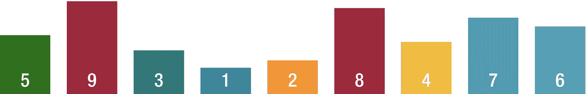
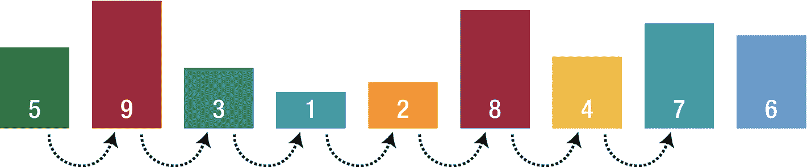
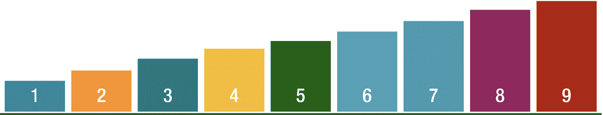
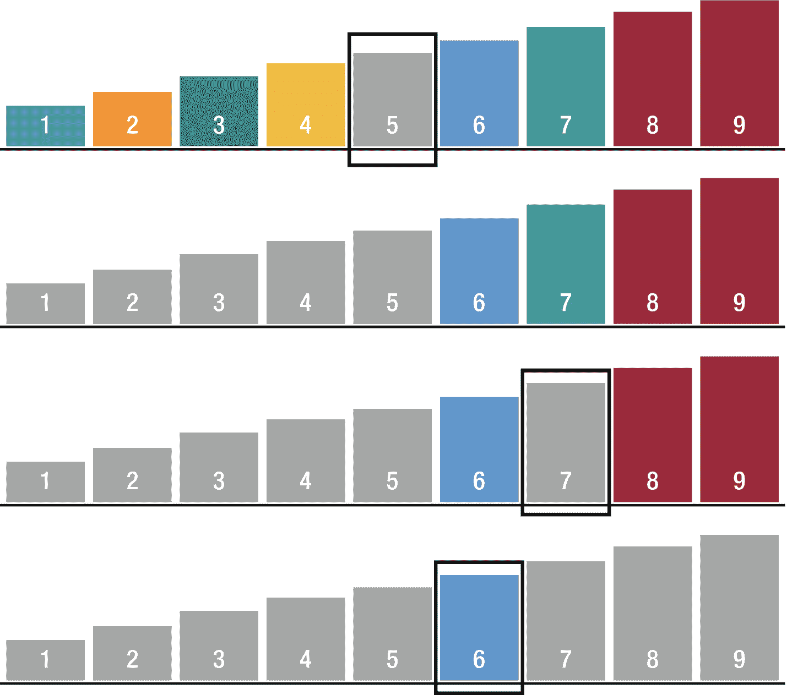

# 15. 搜索算法

为了检查或检索任何数据结构中的元素，会使用搜索算法。这些算法的性能是通过它们找到解决方案的速度来评估的，在大多数情况下，这取决于被搜索的数据结构。某些数据结构是专门为加快搜索算法效率而设计的。

根据搜索机制，搜索算法分为两类：

*   顺序搜索：线性搜索
*   区间搜索：二分搜索


## 线性搜索

针对待查找的值，按顺序检查每一个元素。当数据量很大时，比较次数会增加，所需时间也更长。线性搜索的时间复杂度为 `O(n)`。

我们来看看下面的列表（图 15-1）。



图 15-1

列表

让我们尝试搜索数字 7。首先，我们检查数组中最左边的数字。将其与 5 比较，如果匹配，则搜索结束。如果不匹配，就检查右边下一个数字。我们重复此比较过程，直到找到 7。找到 7 时，搜索在此结束（图 15-2）。



图 15-2

线性搜索

线性搜索的主要优点是简单：从概念上讲，它极其容易理解；从实现上讲，它也非常直接。从操作角度来看，线性搜索的资源效率也很高——它不需要复制或分割正在搜索的数组——因此内存效率很高。它对于未排序和已排序的数据都能同样良好地运行。

线性搜索的主要缺点是它的整体效率非常低下，为 `O(n)`。也就是说，该算法的性能与输入规模呈线性关系。就一般情况而言，线性搜索因此比许多其他搜索算法慢得多。

在某些情况下，如果已知关于被搜索列表当前内容的额外信息，线性搜索的性能可以与许多其他类型的搜索算法相当，甚至更好。例如，如果你可以假设你的列表是先进先出（FIFO）或后进先出（LIFO），并且你知道正在查找的项目几乎总是最近添加的，或者几乎总是在列表末尾，那么定制化的线性搜索可以提供非常好的性能。

### 实现

线性搜索函数使用泛型创建，以使其兼容所有数据类型。

```
func linearSeacrh(_ inputArray: [inputType], searchValue: inputType) -> String {
    let n = inputArray.count
    for i in 0..<n {
        if inputArray[i] == searchValue {
            return "The element is found at index \(i) "
        }
    }
    return "The element is not found"
}
```

首先，我们获取数组的长度并遍历它来搜索该值，找到后，返回其在数组中的索引。如你所见，该实现非常易于执行。

例如：

```
var testArray = [1,2,3,4,5,6]
print(linearSeacrh(testArray, searchValue: 6))
```

输出结果将是：

```
The element is found at index 5
```

## 二分搜索

二分搜索是一种用于搜索预先排序数组元素的算法。它通过反复将搜索区间对半分割来搜索已排序的数组。首先，它将待搜索的值与数组的中间元素进行比较，如果搜索键的值小于区间中间的元素，则缩小区间至下半部分。否则，缩小区间至上半部分，并重复检查，直到找到该值或区间为空。二分搜索的最坏情况时间复杂度为 `O(logN)`。

除了小型数组之外，二分搜索比线性搜索更快，但数组必须首先排序才能应用二分搜索。它可以用来解决多种问题，例如在数组中找到最小或下一个最大的元素。

我们来看看下面的列表，并使用二分搜索查找一个元素（图 15-3）。



图 15-3

已排序列表

让我们尝试搜索数字 6（图 15-4）。



图 15-4

二分搜索

首先，我们查看数组中间的数字。在本例中，它是 5，我们将 5 与我们正在搜索的数字 6 进行比较。我们发现 5 小于 6，这意味着数字 6 位于 5 的右边，因为我们处理的是预先排序的数组。因此，我们移除不再需要的数字。

在剩余的数字中，我们再次查看剩余数组中间的数字，这次是 7。我们将 7 与 6 比较，它大于 6，这意味着我们正在寻找的数字位于 7 的左边。我们再次移除不需要的数字。

在剩余的数字中，我们查看中间的数字，这次是 6，并且 6 等于 6，因此我们找到了正在寻找的数字。

二分搜索的主要优点是它是搜索项目最快的方法之一，并且最坏情况性能为 `O(logN)`。然而，它要求元素是已排序的。

### 实现

```
func binarySearch(inputArray:Array, searchValue: inputType) -> Int? {
    var lowerIndex = 0
    var upperIndex = inputArray.count - 1
    while (true) {
        let currentIndex = (lowerIndex + upperIndex)/2
        if(inputArray[currentIndex] == searchValue) {
            return currentIndex
        } else if (lowerIndex > upperIndex) {
            return nil
        } else {
            if (inputArray[currentIndex] > searchValue) {
                upperIndex = currentIndex - 1
            } else {
                lowerIndex = currentIndex + 1
            }
        }
    }
}
```

首先，我们定义下限和上限索引，并通过将当前列表一分为二进行遍历来搜索该值，直到达到被搜索的值。

例如：

```
var testArray = [1,2,3,4,5,6,7,9,10];
if let searchIndex = binarySearch(inputArray: testArray,searchValue: 5) {
    print("The element is found at index: \(searchIndex)")
}
```

输出结果将是：

```
The element is found at index: 4
```

## 结论

在本章中，你学习了搜索算法及其背后的策略。你掌握了线性搜索和二分搜索及其优缺点。到目前为止，你应该对如何实现这些算法以及如何根据需求选择哪种算法有了很好的理解。在下一章中，我们将学习图算法，例如广度优先搜索、深度优先搜索和 Dijkstra 算法。

