# 16. 图算法

显而易见，许多算法的主要目的与对数据的操作有关，而数据结构在选择算法时扮演着重要的角色。在本章中，我们将讨论非线性数据结构，例如图。

图是一种非线性数据结构，由节点和边组成。图的基本结构如图 16-1 所示。

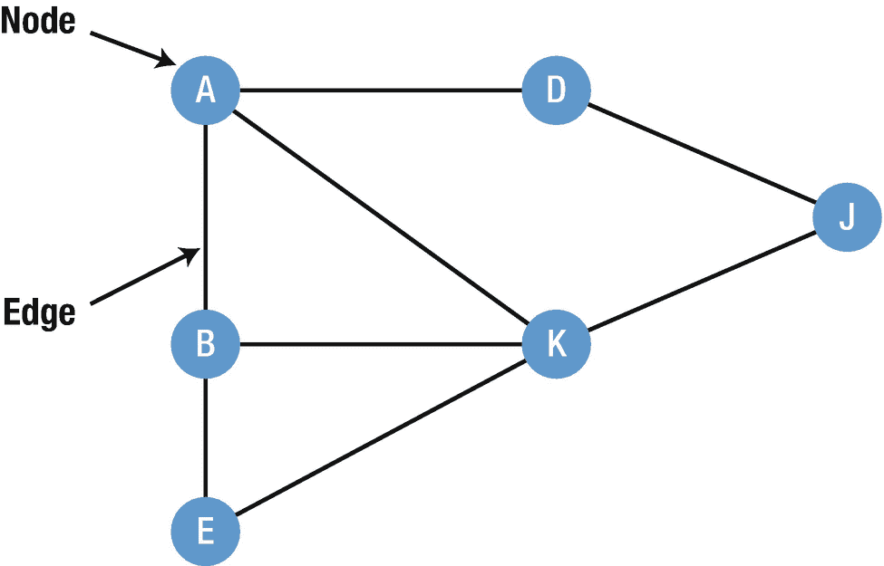

图 16-1

图数据结构

在上图中，节点集合 `N = {A,B,D,E,K,J}`，边集合 `E = {AB,AK, BK,BE,KJ,DJ}`。

图可以是有向的或无向的，并且图的边可以有权重。

## 有向图

这种类型的图的遍历具有限制性，因为一条边可能只允许单向遍历（图 16-2）。

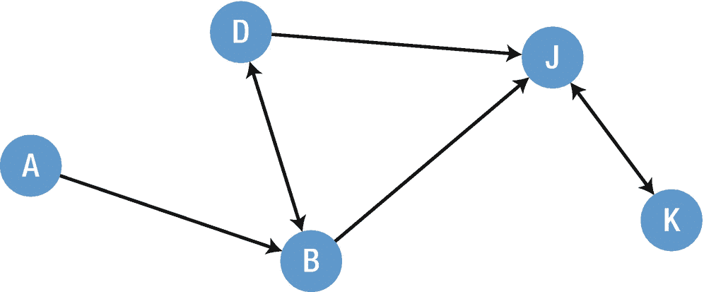

图 16-2

有向图

从这个图中可以很容易地看出：

- 存在一条从 A 到 B 的路径
- 没有从 A 到 D 的直接路径
- 存在一条在 B 和 D 之间的往返路径
- 无法从 B 到达 A


## 无向图

无向图可以看作是一种所有边都是双向的有向图（图 16-3）。

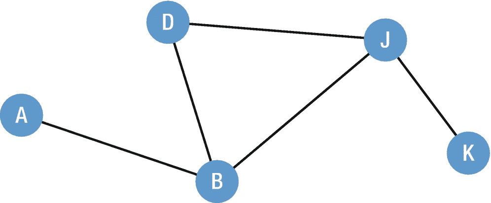

图 16-3 无向图

这里存在两条往返路线，且边的权重对两个方向均适用。

## 加权图

使用每条边的成本都与分配给该边的权重相关联。这使得在边之间选择成本最低的路径变得容易（图 16-4）。

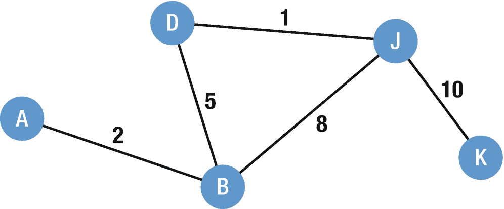

图 16-4 加权图

图搜索算法被用于许多应用，例如在众多游戏、地图以及路径查找应用中寻找从源点到目标点的最短路径。图搜索的主要特征如下：

-   这些算法指定了搜索图中节点的顺序。
-   我们从源节点开始，持续搜索直到找到目标节点。
-   边界（frontier）包含我们已看到但尚未探索的节点。
-   在每次迭代中，我们从边界中取出一个节点，并将其邻居节点添加到边界中。

图搜索算法有很多，但这里我们只讨论其中三种：广度优先搜索、深度优先搜索和迪杰斯特拉算法。

## 广度优先搜索

广度优先搜索是一种图遍历算法，它从根节点开始，探索所有邻居节点，然后选择最近的节点，并探索其余所有节点。它对每个最近的节点都遵循相同的过程，直到达到目标。

假设在下面的图数据结构中，我们的目标是使用 BFS 找到 `G`（图 16-5）。

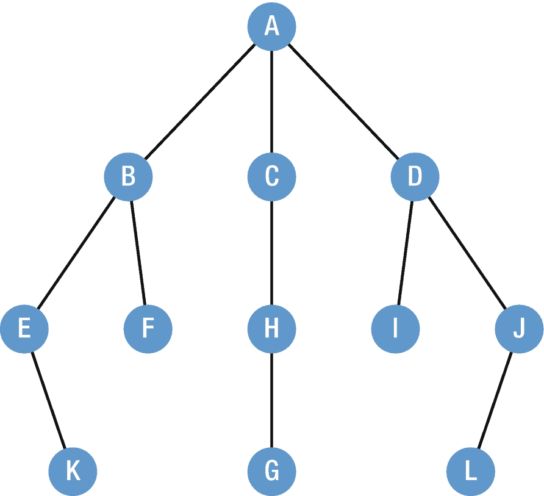

图 16-5 图数据结构

搜索过程从以 `A` 为起点开始。从 `A` 可到达点 `B`、`C` 和 `D`，这些点被视为下一步移动的候选点（图 16-6）。

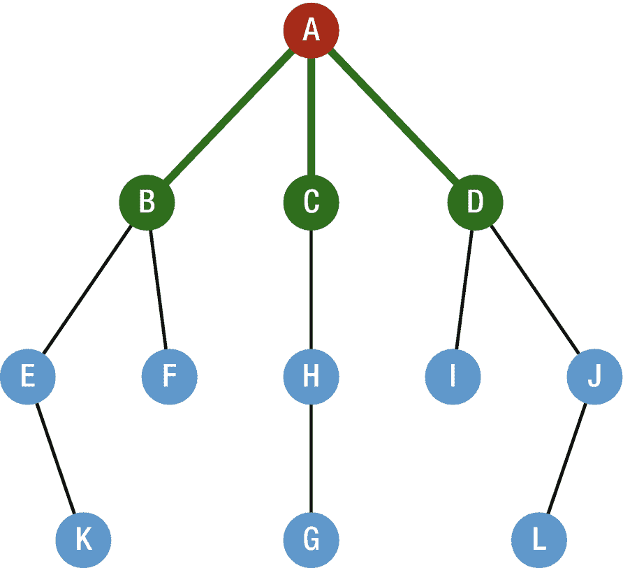

图 16-6 BFS，步骤 1

从候选点中选择一个点。选择的依据是哪个点最先被添加为候选点。对于同时成为候选点的点，选择哪一个无关紧要。为了方便起见，在本例中我们将从左侧选择点。因此，我们从 `B` 开始，移动到所选的点，发现要搜索的点 `G` 不在此处。从当前点 `B` 可到达的 `E` 和 `F` 被添加为下一步移动的候选点（图 16-7）。

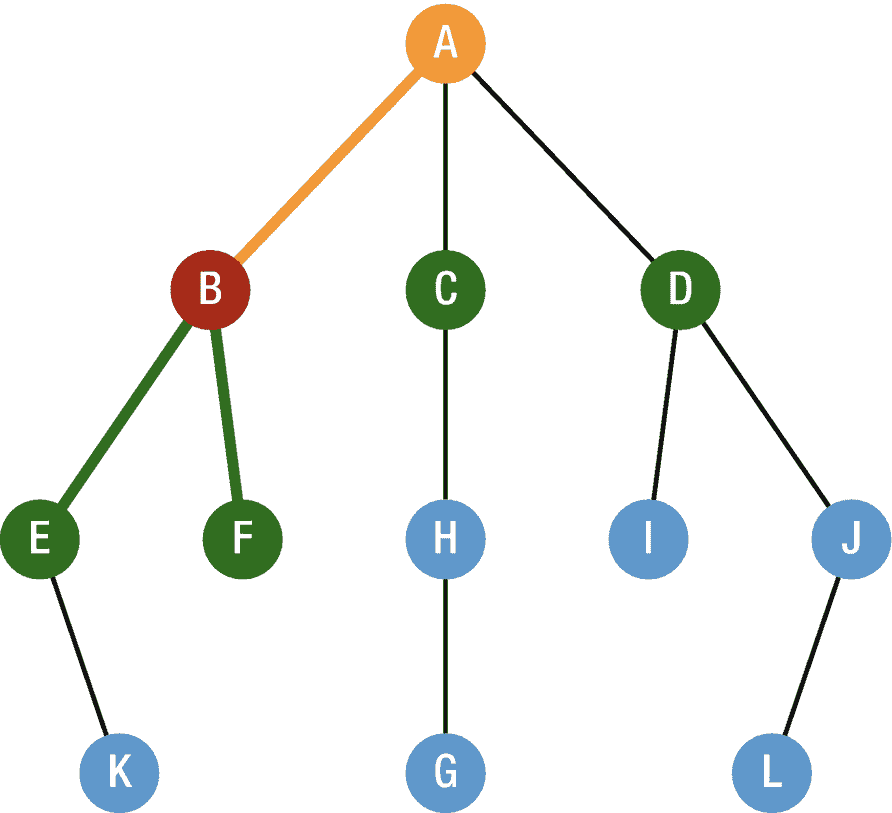

图 16-7 BFS，步骤 2

然后我们继续处理从点 `A` 可到达的下一个点，即 `C`。我们移动到所选的点，再次发现 `G` 不在此处，因此从 `C` 可到达的点被添加为后续移动的新候选点（图 16-8）。

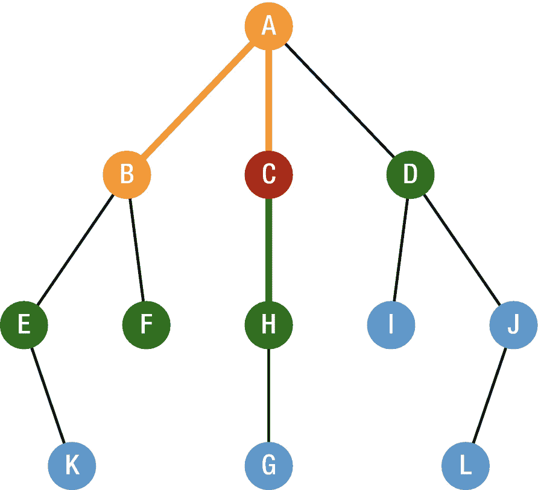

图 16-8 BFS，步骤 3

然后我们继续处理下一个点 `D`，再次发现 `G` 不在此处，并且 `I` 和 `J` 被添加为新的候选点（图 16-9）。

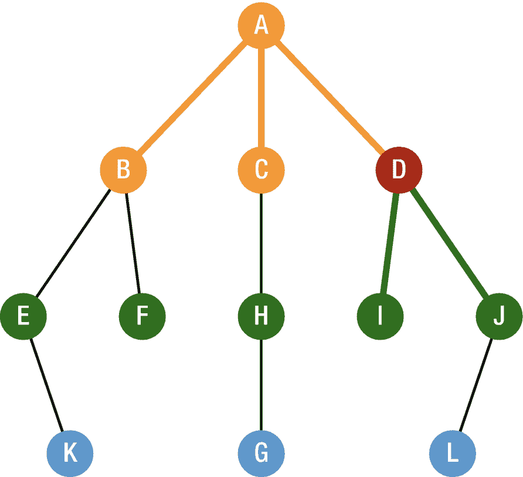

图 16-9 BFS，步骤 4

我们看到来自点 `A` 的所有候选点都已处理完毕，但未能找到点 `G`，因此我们再次从左侧继续。于是我们从点 `B` 移动到它的候选点，第一个候选点是 `E`，我们发现 `G` 不在此位置，并添加 `K` 作为新候选点，然后继续到下一个点（图 16-10）。

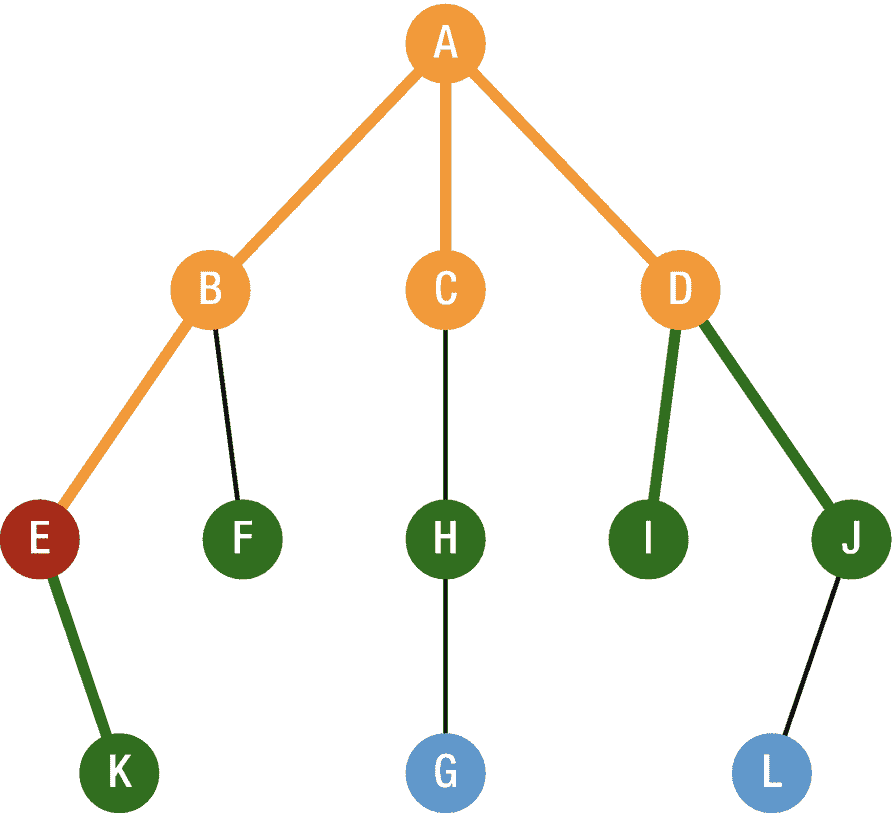

图 16-10 BFS，步骤 5

下一个点是 `F`，从 `F` 出发没有路径，这意味着在这种情况下没有添加候选点，此路线结束。然后，我们继续处理下一个点，从 `C` 到达 `H`，显然 `H` 不是我们要搜索的点，并且 `G` 被添加为新的候选点。接着我们继续到点 `D`。在这里，`I` 和 `J` 这两个候选点都不是我们要找的点，只有 `L` 被添加为新的候选点。从这个点开始，我们再次从左侧开始，即点 `E`。我们移动到下一个候选点，到达路径终点，但未找到 `G`。由于从点 `F` 没有路径，我们继续到点 `H`，最后，当我们从 `H` 移动时，我们达到了目标，因此搜索在此结束。

如你所见，广度优先搜索的独特之处在于它如何广泛地搜索那些离起点最近的点。

**BFS 的优点**

-   如果存在解，BFS 一定能找到。
-   它永远不会陷入死胡同。
-   如果存在多个解，它会以最少的步数找到解。

**BFS 的缺点**

-   内存受限。
-   如果解距离较远，会消耗更多时间。


### 实现

为了创建 BFS 算法，声明的结构中必须包含以下信息：

- 节点值
- 邻居列表
- 访问状态

因此，我们根据上述条件创建一个节点类。

```swift
public class BFSNode {
    public var nodeValue: T
    public var nodeNeighbors: [BFSNode]
    public var visitedNode: Bool
    public init(value: T, neighbors: [BFSNode], visited: Bool) {
        self.nodeValue = value
        self.nodeNeighbors = neighbors
        self.visitedNode = visited
    }
    public func addNeighbor(node: BFSNode) {
        self.nodeNeighbors.append(node)
        node.nodeNeighbors.append(self)
    }
}
```

我们还声明了一个名为 `addNeighbor` 的方法来连接节点。

为了追踪邻居和访问状态，我们需要一个额外的数据结构——一个队列，它是一种先进先出（FIFO）的数据结构。当我们用 BFS 开始搜索过程时，我们将所有邻居添加到队列中，并在访问它们时，将它们逐一弹出并标记为已访问。

让我们向 `BFSNode` 类添加以下方法：

```swift
public static func breadthFirstSearch(first: BFSNode) {
    var queue: [BFSNode] = []
    queue.append(first)
    while queue.isEmpty == false {
        if let node = queue.first {
            print(node.nodeValue)
            node.visitedNode = true
            for child in node.nodeNeighbors {
                if child.visitedNode == false {
                    queue.append(child)
                }
            }
            queue.removeFirst()
        }
    }
}
```

首先，我们初始化一个由 `BFSNode` 组成的队列，然后将第一个元素添加进去。然后，在循环内部，我们开始访问队列中的节点，并在访问节点时将其标记为已访问，同时将未访问的节点加入队列。最后，处理过的节点被移除，我们继续处理队列中的剩余元素。

例如：

```swift
let nodeA = BFSNode(value: "A", neighbors: [], visited: false)
let nodeB = BFSNode(value: "B", neighbors: [], visited: false)
let nodeC = BFSNode(value: "C", neighbors: [], visited: false)
let nodeD = BFSNode(value: "D", neighbors: [], visited: false)
let nodeE = BFSNode(value: "E", neighbors: [], visited: false)
let nodeF = BFSNode(value: "F", neighbors: [], visited: false)
nodeA.addNeighbor(node: nodeB)
nodeC.addNeighbor(node: nodeB)
nodeD.addNeighbor(node: nodeB)
nodeE.addNeighbor(node: nodeB)
nodeF.addNeighbor(node: nodeD)
BFSNode.breadthFirstSearch(first: nodeA)
```

输出将会是：

```
A
B
C
D
E
F
```

可以很容易地看出，我们以 BFS 方式搜索图，即在深入之前先访问每一层的子节点。

## 深度优先搜索 (DFS)

深度优先搜索（DFS）是一种递归算法，它会尽可能深入地探索一个分支，直到抵达终点。当它到达分支的终点时，会后退一步，探索下一个可用的分支，直到找到我们要寻找的值。为了避免多次访问同一个节点，会使用一个布尔值来进行追踪。

让我们看下面的例子：

我们的目标是使用 DFS 找到 G（图 16-11）。

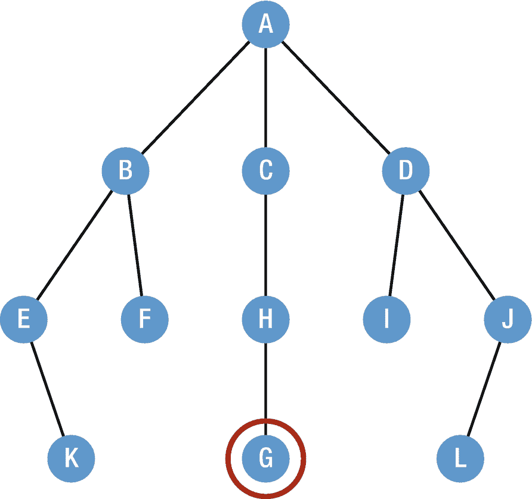

**图 16-11**  
我们将使用深度优先搜索寻找 G

起点是 A；从该点出发，B、C 和 D 都是可达的，它们将被视为下一步移动的候选点（图 16-12）。

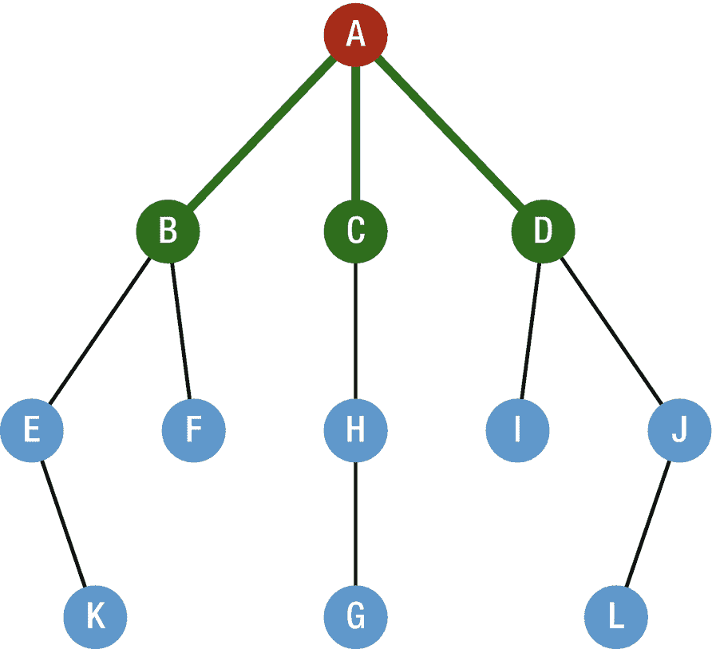

**图 16-12**  
DFS，步骤 1

然后我们在候选点中选择一个，选择依据是最后被添加为候选点的那个。对于同时成为候选点的那些点，选择哪一个无关紧要。我们从左侧开始选择；在我们的例子中是 B，然后我们移动到选中的点。从点 B 可以到达点 E 和 F，因此它们被添加为下一步移动的新候选点（图 16-13）。


**图 16-13**  
DFS，步骤 2

这里我们又有了两个同时添加的新候选点，因此我们选择左侧的那个，即 E，然后移动到选中的点，并将可达的点 K 添加为新候选点。请注意，在深度优先搜索中，我们不会像广度优先搜索那样返回从 A 可达的点；在这里，我们会一直深入直到可达点的尽头（图 16-14）。

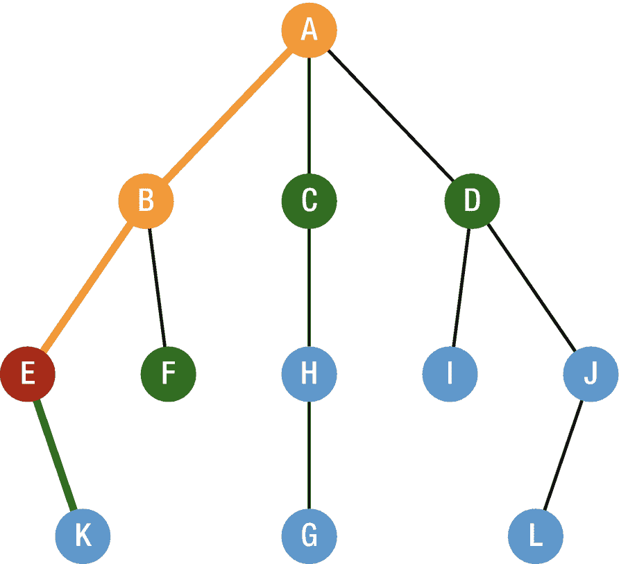

**图 16-14**  
DFS，步骤 3

我们接下来要去的点是 K，从这里无法到达任何点。因此，我们继续前往从 B 可达的下一个点，这里同样没有点可以前往，并且我们要寻找的值也不在此路径中。于是，我们继续前往从 A 可达的下一个点。我们移动到 C，并将 H 添加为新候选点（图 16-15）。

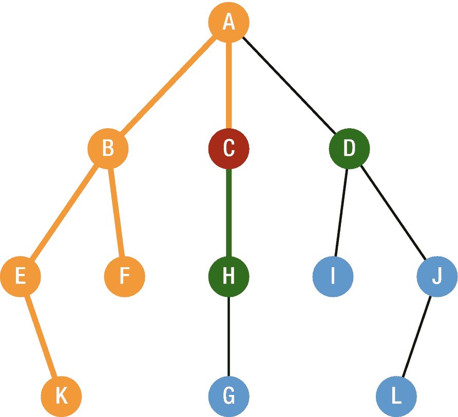

**图 16-15**  
DFS，步骤 4

在下一阶段，我们移动到 H。当我们到达这里时，G 被添加为新候选点，在下一步我们移动到那里。终于，我们的目标达成了，因此搜索在此结束（图 16-16）。

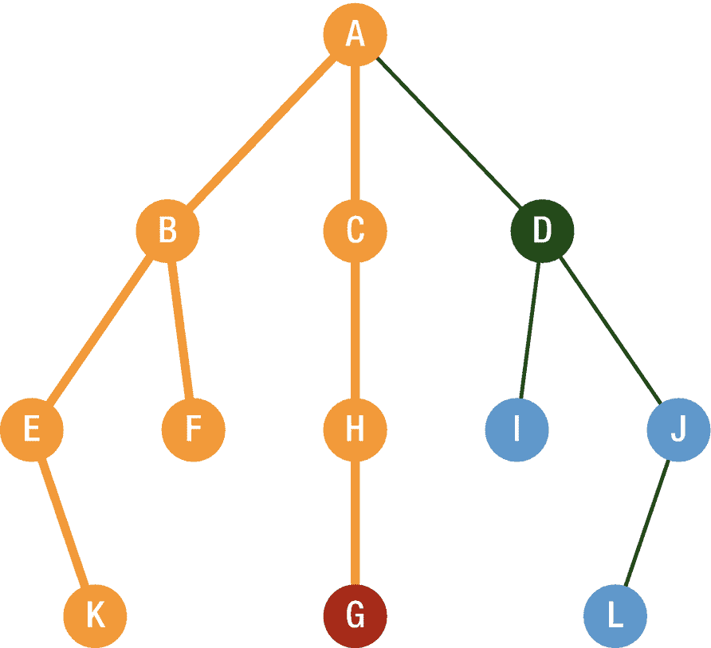

**图 16-16**  
DFS，步骤 5

如您所见，深度优先搜索的独特之处在于它通过深入挖掘一条特定路径来进行搜索。我们有一个二叉搜索树，从根节点（值为 A 的节点）开始。步骤 2 访问第一个子节点（从左到右），即值为 B 的节点。然后，由于该节点也有子节点，我们必须先访问它们（同样从左到右）：因此在步骤 3 中，我们访问值为 E 的节点。搜索过程持续进行，直到达到目标。

**优点**

- 内存需求是线性的。
- 时间和空间复杂度较低。
- 无需过多搜索即可找到解决方案。

**缺点**

- 不保证一定能找到解决方案。
- 可能陷入对无用路径的搜索。


### 实现

首先，我们将创建一个树节点，它包含值和子节点。由于 Swift 要求为类手动创建 `init` 方法，因此这里也包含了该方法。然后我们添加 `addChild` 函数来为指定节点分配子节点。

```swift
public class DFNode {
    public var value: inputType
    public var children: [DFNode] = []
    public init(_ value: inputType) {
        self.value = value
    }
    public func addChild(_ child: DFNode) {
        children.append(child)
    }
}
```

我们在深度优先搜索（DFS）中使用该树节点。为此，我们在树节点类内部创建另一个函数，该函数对下一个节点使用递归过程。

```swift
public func depthFirstSearch(visit: (DFNode) -> Void) {
    visit(self)
    children.forEach {
        $0.depthFirstSearch(visit: visit)
    }
}
```

例如：

首先，我们创建一个树节点并为其添加子节点；然后我们将使用 `depthFirstSearch` 函数来演示其工作原理。

```swift
let nodeA = DFNode("A")
let nodeB = DFNode("B")
let nodeC = DFNode("C")
let nodeD = DFNode("D")
let nodeE = DFNode("E")
let nodeF = DFNode("F")
let nodeG = DFNode("G")
nodeA.addChild(nodeB)
nodeA.addChild(nodeC)
nodeB.addChild(nodeE)
nodeB.addChild(nodeF)
nodeE.addChild(nodeG)
```

我们在此创建的树如图 16-17 所示。

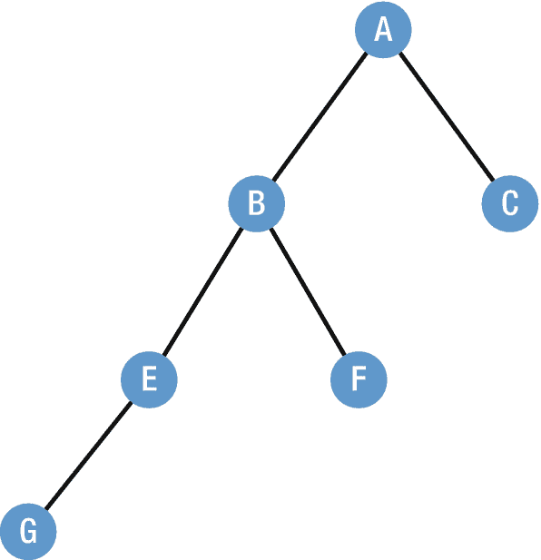

图 16-17

DFS 示例

如果我们对此树运行 `depthFirstSearch` 方法，输出将为

```swift
nodeA.depthFirstSearch {
    print($0.value)
}
```

输出：

```
A
B
E
G
F
C
```

可以很容易地看出，我们以深度优先搜索（DFS）风格搜索图，即在访问其他子节点之前先深入探索更深的节点。

## 迪杰斯特拉算法

迪杰斯特拉算法是一种用于寻找图中两点之间最短路径的算法。它由计算机科学家艾兹格·W·迪杰斯特拉于 1956 年提出。

让我们看看它的实际运行过程；假设我们有一个如图 16-18 所示的图数据结构，并且我们想要找到从 A 到 G 的最短路径。

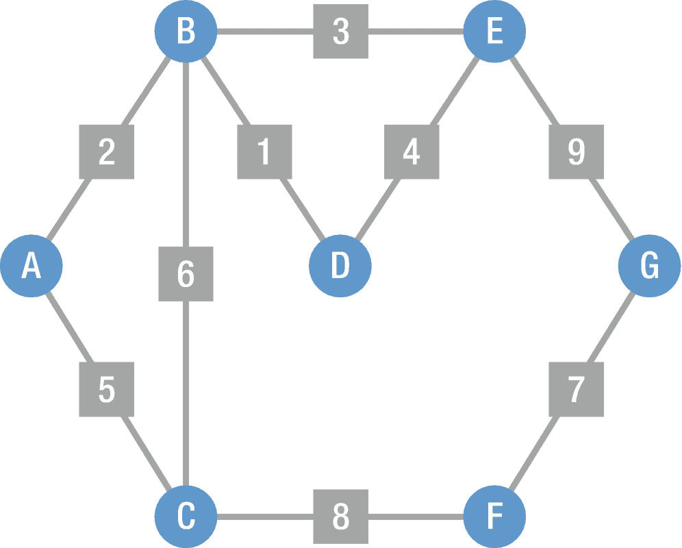

图 16-18

用于迪杰斯特拉算法的图

从图中可以很容易看出每条路径都有相应的开销。在**步骤 1** 中，起点被设为 0，所有其他点被设为无穷大。我们从第一个点开始搜索未探索的点，一旦找到这些点，它们就成为移动到下一个点的候选点（图 16-19）。

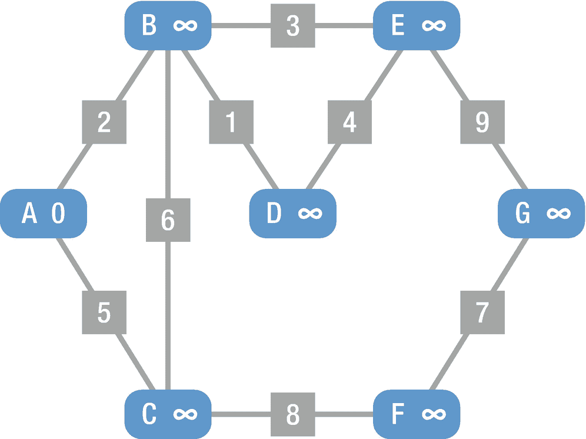

图 16-19

迪杰斯特拉算法，步骤 1

**步骤 2**：在此阶段，点 B 和 C 是我们的候选点，每个点的开销根据当前点的开销加上移动到候选点的开销来计算。在我们的例子中，A 的开销为 0，移动到 B 的开销为 2；B 的开销将为 0+2 = 2。类似地，移动到 C 的开销将为 0+5=5。因此，如果计算出的开销小于当前值，则该点的开销将更新为新值。由于 B 和 C 的当前开销是无穷大，计算出的结果更小，因此 B 和 C 被更新为新值（图 16-20）。

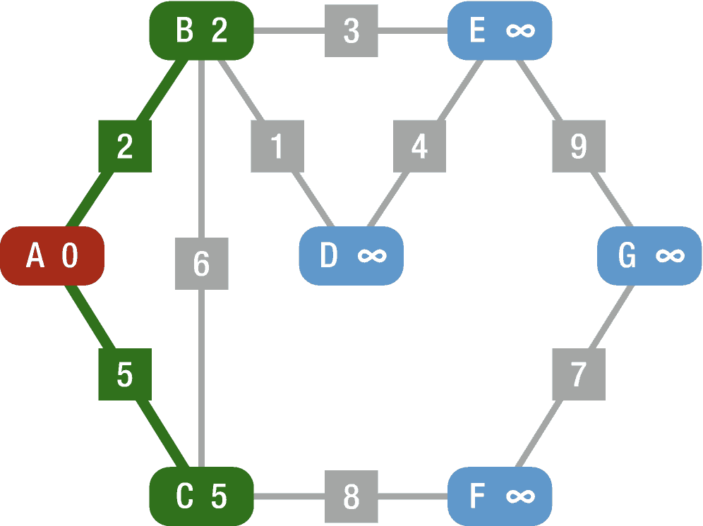

图 16-20

迪杰斯特拉算法，步骤 2

**步骤 3**：在此阶段，我们需要选择下一个要移动的点，并选择开销最低的那个点，在本例中是 B。这意味着 `A → B` 是从起始点到 B 的最短路径。沿着确定为最短的路径，我们移动到点 B，该点有三个候选点，因此 C、D 和 E 被添加为新的候选点。使用开销计算方法，我们计算每个候选点的开销（图 16-21）。

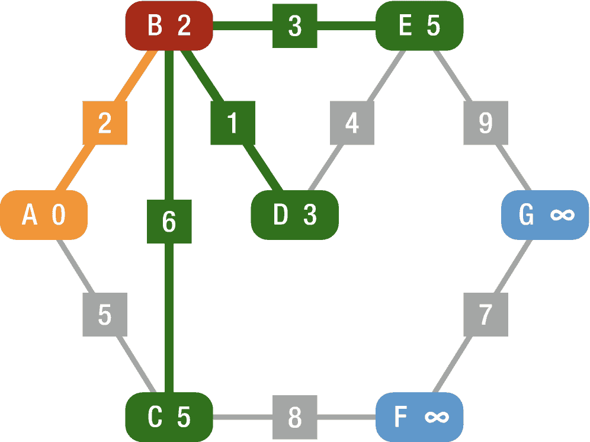

图 16-21

迪杰斯特拉算法，步骤 3

*   `B → C` : 2 + 6 = 8，这大于 C 的当前值 5，因此不进行更新。
*   `B → D` : 2 + 1 = 3，这小于 D 的当前值无穷大，因此该值被更新。
*   `B → E` : 2 + 3 = 5，这小于 E 的当前值无穷大，因此该值被更新。

**步骤 4**：这里我们再次选择开销最低的点，即 D。此时我们已经确定所选路径 `A → B → D` 是从起点 A 到 D 的最短路径，因此我们移动到点 D。该点有一个候选点，因此 E 被添加为新的候选点，并计算 E 的开销（图 16-22）。

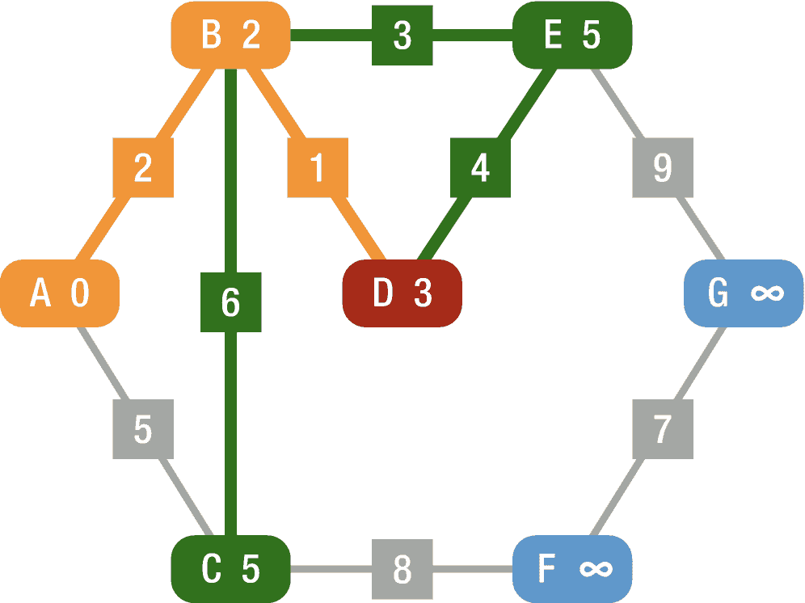

图 16-22

迪杰斯特拉算法，步骤 4

*   `D → E` : 3 + 4 = 7，这大于 E 的当前值 5，因此不进行更新。

**步骤 5**：从 D 到 E 的开销并非最低。点 C 的开销低于 E，并且其最小值为 5，因此我们下一步将移动到 C。该点有一个候选点，因此 F 被添加为新的候选点，并计算 F 的开销（图 16-23）。

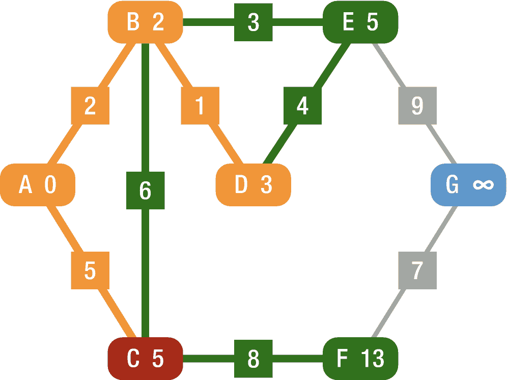

图 16-23

迪杰斯特拉算法，步骤 5

*   `C → F` : 5 + 8 = 13，这小于 F 的当前值无穷大，因此该值被更新。

**步骤 6**：F 的开销大于 E 的开销，因此开销最低的点是 E，其值为 5。我们移动到 E，并且该点只有一个候选点 G；它被添加为新的候选点并计算开销（图 16-24）。

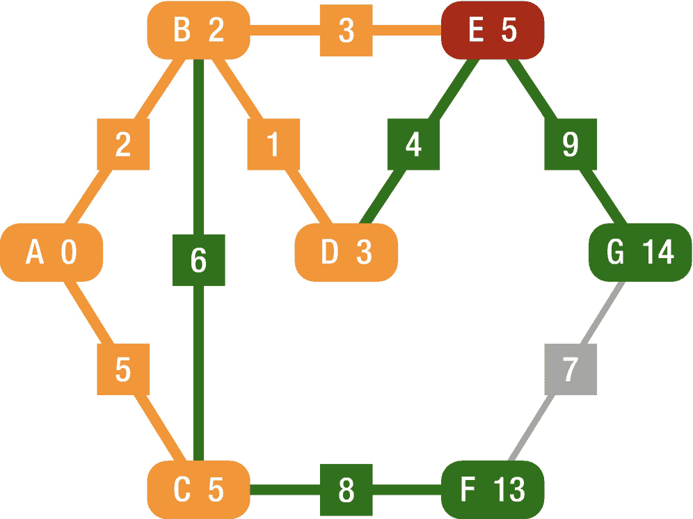

图 16-24

迪杰斯特拉算法，步骤 6

*   `E → G` : 5 + 9 = 14，这小于 G 的当前值无穷大，因此该值被更新。

**步骤 7**：F 的开销低于 G。我们移动到 F，并且该点只有一个候选点 G；它被添加为新的候选点并计算开销（图 16-25）。

*   `F → G` : 13 + 7 = 20，这大于 G 的当前值 14，因此不进行更新。

这意味着 `E → G` 路径优于 `F → G` 路径，最终我们达到了目标，最佳路径是 `A → B → E → G`，总开销为 14。

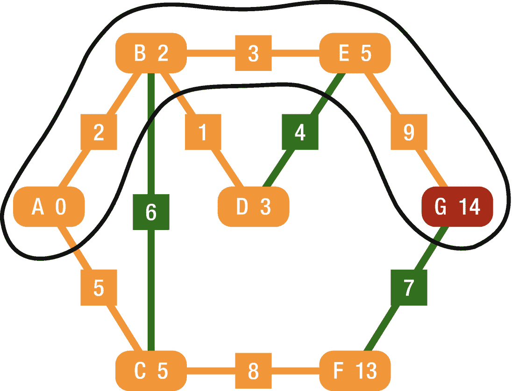

图 16-25

迪杰斯特拉算法，步骤 7

如您所见，迪杰斯特拉算法通过巧妙选择下一步要探索哪个点，高效地搜索最短路径。

**优点**

*   应用于地图导航。
*   位置之间的距离通过边来表示。
*   应用于电话网络。

**缺点**

*   执行盲目搜索，浪费时间。
*   无法处理负权边。


### 实现

首先，我们将创建 `GraphNode` 和 `Connection` 类。`GraphNode` 类有两个属性：`visited`，表示节点是否已被访问；以及 `connections` 数组，表示连接到其他节点的连接。`Connection` 类也有两个属性：`toNode`，即被连接的节点；以及 `cost`，即从当前节点移动到被连接节点的代价。请注意，代价必须是一个正数。

```
class GraphNode {
    var visited = false
    var connections: [Connection] = []
}

class Connection {
    public let toNode: GraphNode
    public let cost: Int

    public init(to node: GraphNode, cost: Int) {
        assert(cost >= 0, "代价必须大于或等于零")
        self.toNode = node
        self.cost = cost
    }
}
```

然后，我们需要为路径创建另一个类。这个类的目的是追踪我们已经访问过的路径以及我们是如何到达那里的，它将用于描述到达目标的最短路径。

```
class Path {
    public let cumulativeCost: Int
    public let node: GraphNode
    public let previousPath: Path?

    init(to node: GraphNode, via connection: Connection? = nil, previousPath path: Path? = nil) {
        if let previousPath = path, let viaConnection = connection {
            self.cumulativeCost = viaConnection.cost + previousPath.cumulativeCost
        } else {
            self.cumulativeCost = 0
        }
        self.node = node
        self.previousPath = path
    }
}
```

这里我们声明了另一个名为 `cumulativeCost` 的属性，用于追踪到达当前点的代价。这是从源节点到这个节点所经过的所有连接的代价总和。

### 算法

首先，我们定义路径集合，它由从我们目前访问过的节点能够到达的节点组成。初始时它是空的；然后我们将到达源节点的路径添加进去。添加路径后，我们要做的第一步是从路径集合中提取代价最小的路径，并检查该节点是否尚未被访问，然后我们继续下一步。然后我们检查是否到达了目标节点，如果是，我们就返回路径集合中代价最小的路径（`return cheapestPathInPathCollection`）。如果没有到达目标节点，我们将当前节点标记为已访问（`cheapestPathInPathCollection.node.visited = true`）。然后在 `for` 循环中，我们添加从当前节点可以到达的新候选节点。通过这种方式，迪杰斯特拉算法找到了到达目的地的最小代价路径。

```
func dijskastraShortestPath(source: GraphNode, destination: GraphNode) -> Path? {
    var pathCollection: [Path] = [] {
        didSet {
            pathCollection.sort { return $0.cumulativeCost < $1.cumulativeCost }
        }
    }
    pathCollection.append(Path(to: source))

    while !pathCollection.isEmpty {
        let cheapestPathInPathCollection = pathCollection.removeFirst()
        guard !cheapestPathInPathCollection.node.visited else { continue }
        if cheapestPathInPathCollection.node === destination {
            return cheapestPathInPathCollection
        }
        cheapestPathInPathCollection.node.visited = true
        for connection in cheapestPathInPathCollection.node.connections where !connection.toNode.visited {
            pathCollection.append(Path(to: connection.toNode, via: connection, previousPath: cheapestPathInPathCollection))
        }
    }
    return nil
}
```

例如：

让我们创建前面举例的图示，并找到到达目标的最小代价方式，即找到从 A 点到 G 点的最短路径。

**步骤 1：** 创建继承自我们 `GraphNode` 类的自定义类。

```
class sampleGraphNode: GraphNode {
    let name: String
    init(name: String) {
        self.name = name
        super.init()
    }
}
```

**步骤 2：** 基于 `sampleGraphNode` 创建节点。

```
let nodeA = sampleGraphNode(name: "A")
let nodeB = sampleGraphNode(name: "B")
let nodeC = sampleGraphNode(name: "C")
let nodeD = sampleGraphNode(name: "D")
let nodeE = sampleGraphNode(name: "E")
let nodeF = sampleGraphNode(name: "F")
let nodeG = sampleGraphNode(name: "G")
```

**步骤 3：** 在这些节点之间创建连接，并为这些路径分配代价。

```
nodeA.connections.append(Connection(to: nodeB, cost: 2))
nodeA.connections.append(Connection(to: nodeC, cost: 5))
nodeB.connections.append(Connection(to: nodeC, cost: 6))
nodeB.connections.append(Connection(to: nodeD, cost: 1))
nodeB.connections.append(Connection(to: nodeE, cost: 3))
nodeC.connections.append(Connection(to: nodeF, cost: 8))
nodeD.connections.append(Connection(to: nodeE, cost: 4))
nodeE.connections.append(Connection(to: nodeG, cost: 9))
nodeF.connections.append(Connection(to: nodeG, cost: 7))
```

**步骤 4：** 设置起点和目的地节点，并调用迪杰斯特拉算法来找到最短路径。

```
let sourceNode = nodeA
let destinationNode = nodeG
var path = dijskastraShortestPath(source: sourceNode, destination: destinationNode)
if let succession: [String] = path?.array.reversed().compactMap({ $0 as? sampleGraphNode}).map({$0.name}) {
    print("最快路径: \(succession)")
} else {
    print("在 \(sourceNode.name) 与 \(destinationNode.name) 之间没有路径")
}
```

输出将是：

```
最快路径: ["A", "B", "E", "G"]
```

## 总结

在本章中，你学习了图算法及其背后的策略。你掌握了广度优先搜索、深度优先搜索和迪杰斯特拉算法，以及它们的优点和缺点。到现在，你应该对这些算法的实现方法以及如何根据需求选择合适的算法有了很好的理解。

