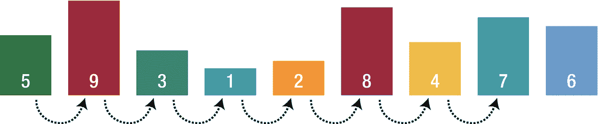
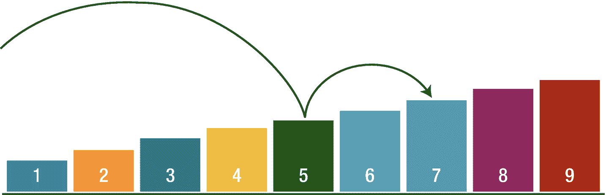

# 17. 选择最佳算法

我们已经学习了不同类型的算法，如排序、搜索和图算法，并且很可能有多种算法可以完成相同的任务。问题是，如果我们想在列表中搜索一个值，我们应该选择哪种类型的搜索算法？在本章中，我们将通过分析各种算法来研究这个问题。

比较算法有很多种方法，但在本章中，我们将重点关注时间复杂度和空间复杂度。

- 时间复杂度：完成任务所需的时间
- 空间复杂度：完成任务所需的内存

我们将考察本书中解释过的不同类型的算法。

## 排序算法

我们已经学习过，排序算法将列表中的值按从小到大的顺序排列，并且在计算机科学中有许多可用的排序算法。为了选择一种与我们的程序完美匹配的算法，我们必须深入了解它们在不同情况下的表现。

### 冒泡排序

当列表几乎已排序时（例如只有两个元素错位），它非常有用。冒泡排序的空间需求最低，因为元素是原地交换的，无需使用额外的临时存储。

| **冒泡排序** | 最佳情况 | 最差情况 |
|-----------------|-----------|------------|
| 时间复杂度 | O(n) | O(n²) |
| 空间复杂度 | O(1) | O(1) |

### 选择排序

它与冒泡排序类似，在小列表上表现良好，且空间需求最低。最佳、平均和最差情况的时间复杂度都是 O(n²)，这与数据的分布无关。

| **选择排序** | 最佳情况 | 最差情况 |
|-------------------|-----------|------------|
| 时间复杂度 | O(n²) | O(n²) |
| 空间复杂度 | O(1) | O(1) |

### 插入排序

当用于小型数据数组时，它相当高效。二次运行时间 O(n²) 可以提升到不错的 O(n∗k)，其中 k 是它需要回溯数组以将前一个元素与当前元素交换的步数。如果列表是部分排序的，它的表现甚至可能优于快速排序。

| **插入排序** | 最佳情况 | 最差情况 |
|-------------------|-----------|------------|
| 时间复杂度 | O(n) | O(n²) |
| 空间复杂度 | O(1) | O(n) |

### 归并排序

对于较大的列表，它的速度更快，因为与插入排序和冒泡排序不同，它不会遍历整个列表。空间复杂度始终为 `O(n)`，因为必须将元素存储在某处。在使用数组的实现中，额外空间复杂度可以为 `O(n)`，而在链表实现中则为 `O(1)`。在实践中，使用列表的实现需要为列表指针提供额外空间，因此除非列表已存在于内存中，否则这一点并不重要。

| **归并排序** | 最佳情况 | 最坏情况 |
| 时间复杂度 | `O(n)`（`O(n logn)`） | `O(n logn)` |
| 空间复杂度 | `O(1)` | `O(n)` |

### 快速排序

如前所述，快速排序与归并排序一样采用分治法，是一种递归算法。其最坏情况下的运行时间与选择排序和插入排序一样糟糕。另一方面，其平均情况下的运行时间与归并排序一样好。那么问题来了，既然它至少与归并排序一样好，为什么还需要它？这是因为隐藏在快速排序大 O 表示法中的常数因子相当小。在实践中，快速排序的性能优于归并排序，并且显著优于选择排序和插入排序。基准元素的选择对快速排序的效率起着重要作用。

| **快速排序** | 最佳情况 | 最坏情况 |
| 时间复杂度 | `O(n logn)` | `O(n²)` |
| 空间复杂度 | `O(logn)` | `O(n)` |

## 搜索算法

搜索算法旨在从存储元素的数据结构中检查或检索一个元素。

### 线性搜索与二分搜索

线性搜索每次扫描一个元素，随着元素数量的增加，搜索时间也会不断增加。

| **线性搜索** | 最佳情况 | 最坏情况 |
| 时间复杂度 | `O(1)` | `O(n)` |
| 空间复杂度 | `O(1)` | `O(1)` |

二分搜索将搜索范围缩减为一半，并根据中间元素，继续在给定列表的中间元素左侧或右侧进行搜索。

| **二分搜索** | 最佳情况 | 最坏情况 |
| 时间复杂度 | `O(1)` | `O(logn)` |
| 空间复杂度 | `O(1)` | `O(1)` |

**区别**

- 二分搜索要求数据已排序，而线性搜索则不需要。
- 二分搜索随机访问数据，而线性搜索顺序访问数据。
- 二分搜索执行顺序比较，而线性搜索执行相等比较。

线性搜索搜索数字 7 的过程如图 17-1 所示。

图 17-1  
线性搜索示例

二分搜索搜索数字 7 的过程如图 17-2 所示。

图 17-2  
二分搜索示例

## 图搜索算法 (GSA)

显然，图搜索算法用于图数据结构。GSA 会遍历图的节点以寻找目标。

### 广度优先搜索 (BFS) 与深度优先搜索 (DFS)

| 广度优先搜索 (BFS) | 深度优先搜索 (DFS) |
| --- | --- |
| 使用队列数据结构 | 使用栈数据结构 |
| 从源顶点出发，以最少的边数到达某个顶点。 | 从源出发，可能需要经过更多边才能到达某个顶点。 |
| 当顶点距离给定源较近时，该算法较为有用。 | 当顶点距离源较远时，该算法较为有用。 |
| 它优先考虑相邻节点；因此不适用于游戏和谜题中的决策树。 | 它适用于决策树，因为我们可以先做出一个决策，然后探索该决策下的所有路径。 |
| 时间复杂度为 `O(V+N)`，其中 `V` 表示顶点数，`N` 表示节点数。 | 时间复杂度为 `O(V+N)`，其中 `V` 表示顶点数，`N` 表示节点数。 |

## 迪杰斯特拉算法

在广度优先搜索中使用优先队列，就构成了迪杰斯特拉算法。通过优先队列，添加到队列中的每个任务都具有一个“优先级”，并根据其优先级水平在队列中插入相应位置。当你对图一无所知，且无法估计每个节点到目标的距离时，应使用迪杰斯特拉算法。

