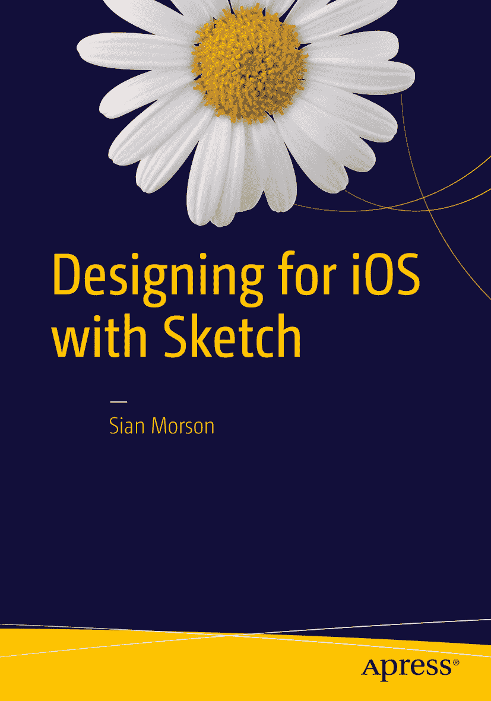

Sian Morson *使用 Sketch 设计 iOS*

作者在本文中引用的任何源代码或其他补充材料，读者均可从 [`www.apress.com/9781484214596`](http://www.apress.com/9781484214596) 获取。有关如何找到本书源代码的详细信息，请访问 [`www.apress.com/source-code/`](http://www.apress.com/source-code/)。读者也可以在 SpringerLink 上每章的补充材料部分访问源代码。

ISBN 978-1-4842-1459-6  
e-ISBN 978-1-4842-1458-9  
DOI 10.1007/978-1-4842-1458-9

© Apress 2015

*使用 Sketch 设计 iOS*

常务董事：Welmoed Spahr  
首席编辑：Michelle Lowman  
技术审校：Ashley Bennett、Gabriel Sebastien 和 Scott Tolinski  
编辑委员会：Steve Anglin、Louise Corrigan、James T. DeWolf、Jonathan Gennick、Robert Hutchinson、Michelle Lowman、James Markham、Susan McDermott、Matthew Moodie、Jeffrey Pepper、Douglas Pundick、Ben Renow-Clarke、Gwenan Spearing  
协调编辑：Mark Powers  
发展编辑：Gary Schwartz  
文字编辑：Brendan Frost  
排版：SPi Global  
索引编制：SPi Global  
插图：SPi Global

如需翻译相关信息，请发送电子邮件至 `rights@apress.com`，或访问 [`www.apress.com`](http://www.apress.com/)。Apress 和 friends of ED 的书籍可批量购买，用于学术、公司或促销用途。大多数图书也提供电子书版本和许可证。欲了解更多信息，请参阅我们的特殊批量销售–电子书许可网页： [`www.apress.com/bulk-sales`](http://www.apress.com/bulk-sales)。

本作品受版权保护。出版者保留所有权利，无论是全部还是部分材料，具体包括翻译、重印、重用插图、朗诵、广播、以缩微胶卷或任何其他物理方式复制、传输或信息存储与检索、电子改编、计算机软件，或现在已知或今后开发的类似或不同方法的权利。与评论或学术分析相关的简短摘录，或专门为输入并执行到计算机系统而提供、仅供购买者独家使用的材料，不受此法律限制。本出版物或其部分的复制仅允许在出版者所在地的现行版权法规定下进行，且使用许可必须始终从 Springer 获取。使用许可可通过版权清算中心的 RightsLink 获得。违反行为将根据相应的版权法受到起诉。

本书中可能出现商标名称、标识和图像。我们没有在每个商标名称、标识或图像出现时使用商标符号，而是仅以编辑方式使用这些名称、标识和图像，以造福商标所有者，且无意侵犯商标权。本出版物中对商品名称、商标、服务标志和类似术语的使用，即使未明确标识，也不应被视为对其是否受所有权保护的表达。

尽管本书中的建议和信息在出版时被认为是真实和准确的，但作者、编辑和出版者均不对可能出现的任何错误或遗漏承担法律责任。出版者不对本书所包含的材料作任何明示或暗示的保证。

本书由 Springer Science+Business Media New York 向全球图书贸易发行，地址：233 Spring Street, 6th Floor, New York, NY 10013。电话：1-800-SPRINGER，传真：(201) 348-4505，电子邮件：`orders-ny@springer-sbm.com`，或访问 `www.springeronline.com`。Apress Media, LLC 是加州有限责任公司，其唯一成员（所有者）是 Springer Science + Business Media Finance Inc (SSBM Finance Inc)。SSBM Finance Inc 是特拉华州的公司。

谨以此书献给：  
我的侄子 Shaddai——未来属于你。  
以及  
我的兄弟 Khem——保持坚强。

**致谢**

感谢所有参与本书工作的人，特别是我的技术审校：Sebastien、Ashley 和 Scott。感谢你们让本书变得更好。你们的反馈是无价的！

同时，非常感谢 Michelle、Mark 和 Welmoed！

## 目录

1. 第 1 章：为什么选择 Sketch？ - 1
   - 一点历史 - 2
   - Sketch 2 登场 - 3
   - Sketch Mirror - 4
   - 再见了，Fontcase…… - 5
   - 苹果设计奖 - 5
   - Sketch 3 - 6
   - Sketch 3 界面 - 7
   - 位图 vs. 矢量图 - 8
   - 社区 - 12
   - iOS9 - 13
   - 应用切换器 - 14
   - 照片的新导航 - 14
   - 新的返回按钮 - 14
   - 新的系统字体：San Francisco - 15
   - Apple Watch - 15
   - 总结 - 17
2. 第 2 章：Sketch 入门 - 19
   - 安装 - 19
   - 打开 Sketch - 20
   - 画布 - 22
   - 工具栏 - 23
   - 自定义工具栏 - 24
   - 图层 - 25
   - 选择和移动图层 - 26
   - 复制图层 - 27
   - 隐藏和锁定图层 - 27
   - 组 - 28
   - 检查器 - 29
   - 样式 - 29
   - 智能参考线 - 30
   - 画板 - 31
   - 标尺和参考线 - 33
   - 显示像素 - 33
   - 显示标尺和参考线 - 33
   - 显示网格 - 34
   - 显示布局 - 34
   - 快捷键 - 35
   - 自定义快捷键 - 36
   - 总结 - 38
3. 第 3 章：为形状设置样式 - 39
   - 特殊形状 - 40
   - 编辑形状上的点 - 41
   - 直线模式 - 42
   - 镜像模式 - 43
   - 断开模式 - 43
   - 不对称模式 - 43
   - 组合形状 - 43
   - 自定义形状 - 44
   - 布尔运算 - 44
   - 联合 - 45
   - 减去 - 46
   - 相交 - 47
   - 差值 - 47
   - 蒙版 - 48
   - 轮廓蒙版 - 49
   - Alpha 蒙版 - 49
   - 扁平化 - 50
   - 缩放 - 50
   - 样式 - 51
   - 填充 - 51
   - 渐变 - 54
   - 混合 - 56
   - 不透明度 - 56
   - 阴影 - 56
   - 模糊 - 56
   - 高斯模糊 - 57
   - 动感模糊 - 57
   - 缩放模糊 - 58
   - 背景模糊 - 59
   - 共享样式 - 59
   - 图像 - 60
   - 颜色调整 - 62
   - 总结 - 62
4. 第 4 章：符号与文本 - 63
   - iOS 模板符号 - 66
   - 文本与字体 - 67
   - 文本检查器 - 70
   - 文本对齐 - 70
   - 路径上的文本 - 70
   - 文本轮廓 - 71
   - 抗锯齿与文本 - 72
   - 文本样式 - 73
   - 总结 - 74
5. 第 5 章：为 App 设计做准备 - 75
   - 人机界面指南 - 75
   - 顺应 - 76
   - 清晰 - 77
   - 深度 - 80
   - 设备与分辨率 - 81
   - 使用标准 iOS 尺寸 - 85
   - 总结 - 86
6. 第 6 章：优化工作流程 - 87
   - 自定义工作空间 - 88
   - 偏好设置 - 89
   - 整理文档 - 89
   - 命名图层和符号 - 92
   - 创建自定义网格 - 94
   - 演示模式 - 94
   - 设置默认样式 - 95
   - 定义你的调色板 - 95
   - 旋转工具 - 97
   - Sketch Mirror - 98
   - 其他工作流程工具 - 99
   - Flinto - 99
   - Flinto for Mac - 100
   - Marvel - 100
   - Dropbox - 101
   - InVision - 102
   - 总结 - 103
7. 第 7 章：使用 Sketch 为 App 绘制线框图 - 105
   - App - 107
   - 启动画面 - 108
   - 用户引导 - 109
   - 身份验证 - 110
   - 邮箱注册 - 112
   - 首页 - 113
   - 偏好设置页面 - 114
   - 个人资料页面 - 116
   - 权限 - 117
   - 相机拍摄 - 120
   - 总结 - 123
8. 第 8 章：设计你的 App - 125
   - 颜色 - 125
   - 搭建场景 - 126
   - 启动画面 - 127
   - 用户引导 - 129
   - 身份验证 - 131
   - 邮箱注册 - 133
   - 首页 - 134
   - 设置 - 137
   - 个人资料页面 - 138
   - 权限 - 140
   - 相机拍摄 - 141
   - 总结 - 142
9. 第 9 章：设计你的 App 图标 - 143
   - 什么造就了一个伟大的 App？ - 144
   - 避免使用文字 - 145
   - 明智地使用颜色 - 145
   - 保持简洁 - 146
   - 从他人处汲取灵感 - 146
   - 其他一致性修改 - 154
10. 第 10 章：为开发导出你的资源 - 157
    - 哪些需要导出，哪些不需要 - 158
    - 切片工具 - 159
    - 从插入菜单进行切片 - 160
    - 导出画板 - 162
    - 导出单个资源 - 163
    - 为资源创建文件夹 - 164
    - 裁剪背景 - 165
    - 总结 - 166
11. 第 11 章：Sketch 资源 - 167
    - 插件 - 167
    - 安装插件 - 167
    - Sketch Toolbox - 168
    - GitHub - 170
    - 我喜爱的插件 - 171
    - 其他资源 - 171
    - 总结 - 173
- 索引 - 175

**内容速览**

- 关于作者 - xiii
- 关于技术审阅者 - xv
- 致谢 - xvii
- 第 1 章：为什么选择 Sketch？ - 1
- 第 2 章：Sketch 入门 - 19
- 第 3 章：为形状设置样式 - 39
- 第 4 章：符号与文本 - 63
- 第 5 章：为 App 设计做准备 - 75
- 第 6 章：优化工作流程 - 87
- 第 7 章：使用 Sketch 为 App 绘制线框图 - 105
- 第 8 章：设计你的 App - 125
- 第 9 章：设计你的 App 图标 - 143
- 第 10 章：为开发导出你的资源 - 157
- 第 11 章：Sketch 资源 - 167
- 索引 - 175

**关于作者与关于技术审阅者**

- 关于作者
- 关于技术审阅者

