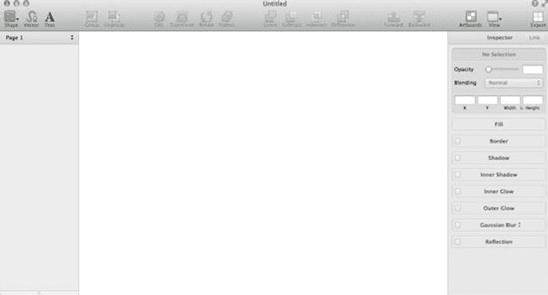

# 进入 Sketch 2

`Sketch` 首次进入我的视野是在 2013 年底，远早于其当前版本（v3.3.3）。当时第二版已经发布，我的一些朋友正在讨论这个程序。我看了一下界面，觉得它看起来非常简单。也许过于简单了，如图 1-1 所示。那时，我仍然是 `Fireworks` 的粉丝，用它来做界面设计，主要是因为它的工具非常专注，不像 `Photoshop` 那样让人不知所措。当时，我并没有足够的兴趣去深入探究或更好地理解 Bohemian Coding 试图用 `Sketch` 实现什么目标。

图 1-1. `Sketch` 2 的界面

然而，就像那辆不懈努力的小火车头一样，这家斗志昂扬的软件工作室对程序进行了稳步且持续的改进。从一开始，他们就在倾听并密切关注着他们日益壮大的社区中设计师们的反馈。这在每一次 `Sketch` 的发布中都显而易见。

首先，需要重点指出的是，`Sketch` 是一款 Mac OS X 应用。这意味着 `Sketch` 最初是为在 Mac 操作系统上独立且独家运行而创建的。因此，其版本的发布时机和优化都与苹果操作系统的各个版本相协调。从 `Sketch` 2.3 版本开始，它被称为“Snow Leopard”版本。该团队增加了布尔运算、背景模糊以及将 PDF 和 EPS 文件导入设计的功能。

开发人员还专注于提升程序的响应性和速度。像背景模糊这样的功能对 iOS 设计师来说非常重要，因为这一特性在苹果对 iOS 的全面革新中十分突出。鉴于这种新外观在各地的 iPhone 上广泛展示，`Sketch` 开发团队有先见之明地将此功能加入了程序中。正是这种思维方式让设计师们注意到了 `Sketch`。

