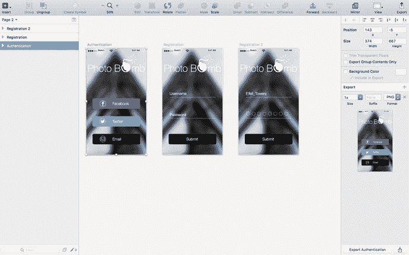

# Sketch Mirror

Bohemian Coding 展现出远见卓识的另一个功能是增加了 `Sketch Mirror`（见图 1-2）。这个便捷的功能允许设计师在他们的 iPhone 或 iPad 上完美预览自己的作品。`Sketch Mirror` 作为一个独立的 iPhone 应用发布，可通过应用商店获取，它能根据分辨率放大或缩小你的设计，并允许你直接在 iPhone 或 iPad 上预览设计。这个小小的改变展示了 Bohemian Coding 不仅致力于服务移动应用的设计师，也致力于 iOS 本身；也就是说，`Sketch` 向当时占主导地位的移动平台表示了致敬。

图 1-2. `Sketch Mirror` 允许设计师在 iPhone 上预览设计

Bohemian Coding 的团队并不满足于现状，他们持续改进这个程序。`Sketch` 2.4 改进了蒙版功能，显著提升了分组、调整大小、移动以及取消分组大量图层时的速度，修复了多个 bug，并提高了色彩准确度——这对所有设计师来说都至关重要。

## 再见，Fontcase……

Bohemian Coding 心系全球设计师需求和愿望的一个关键证明，是退役了 `Fontcase`。对于那些不了解的人来说，`Fontcase` 是一个字体管理系统，允许设计师和平面设计师存储、管理和预览他们的字体。虽然这听起来可能多余且不必要，但对设计师来说，像 Font Manager 这样的工具极其重要。设计师需要知道系统中安装了哪些字体以及它们的外观，而 Font Manager 使得浏览字体变得非常容易。该程序一度直接内置于 iOS 中。由于 `Fontcase` 在字体激活和沙盒机制方面存在问题，Bohemian Coding 团队明智地决定退役 `Fontcase`。显然，当时存在重大问题，`Fontcase` 无法正常工作。此外，设计师们也很难理解最初为什么需要它。正如 Bohemian Coding 博客所述：

> “我们认识到，`Fontcase` 的主要功能在当今时代已不再需要或不适用，是时候让它退役了。因此，我们做出了艰难的决定，将该应用从商店中移除。我们将为任何遇到问题的人提供非沙盒版本，但这将是 `Fontcase` 的最后一个版本。”

排除了 `Fontcase` 的干扰后，团队继续完善这个程序。随后发布了一些次要版本，这表明团队在努力修复软件中 bug 的同时，也密切关注着设计界的动态。同样重要的是要注意到，`Sketch` 的版本发布、修复和更新比 `Photoshop` 更加及时。设计师们常常抱怨 `Photoshop` 的重大更新和版本发布间隔大约两年。而 `Sketch` 则大约每隔一个月左右就会发布一次更新。这充分说明了拥有一个更精干、更敏捷的开发团队的优势。

就这样，`Sketch` 引起了设计界的关注。尽管如此，只有更大胆的设计师才会放弃 `Photoshop`，完全转向 `Sketch`。许多其他人则在观望和等待，看这款软件将如何发展，以及它是否会成为真正的竞争者。

## 苹果设计奖

自 1996 年以来，苹果每年都会在其年度全球开发者大会（WWDC）上宣布其久负盛名的设计奖得主。设计奖颁发给在设计和开发方面表现卓越的顶级应用。这是苹果授予那些使用其软件产品达到了最高设计标准的开发者的一项崇高荣誉。这些应用为苹果期望在其平台上实现的用户体验树立了标准。它们兼具创新性和启发性。在评选苹果设计奖时，苹果会寻找那些令人愉悦、创新、领先、引人入胜、赋能且设计精良的应用。该奖项旨在表彰苹果认为由世界各地独立开发者创造的最佳应用。

`Sketch` 是 2012 年的设计奖得主之一。对于那些因高标准的设计而被苹果软硬件产品吸引的设计师来说，这是一件了不起的大事。这不仅意味着 `Sketch` 的开发者通过创建一款能让设计界集体生活更轻松的应用而引起了他们的注意，还意味着他们在创建一款美观的应用时做到了这一点。通常情况下，软件的功能性往往会掩盖其外观和使用感受。通过赢得苹果著名的设计奖，Bohemian Coding 已经牢固地确立了自己作为领先设计和软件开发公司的地位。此外，随着设计对许多公司来说变得越来越重要，`Sketch` 成为了值得关注的焦点。

