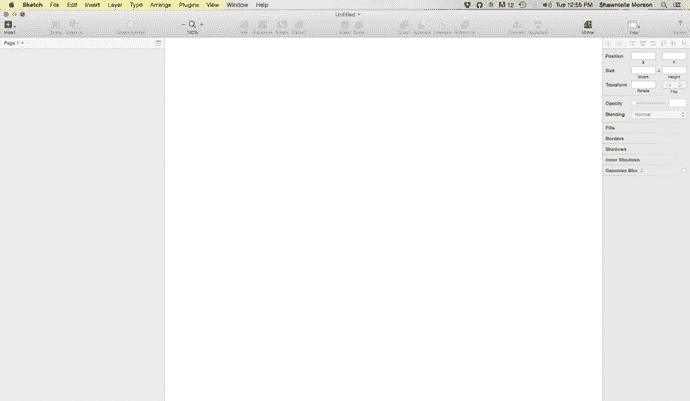
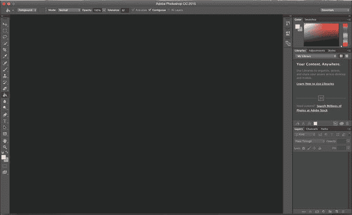

# Sketch 3

到 2014 年时，Bohemian Coding 团队已经开发 Sketch 超过两年，团队成员从最初仅两人负责开发和设计，增加到大约五人。他们也学会了外包的价值，并借助第三方开发者帮助创建了全新的 Sketch 网站，以及一段突出展示所有最新功能的实用视频。

然而，直到 4 月 Sketch 3.0 发布后，设计界的更多人才开始注意到它。在 Sketch 2.0 发布两年后，Sketch 3.0 问世。此时公司拥有了一支规模扩大的新团队和一系列全新及改进的功能。如前所述，增加团队成员并将部分关键环节外包，帮助团队专注于产品本身。他们重启项目，重新设计了网站，并倾听那些热衷于看到变化和更新的设计师社群的声音，尤其是符号、导出以及初具雏形的检查器功能。

那时，移动应用已逐渐引领世界，设计师们正大力拥抱不限于特定设备的移动范式。网络也迅速转向移动优先。设计师希望并需要其软件开发方理解设计这门学科正在发生的变化。他们使用 Photoshop 已经多年，而 Adobe 似乎并未倾听设计师社群的抱怨。

Sketch 3 发布时，Bohemian Coding 将其作为免费升级提供给已购买并拥有 Sketch 2 的用户。在 4 月的一周内，Sketch 3 在 Mac OS 应用商店的售价为 49.99 美元。这也是我第一次购买自己的副本。2014 年 4 月 21 日后，该应用价格涨至 79.99 美元，随后又涨至目前的 99.99 美元。单从价格来看，相比价格极高的 Adobe Photoshop、Illustrator 或 Creative Cloud，Sketch 具有巨大优势。后者每月 49.99 美元，一年下来约 600 美元。考虑到其强大的功能集，Sketch 凭借其蕴含的能力堪称物超所值。仍对这款软件持观望态度的人可以下载免费的 30 天试用版。

Sketch 3 向设计师社群发布后，后续更新变得更加频繁。每一次后续更新都在性能改进、新功能和错误修复方面提升了标准。截至撰写本文时，Sketch 的最新版本为 3.3.3。Bohemian Coding 团队似乎不仅在倾听并考虑设计师的需求，还在遵循一条最著名的初创公司法则——倾听并密切关注客户，然后快速迭代产品。

随着设计师社群日益壮大并提供高质量反馈，Bohemian Coding 团队对程序进行了多次修改和改进。他们专注于将 Sketch 打造成梦想中的“设计师工具箱”，让设计师所需的一切——用于制作出色网站和应用的工具——尽在指尖。

公平地说，有必要指出 Sketch 并非适用于所有人或所有设计。如果你特别需要处理位图，那么可能找不到比 Photoshop 更好的编辑器。然而，许多设计师发现，一旦开始使用 Sketch，就能轻松完成与 UI 设计相关的大部分工作。

除了程序本身令人惊叹的改进外，开发者社区也开始围绕这款应用集结，并创建了一个充满活力的插件社区，用来补充应用本身无法做到的事情。Bohemian Coding 鼓励这种第三方开发，并将其理解为在开发者社区中建立支持的一种方式。随着编码与设计之间的界限迅速模糊，让开发者们参与进来也变得至关重要。我将在本书后面介绍一些更有用的插件。

## Sketch 3 界面

Sketch 3 的界面有意设计得简洁、极简且精简，如图 1-3 所示。顶部有一个可轻松定制的工具栏，用户可以根据个人偏好在此工具栏中添加或移除工具。

图 1-3. Sketch 3 界面

左侧的图层列表允许你命名和查找设计中的图层。

屏幕右侧是检查器，它为你提供了更改屏幕上当前显示项目属性的工具。屏幕上每个项目都可以使用检查器进行更改或修改。

如图 1-4 所示，与拥有庞大工具列表和众多窗口的 Photoshop 相比，Sketch 几乎可以说是“若有若无”。即使在我对 Photoshop 更加熟悉之后，它提供的海量功能（其中一些我从未用过）也总是让我望而生畏。而使用 Sketch，几乎每个功能都会在某个时候派上用场。我觉得这个界面很友好。它明亮、轻快，一点也不令人不知所措——尤其对初学者来说。但不要被界面的简洁所迷惑。这种简洁是精心设计的。Sketch 是一款强大的图形设计软件，能让你创建精美的设计。

图 1-4. Adobe Photoshop 6 界面

