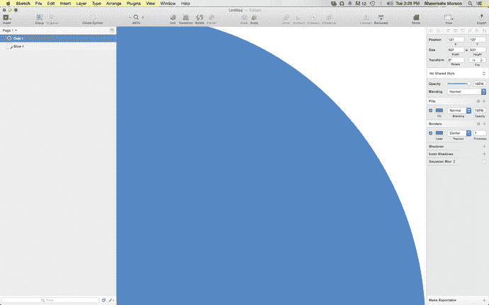
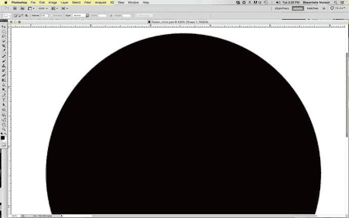

# 位图 vs. 矢量图

你可能会问自己：“那么，除了价格和用户界面之外，`Sketch` 与 `Photoshop` 到底有何不同？”了解并理解两者的区别是很重要的。需要明确的是，有些 `Photoshop` 能做的事 `Sketch` 根本做不到，而且它本身的设计初衷也并非去做那些事。`Sketch` 真正出色的地方在于界面设计。事实上，它似乎就是为此目的而专门构建的。因此，它为 UI 设计师提供了更丰富的、量身定制的功能集。

然而，一个主要区别在于，`Sketch` 是基于矢量的工具，而 `Photoshop` 不是。`Photoshop` 是一款照片编辑工具，并非为最佳的 Web 或移动端 UI 设计而设计。正如我上一本书（*《学习 iOS 开发的设计》*，Apress，2014 年）中所提到的，`Fireworks` 是最接近 UI 设计的合理替代品。但该应用未能流行起来，结果 `Adobe` 在 2013 年停止了对它的支持。

可以说，在 `Photoshop` 中，真正对 UI 设计有用的功能比例估计只有大约 20%。这意味着设计师们下载并使用着一个上次我检查时大小接近 1GB 的程序，而其中 80% 的功能对他们来说毫无用处，甚至根本不是为他们设计的。实际上，`Photoshop` 正如其名，本意是作为编辑和处理照片的工具。因此，它是基于**位图**的，意味着每张图像都由像素组成，这些像素被排列起来以显示图像。

位图的一大优点是它们能显示大量颜色，并允许编辑人员利用位图格式获得漂亮的照明和阴影效果。不幸的是，它们在放大显示时无法不损失画质。因此，它们会产生相当大的文件。试着放大一张位图，你会很快失去画质。放大观看会显示出组成图像的每一个独立像素。设计师们多年来都明白，`Photoshop` 最初是作为一款位图编辑工具开发的。的确，`Photoshop` 是由一些业余摄影师和程序员为了展示他们的摄影作品而创建的。有人会说，更合理的比较应该在 `Fireworks` 和 `Sketch` 之间。然而，当 `Adobe` 在 2013 年停止支持 `Fireworks` 时，这一点就变得没有意义了。该程序仍然作为 `Creative Cloud` 的一部分提供，但 `Adobe` 没有计划继续为其提供修复程序。

`Sketch` 是一款 100% 基于矢量的工具。**矢量**由点、线、曲线以及最重要的——数学构成。在第 3 章中，我们将看到 `Sketch` 如何允许设计师编辑数值来改变形状在屏幕上的显示方式。用肉眼观察位图和矢量图像时，它们看起来可能一样。但放大观看，你会发现，如前所述，位图由于是由像素构成的，放得越大，画质损失越严重。尤其是曲线，在位图上会显得模糊。而放大矢量图像则会呈现出不同的景象。无论放大多少倍，矢量图像都能保持其画质，无论尺寸如何变化，曲线都能保持清晰锐利。

为什么这很重要？因为设计师被要求为各种屏幕尺寸和分辨率进行设计的情况越来越多，尤其是在移动设备方面。使用 `Sketch` 创建的矢量图，你可以省去像在 `Photoshop` 中那样为适应市场上日益增多的屏幕尺寸和分辨率而进行 `@2×` 设计的麻烦。此外，`Sketch` 允许你以像素为单位进行设计，这恰恰是当今大多数界面的度量单位。

图 1-5 展示了放大观看时位图和矢量图像显示效果的区别。这对那些必须跨平台并为 Retina 屏幕（正迅速成为移动显示标准，尤其是 iOS 设备）进行设计的设计师来说，具有重大意义。

图 1-5.

在 Sketch 3 中以 400% 比例查看的矢量形状

请注意图 1-5 中在 `Sketch` 里创建的圆形形状曲线的平滑度。不放大时，矢量图和位图看起来差不多，可能很难区分。然而，一旦放大，你就会看到作为矢量的圆形曲线会异常锐利。

在图形学中，矢量形状是使用**贝塞尔曲线**创建的。通常，矢量形状有两个由控制柄控制的点。每个点都允许用户操纵曲线。最终结果根据点的位置绘制而成。当我们在第 3 章讨论形状时，会详细探讨贝塞尔曲线，但这就是处理矢量图以及它们如何保持锐利度的要点。矢量图可以缩放到任何尺寸，无论你放大多少倍或图像变得多大。这对设计师来说至关重要，并且它已成为 `Sketch` 的标志性特性之一。

图 1-6 展示了在 `Adobe Photoshop` 中创建的圆形形状。注意圆形那参差不齐的圆角边缘。位图是由像素构成的，一旦放大，或者如果图像尺寸增大，你会看到像素化现象在圆的边界处尤为明显。

图 1-6.

在 Adobe Photoshop 中以 200% 比例查看的位图形状

因为 `Sketch` 是一款矢量图形工具，在该应用中创建的任何形状在缩放时都能保持其画质。

作为设计师，拥有选择权很重要，而能够使用一款专门为设计师考虑而创建的工具至关重要。同时，需要注意的是，使用 `Sketch` 并不妨碍你继续使用 `Photoshop` 和 `Creative Cloud`。完全有可能两者都使用，而且我相信有些设计师确实两者都用。`Sketch` 为设计师带来的是一种全新的灵活性和更精细化的工作流程。如果作为一名设计师，你的重点是用户界面或图标设计，那么你必须考虑到，对一些人来说，`Adobe Creative Cloud` 的成本可能过于高昂。

长期以来，绝大多数设计师在工作中都偏爱 Mac 而非 PC，而且苹果公司对设计和创意的关注多年来一直备受赞誉。强尼·艾夫是全球创意设计师的现代英雄。他与史蒂夫·乔布斯的合作促成了世界上一些最具标志性产品的诞生。其中包括糖果色 iMac、时尚的白色 MacBook，以及最终的 iPhone 和 iPad。设计师们多年来一直崇拜艾夫，自从史蒂夫·乔布斯去世后，艾夫帮助公司保持在设计领域的前沿。`Sketch` 专门迎合设计师的需求，其价格点立即吸引了那些有兴趣尝试它的人。它与苹果公司的紧密契合使得设计师很容易探索这个新工具。

`Sketch 3` 的一个主要特点是速度。该程序只有 32MB，运行速度很快，因为它在配备 Retina 屏幕的新一代英特尔 Mac 上占用的处理能力更少。第 3 版还专门为 Mac 重新构建，并针对 OS X 进行了优化，对用户的需求响应迅速。它允许设计师使用其画板系统创建和查看整个项目，同时保持相对较小的占用量。任何使用过 `Photoshop` 的人都知道，对于包含大量屏幕的复杂项目，PSD 文件的大小很容易达到数 GB。

