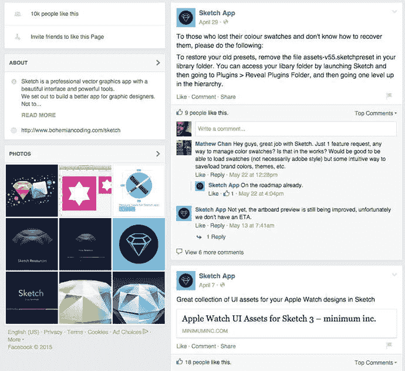
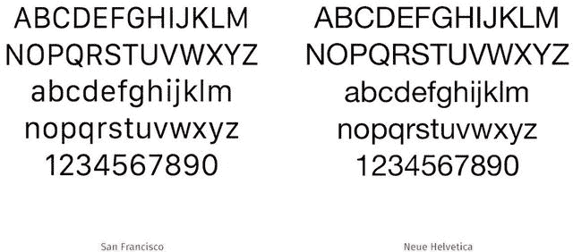
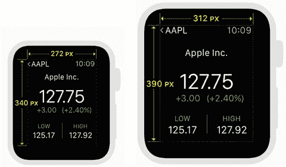
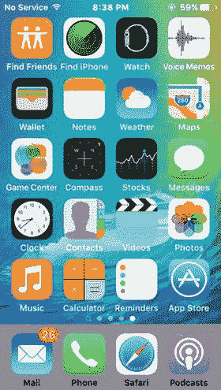

# Sketch 的独特优势

通过专为 Mac OS X 构建，`Sketch`能够免费适配一些功能。例如，我之前提到过移除了`Fontcase`。`Sketch`现在可以使用 Mac OS 内置的字体渲染引擎。再加上自动保存功能，便形成了一个令人羡慕的组合。直接从 Mac OS App Store 下载也不会带来任何不便。

## 社区

`Sketch`的另一个主要优势是它倾听广大社区的声音，这常常推动程序更新。这里有 Twitter 列表、Facebook 群组，甚至在线博客平台 Medium 上还有一份精心策划的文章列表（见图 1-7）。版本更新同时解决了社区成员关心的问题以及开发者关注的问题，而这些都建立在它们已为程序创造的坚实基础上。

图 1-7. Facebook 上的 `Sketch` 社区

`Bohemian Coding`网站自豪地列出了其他与`Sketch`集成的应用程序、专注于该程序的群组和网站，以及为任何想学习该程序的人提供的资源。他们还提供了一种基于订阅的新闻通讯，直接回答社区提出的问题，提供常见问题的帮助，并介绍有助于用户工作流程的插件。总而言之，`Sketch`社区相当资源丰富。除了免费资源，还有 Udemy 上的付费课程，甚至还有由`Sketch`设计师`Christopher Downer`在`TreeHouse`上教授的`Sketch`课程。

`Meng To`创建了这些独立课程中最受欢迎的之一。`Meng`是一位设计师，也是“设计师也应该会编码”这一日益壮大思潮的坚定支持者。他撰写了`Design & Code`，这是一本电子书，教设计师如何通过使用`Xcode`进行一些基础编码，来掌握 iOS 设计的精妙之处。在书中，他大力称赞使用`Sketch`和名为`Flinto`的在线原型制作工具可以轻松制作原型。`Meng`现在环游世界，开设现场课程，教授设计师如何使用`Sketch`设计应用，并使用苹果的新开发语言`Swift`构建它们。`Design & Code`促使我再次仔细审视`Sketch`——我很高兴我这么做了。

我一直觉得`Photoshop`的用户界面令人生畏。可用的工具数量之多，甚至成为我想要学习如何使用它的障碍。我从一些初次接触设计的设计师那里也听到了类似的故事。`Sketch`有一个精简的界面，与 Adobe 的另一款工具`Fireworks`更为相似。我喜欢`Fireworks`，因为它似乎和`Sketch`一样，是为设计师设计的；具体来说，是那些更专注于 Web 和移动应用用户界面设计的设计师。当我第一次打开`Sketch`时，我立刻感到舒适。我可以自定义工具栏，包含我最常用的工具。这让我能够在更少干扰的情况下花更多时间进行设计，这促使我尝试使用我所需要的特定工具。

`Photoshop`并非是唯一可以比较的对象。市面上当然还有其他设计工具。还有一些其他的小众图形程序，可以吸引那些正在寻找`Photoshop`替代品的设计师。像`Skala`这样的应用，对于正在寻找专为他们量身打造的差异化工具的设计师来说，是值得考虑的替代品。

特效是设计师会欣赏`Sketch`的另一个原因。此外，能够一次为一个图层添加多个效果，是对`Sketch`功能集的一个很好的补充。这包括模糊、反射、边框以及内阴影和外阴影。

使用`Sketch`进行导出，就像进行几次选择和点击几个按钮一样简单。可以以多种分辨率导出整个画板。如果你曾尝试在其他程序中导出设计，你会欣赏这个功能。

## iOS 9

`iOS 9`是 iPhone 操作系统的最新版本。关于其“引擎盖下”的改动已经说了很多，而有些人则认为这些改动基本上都是次要的。尽管如此，尽管`iOS 9`提供了一些可能不为人所见的优化，但它仍然是一个重要的更新。

你可能还记得，2013 年，苹果彻底改革了 iOS 的用户界面，自 2007 年第一款 iPhone 发布以来首次改变了外观。`iOS 7`为 iPhone 和 iPad 用户带来了完全不同的观感和体验。它摒弃了拟物化设计，转向了扁平化设计的趋势。它还引入了诸如“控制中心”之类的新工具，这是一个从屏幕底部向上滑动即可升起的面板，显示一个磨砂面板，提供对飞行模式、蓝牙和其他选项的便捷访问。新操作系统还为苹果引入了一种全新的“扁平化设计”语言。设计人员不得不接受，他们也确实这样做了。事实上，新的应用程序都具有`iOS 7`特定的观感和体验。

`iOS 8`通过添加`HealthKit`和`HomeKit`等框架进一步优化了用户界面。但这两者都没有代表设计语言的重大转变，也没有给设计师带来重大问题。

`iOS 9`于 2015 年秋季发布，是苹果移动设备操作系统的最新迭代版本。因此，你可能会问自己该期待什么，以及在使用`Sketch`进行设计时如何应对这些变化。好消息是，从设计的角度来看，需要设计师担心的变化并不多。`iOS 9`的核心在于为移动设备操作系统提供了更高的稳定性和修复，并对 iOS 的核心应用程序系列进行了更多更改。这些更改将为用户提供跨设备的更一致体验、错误修复、性能的显著提升，以及最引人注目的是，操作系统体积的显著减小。用户可以期待诸如多任务处理、新键盘、像`Apple News`这样的新应用，以及向`Apple Maps`添加公共交通信息等新功能。

虽然从设计角度来看这些变化并不显著，但设计师需要了解几个功能特性；这些特性不仅将改变用户与其设备的交互方式，还可能影响与应用程式的交互。

### 应用切换器

通过双击 Home 键仍然可以在应用之间切换；然而，这样做现在会显示所有当前打开程序的较新的垂直视图。用户可以像以前一样滑动浏览。

### 照片的新导航方式

现在，当在“相机胶卷”中浏览照片时，你可以简单地在一列照片上滑动，以更详细地查看其中一张。你不再需要单独点按每张照片。

### 新的返回按钮

添加一个允许用户返回上一个程序的返回按钮，标志着`iOS 9`中的一个新导航元素。该按钮允许用户无需按 Home 键即可导航回上一个程序。

### 新系统字体：旧金山（San Francisco）

iOS 的系统字体已更新。有些人可能还记得，iOS 曾大量使用 Helvetica 作为其官方系统字体。如今，这一字体已被苹果自创的字体“旧金山（San Francisco）”所取代。眼尖的人会注意到两种字体间的细微差别，但大多数人都认为这种差别并不显著（见图 1-8）。在设计界，关于旧金山字体是否更具“可读性”一直存在争议。苹果公司显然对此深信不疑。

**图 1-8.** 旧金山字体与 Helvetica Neue 字体

旧金山字体源于无衬线（San Serif）字体系列，包含两种不同的字体：SF 字体和 SF Compact 字体。SF 字体应用于 iOS 和 OS X 系统，而 SF Compact 字体则应用于 Apple Watch。两者虽有关联，但在圆角状态以及字母间距上有细微差别，后者略大，以提高旧金山字体的可读性。该字体还支持多种语言，如希腊语、越南语和波兰语。这套字型由苹果团队设计。

## Apple Watch

虽然 WWDC 通常是发布新操作系统的场合，但在 2014 年 9 月的一场特别活动中，苹果发布了一款新产品——Apple Watch。这自然在设计师圈中引起了轰动，也给 iOS 开发者带来了新的设计挑战。可以确定的是，新手表会运行在某个 iOS 版本上，事实也是如此。

迄今为止，自 2015 年 4 月正式发布以来，已有相当数量的 Apple Watch 应用进入了苹果 App Store。包括 Target、星巴克、eBay 和耐克在内的一些主要零售商，以及一些非主流商家，都已在该商店发布了 Apple Watch 应用。

Apple Watch 的推出，让几乎所有科技从业者都兴奋不已。苹果正朝着可穿戴设备领域迈出传闻已久的一步，凭借其对设计的执着，全世界不仅期待着手表的外观，更关注它的运作方式以及它将为设计师带来哪些挑战（如果有的话）。

如图 1-9 所示，Apple Watch 有两种尺寸：38mm 和 42mm（按高度计算）。因此，38mm 版本的屏幕分辨率大约为 340px x 272px，而 42mm 版本则为 390px x 312px。

**图 1-9.** Apple Watch 有两种尺寸：38mm 和 42mm

两种尺寸的 Apple Watch 都显示相同的内容，并利用动态排版（Dynamic Type）确保元素能够自适应调整以适配可用空间。

与苹果其他产品一样，Apple Watch 拥有自己的人类界面指南。如果你对为 Apple Watch 进行设计感兴趣，应该仔细研读这些指南。Apple Watch 在排版、颜色、自定义、图标和动画方面有着非常具体的设计原则。

Apple Watch 运行着名为 watchOS 的自有软件。目前版本为 2，它是 iOS 的修改版，且仅能在 Apple Watch 上运行。

本书不会深入探讨为 Apple Watch 进行设计的细节，但可以说，手表不仅为设计师开辟了新的领域，也带来了新的挑战。而且，和往常一样，网上已有 Sketch 的 Apple Watch 模板可供下载和使用。

iOS9 的其他变化还包括新增了“新闻（News）”等应用，并对“地图（Maps）”和“备忘录（Notes）”应用进行了功能改进。尽管 iOS9 在操作系统的整体设计语言上可能没有具体的改变，但注意这些应用（尤其是新应用）提供了新的信息呈现方式，这很重要。在其中，你能找到苹果设计语言未来走向的线索。对于刚接触 iOS 设计的设计师，建议仔细研究这些新应用，以了解其产品的最佳设计实践。例如，如果你刚开始学习，并好奇如何最佳实现分段控件（Segmented Control），除了人类界面指南，苹果自带的应用程序是学习如何成为一名优秀 iOS 设计师的最佳途径（见图 1-10）。

**图 1-10.** iOS9 中新旧自带的应用程序

目前，苹果自带的应用程序数量已达 29 个。除此之外，还有 11 个用户可以从苹果下载的附加应用。

## 总结

虽然 Sketch 最初是为 Mac 和 OS X 创建的，但对于有兴趣创建应用的设计师来说，Sketch 和 iOS 是一个绝佳的组合。借助 Sketch，为 iOS、watchOS 甚至 MacOS 进行设计的设计师如今拥有了一款专门为他们开发的工具。Sketch 的开发者曾反复表示，他们没有计划推出该软件的 Windows 版本。这意味着该程序将继续针对 Mac 用户进行演变。对于任何愿意花时间学习该程序，并深入为 iPhone 和 iPad 进行应用设计的人来说，使用 Sketch 为 iOS 进行设计是合理的。学习 Sketch 是很好的第一步。

在下一章中，我们将引导你安装 Sketch，并介绍其界面以及其他你在开始使用 Sketch 为 iOS 进行设计时需要了解的功能。

