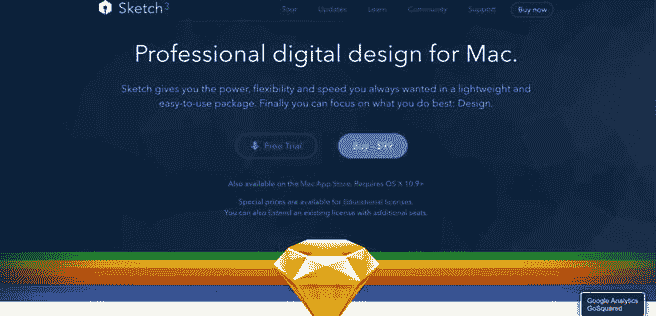

# Sketch 入门

Sketch 的最新版本是 Sketch 3（确切地说是 3.3.3 版本），本书假设你正在运行此版本。如果你使用的是旧版本，则需要更新。如前所述，Sketch 是一款仅适用于 Mac 的应用程序，需要 OS X（Mavericks）或更高版本才能运行。如果你运行的是较旧版本的 Mac OS X，也需要进行更新。

## 安装

要安装 Sketch，你可以直接从 Mac App Store 下载，或者直接从 Bohemian Coding 网站购买该应用，如图 2-1 所示。你也可以免费下载试用版。如果你使用的是试用版，试用期结束后，请前往程序中的 Sketch 菜单并选择“注册”。程序会要求你输入许可证密钥，从而引导你完成注册流程。无论你是从 Mac OS App Store 还是直接从 Bohemian Coding 购买 Sketch，其价格均为 99.99 美元。

**图 2-1.** 你可以直接从 Bohemian Coding 网站购买 Sketch 3

要安装从 Bohemian Coding 购买的应用，请下载它，并将该程序从“下载”文件夹移动到“应用程序”文件夹。你也可以直接双击下载的 `.DMG` 文件并按照说明操作。无论哪种方式，该文件都必须添加到你的“应用程序”文件夹中。

一旦文件位于该文件夹中，你就可以双击启动程序。这样就大功告成了！你现在已经安装了令人兴奋的新设计程序 Sketch，并准备好学习更多关于为 iOS 进行设计的知识了！

