# 开场介绍

打开程序后，您会发现 Sketch 的界面相当简洁。它被设计得尽可能精简，以便让您能完全专注于工作。没有浮动面板，您所需的一切都可以从界面内的三个主要区域轻松访问。这三个区域分别是：

顶部的工具栏、左侧的图层面板、右侧的属性检查器，以及屏幕中央的画布——您实际的设计工作都将在那里进行。

Sketch 提供无限滚动功能。这让您能对屏幕上显示的内容有极高的控制权。借助此功能，您可以在任意方向上无限滚动，并向画布添加任意多的内容，如图 2-2 所示。

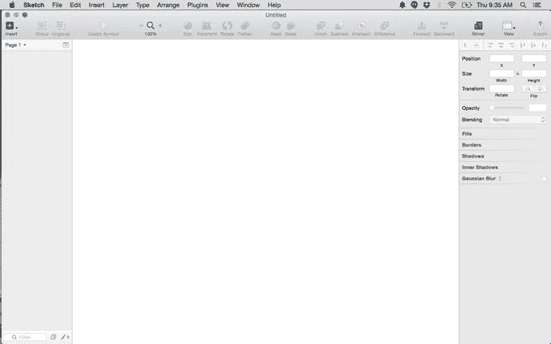

图 2-2. Sketch 3.3.3 版本界面

**提示**：如果您在画布上滚动到最左、最右或任何位置后迷失了方向，可以随时使用快捷键 `⌘1` 或通过 `视图` 菜单选择 `居中画布` 来返回您的设计。

## 画布

屏幕的中间区域称为画布。这是您花费时间最多的地方，因为您的设计实际上就存在于这个空间。您在属性检查器中所做的调整都会在画布区域中体现出来。

当您开始设计时，手头必须准备好 iPhone 的正确尺寸。如您所知，iOS UI 设计包含许多独特的元素，每个元素都带有苹果独特的触感。这些元素是 iOS 设计语言不可或缺的一部分。您可能已经安装了 San Francisco 字体，但那些赋予 iOS 标志性外观和感觉，使其与众不同、在与其他移动操作系统对比时脱颖而出的其他元素呢？这包括诸如 iOS 键盘、分段控件，以及从 iPhone 底部轻松滑出的控制中心等元素。您可能会问自己，我们需要从头设计所有这些元素吗？嗯，当然不必。

2014 年 3 月，Sketch 宣布将附带由知名设计工作室 Teehan+Lax 创建的 iOS8 GUI。Sketch 团队此前曾为 Adobe Photoshop 发布过 iOS 模板，因此设计师们对其精细的工作已很熟悉。

该模板包含一个精雕细琢、分层的文件，内含多个形状和图层。所有这些形状和图层都经过精心制作，重新呈现为 Sketch 的原生格式——矢量。更令人兴奋的是，这些形状和图层都是可编辑的。只要遵循 Sketch 的条款，设计师可以自由使用它们来创作新设计。对于有兴趣使用 Sketch 进行 iOS 设计的设计师来说，这简直是天赐之物。

Sketch 捆绑 GUI 的好处在于，设计师不再需要上网搜索并导入程序。现在只需点击几个按钮就能轻松访问。要访问该 GUI，请转到工具栏上方的 `文件` 菜单，选择 `从模板新建`，如图 2-3 所示。选择您设计所需的合适模板。您会看到 iOS App 图标和 iOS UI Design Mac App 图标等模板。选择 `iOS UI Design` 模板，然后就可以开始了。

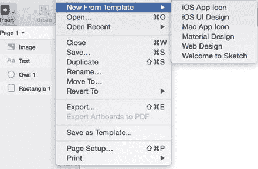

图 2-3. 在 Sketch 3 中访问 Teehan+Lax iOS8 GUI

打开菜单并选择 `iOS UI Design` 后，Sketch 将打开一个新窗口，其中包含模板以及所有元素、图层、组和矢量，如图 2-4 所示。图层和组已根据其在画布上对应的元素进行了命名。将鼠标悬停在图层列表中的某个元素上，将高亮显示画布上对应的元素。这里包含了您为 iOS 设计应用所需的所有 UI 元素。

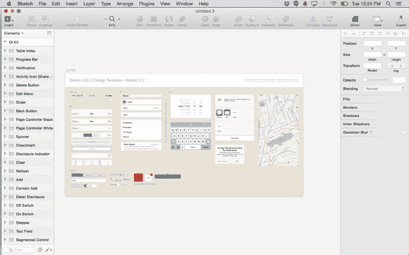

图 2-4. Sketch 3 中的 iOS UI 设计模板

如果您正在开始一个新的 iOS 设计或原型，可以直接从工具栏中将这些元素中的任何一个添加到您的画板，轻松上手。只需打开模板，转到：`插入` ➤ `符号`，然后选择要添加到设计中的单个符号。

由于画布完全不受约束，在为特定设备、屏幕尺寸和分辨率进行设计时，这可能会带来问题。如何为小屏幕与大屏幕设计？如何为 iPhone 与 iPad 设计？甚至如何为显示网站的显示器设计？这引出了我们对画板的讨论与探索。

## 工具栏

工具栏（如图 2-5 所示）包含了您进行设计所需的所有工具。您将使用工具栏来创建形状和添加图层。仔细查看工具栏，最左边的 `插入` 菜单是您看到的第一个按钮。`插入` 菜单用于创建形状、添加文本、图像、画板等。所有这些元素都将成为您使用 Sketch 创建的任何设计的构建块。

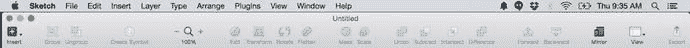

图 2-5. Sketch 工具栏显示在画布顶部

从左到右，工具栏中的其他元素如下。我们将在本书后面更详细地讨论每一项：

*   **编组** 和 **取消编组**：这些工具用于通过将选定的图层组合成组来保持文档的组织性。
*   **创建符号**：此选项用于将图层扁平化以创建符号，这些符号可以在页面或画板之间重复使用。
*   **缩放**：允许您按百分比指示放大或缩小画布。点击工具栏中放大镜旁边的加号或减号按钮将相应地调整画布。
*   **编辑、变换、旋转和展平**：您可以使用此工具以多种方式操作形状。
*   **遮罩和缩放**：此工具允许您将图层裁剪到形状，并调整其大小。
*   **联合、减去、交集和差集**：这些是布尔运算工具。
*   **前移和后移**：这允许您通过将各个图层置于前景或将其他图层移至背景来进一步组织设计。
*   **镜像**：此工具允许您使用 `Sketch Mirror` 应用在 iPhone 上查看您的设计。
*   **视图**：让您显示或隐藏各种视觉辅助工具，如标尺、网格和布局参考线。您也可以在此处调整网格和布局设置。
*   **导出**：此工具允许您以多种不同尺寸导出设计。

### 自定义工具栏

工具栏也可以根据您的喜好和工作流程进行自定义。一旦您知道哪些工具比其他工具使用得更频繁，自定义工具栏就会很有帮助。它使特定工具易于访问。

要自定义工具栏，请转到 `视图` 菜单并选择 `自定义工具栏`。一个包含所有代表操作的图标的窗口将滑下。您只需从下拉面板中选择图标，并将其拖入工具栏中的空白区域，即可将这些图标中的任意一个添加到工具栏中，如图 2-6 所示。将其拖入空间后，它会自动对齐到位。当您选择了所有想要的图标后，点击 `完成`，抽屉面板便会收起。不过，在本书的其余部分，我们将假定使用现有的默认工具栏。

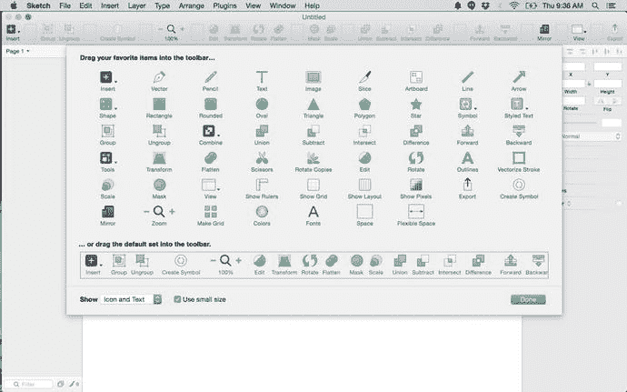

图 2-6. 通过从下拉面板中选择图标来自定义您的工具栏

## 图层

Sketch 中有几种不同类型的图层。图层是您应用程序的构建块。您将向图层中添加各种元素，以在应用程序中创建不同的视图。通常，一个图层将由形状、文本和图像的组合构成。Sketch 会在每个图层旁边显示一个小图标，告诉您该图层包含哪种元素。形状图层会有一个形状图标，文本图层会显示一个小的 AA，而包含图像的图层则会有一个小的图片图标。这些图标让您能够轻松识别每个图层的内容。

如图 2-7 所示的图层列表显示了画布上的所有图层，您可以在其中对它们进行组织。任何图层都可以被选中并在画布上移动。随着您添加更多图层，该列表会逐渐填充。如果您在画布上添加一个新形状，您将看到在顶部会创建一个新图层。Sketch 会根据您创建的形状自动命名该图层。图层可以相互重叠，您可以直接在图层列表中操作哪个图层显示在最上面或最下面。您也可以使用工具栏中的“前移”和“后移”按钮来实现这一点。

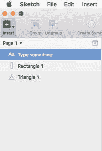

图 2-7. 图层列表显示了画布上的所有元素。

### 选择和移动图层

图层相当灵活，您可以随时在画布上移动它们。要选择一个图层，您可以在图层列表中选择图层名称，或者在画布上选择特定的图层。一旦您选中了一个图层，就可以在画布上移动它。您可以通过出现的白色控制柄来判断图层已被选中。这些控制柄允许您更改该图层中形状的形状和属性。选中图层后，您可以使用检查器中的位置属性（如图 2-8 所示）来移动它，或者使用鼠标在画布上拖动它。

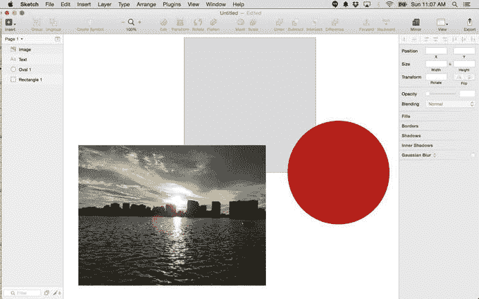

图 2-8. Sketch 画布上的一个图像和两个形状。请注意，每个对象在左侧的图层列表中都有一个对应的图层。

提示  
要每次以一个像素的增量移动图层，请使用键盘上的箭头键。要每次以 10 个像素的增量移动形状，请按住 `Shift` 键并按箭头键。

### 复制图层

在 Sketch 中，有多种复制图层的方法。在画布上右键单击图层，会弹出一个新的菜单列表，然后从该列表中选择“复制”。完成此操作后，您将看到图层列表中出现了一个新图层。新形状将出现在画布上被复制形状的顶部。您只需移动它即可。或者，您也可以通过按住 `Option` 键并单击并拖动图层来创建新图层以复制它。

### 隐藏和锁定图层

在设计时，有时需要隐藏图层，以便您可以有效地在特定图层上工作，而不会受到其他图层的干扰或阻碍。Sketch 让您可以轻松做到这一点。要隐藏一个图层，请将鼠标悬停在图层列表中单元格的右侧。会出现一个小的“眼睛”图标。出现后，点击它。您将看到对应的形状从画布上消失。但是，它仍会保留在图层列表中。任何被隐藏的图层，其文本会变灰，旁边会有一个眼睛图标。

出于类似的原因，您可能需要锁定图层。有时，设计师会锁定他们的背景图层，以防止它干扰他们在其他图层上的工作。由于背景不太可能改变，有时可以将其锁定，同时保持可见，以防止意外编辑。要锁定图层，请右键单击并从菜单中选择“锁定图层”。您将看到图层列表中对应的图层旁边会出现一个锁定图标。该图标表示该图层已被锁定，无法编辑。只需再次点击锁定图标即可解锁图层并允许其进行编辑。图 2-9 显示了一个隐藏的图像图层和一个锁定的文本图层。

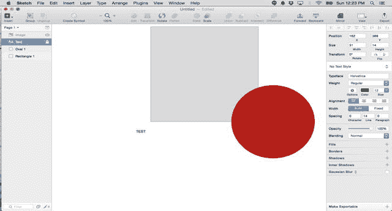

图 2-9. 画布上图像图层被隐藏，文本图层被锁定。

### 组

在您的图层中，您还可以创建组。组是组织设计的好方法。例如，如果您有多个图层构成了应用程序中的标签栏，您可能希望将所有元素分组。

要创建一个组，请选择您想要分组的所有图层。您可以通过选择并拖动一个框框住所有想要分组的元素来选择多个图层。或者，您可以按住 `Shift` 键并在图层列表中选择所有想要分组的图层。选中所有图层后，点击工具栏中的“分组”按钮。您会注意到图层列表中创建了一个文件夹。点击该文件夹将显示构成该组的各个图层。

组也可以嵌套。也就是说，在其他组内可以包含图层组。例如，如果在您的“标签栏”组中有五个图标，您可能希望在该组内创建一个图标组。那么图标组文件夹将位于标签栏组文件夹内。

提示  
您可以通过打开一个组并在画布上拖动它，将图层中的一组形状作为一个整体移动。

### 检查器

检查器位于用户界面的最右侧，如图 2-10 所示，它会显示画布上所选图层的各种属性。根据您选择的内容，它会显示诸如大小、颜色和样式等信息。检查器包含允许您查看屏幕上所选对象属性的工具。如果您选择一个图像，您将看到与该图像相关的属性。如果您选择文本，您将看到与该文本主体相关的属性。如果您在文档中更改任何内容，您会注意到检查器中的属性可能会并且将会发生变化。要编辑一个形状，您可以直接在检查器中工作以更改数值。这些数值包括位置和大小。

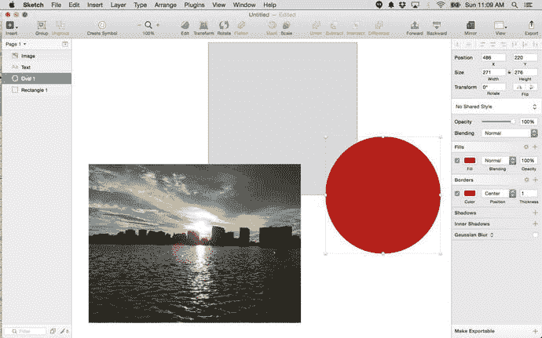

图 2-10. 选中一个形状并在右侧检查器面板中显示其属性的 Sketch 画布。

## 样式

您可以在检查器中调整与图层相关的样式。以图 2-9 中的圆形为例。请注意它是一个纯红色。该颜色与检查器中的“填充”设置相关联。“填充”设置旁边的复选框已被选中。该窗口中的颜色直接与圆形的颜色相关联。点击填充旁边的红色方块会弹出一个弹出窗口，其中包含该图层的多种不同填充选项。在弹出窗口区域内任意位置点击，即可更改图层颜色的深浅。您可以使用颜色区域下方的滑块来更改颜色，或调整其不透明度。取色器允许您对屏幕上 Sketch 内部或外部的任何颜色进行取样。在取色器下方，您还可以编辑 RGB 或十六进制颜色代码。

弹出窗口顶部的图标代表了填充纹理的不同选项。这些选项从左到右依次为：纯色填充、径向渐变、角度渐变、图案填充和噪点填充。

边框颜色也可以编辑，并可以更改其粗细以及其他设置。此外，还可以通过检查器面板中的选择来为您的形状添加阴影（外部或内部）。

### 智能参考线

在画布上移动形状时，可能会注意到偶尔出现的带有数字的红色线条。这些线条被称为智能参考线。它们能帮助您在图层中测量和对齐元素。数字会显示两个图层之间的距离，如图 2-11 所示，而参考线则能帮助您将一个图层与另一个图层对齐。

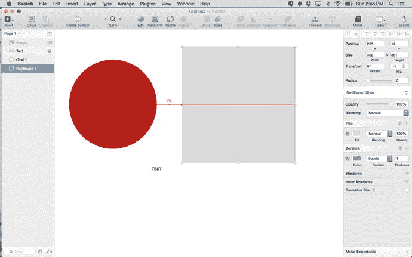

图 2-11. 智能参考线显示两个图层之间的距离

**提示：** 按住 `Option` 键的同时将鼠标悬停在两个图层上，会显示这两个图层之间的距离，以及它们是否对齐。

## 画板

如果您使用过 Adobe Illustrator，可能对画板的概念很熟悉。画板允许您为 Sketch 的无限画布定义边界。它会创建与特定设备或屏幕对应的设定尺寸，供您在其中进行设计。

您可以通过点击左上角的 `Insert` 按钮并从菜单中选择 `Artboard` 来在 Sketch 中创建画板。您可以创建自己的画板，或者幸运的是，对于为 iOS 进行设计的人来说，Sketch 附带了一些预设尺寸的模板，让您可以轻松上手。这样，您只需为设计选择合适的尺寸，就能直接开始工作。

您可以在 Sketch 的一个画板中创建整个应用程序，这非常有用。这是一种方便的方式，可以查看整个应用的外观，而无需为每个屏幕浏览多个不同的文件。它还为 Sketch 的无限画布增加了一些约束。画板会根据您所针对的设备，创建一个正确尺寸的边界。

从 `Insert` 按钮菜单中选择 `Artboard` 后，各种模板会出现在 Sketch 窗口的左侧。Sketch 提供了 iPad（竖屏、横屏和 Retina）以及 iPhone（竖屏、横屏和 Retina）的模板，如图 2-12 所示。此外，还有 iOS 图标的模板。

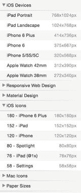

图 2-12. Sketch 3 中的预设画板模板

您会注意到，选择一个画板模板后，画布上会添加相应的画板，同时左侧的图层面板中也会出现一个图层。图层的标题将与模板相对应。要更改图层名称，您可以像重命名其他文件一样，双击它然后重新命名。

如果您为 iPhone 等设备选择了一个模板，Sketch 会创建一个尺寸与该设备匹配的画板。您还可以在一个画布上拥有多种画板。例如，如果您正在创建一个需要同时在 iPhone 和 iPad 上运行的通用应用，这将非常有用。在这种情况下，您可以添加 iPhone 和 iPad 的模板，并展示该应用在两个设备上的显示效果。这对于呈现您的作品来说是一种很好的方式。

您可以重新排列、复制甚至导出您的画板，以适应您的设计需求。在 Sketch 中，有几种复制画板的方法。您可以复制粘贴画板，然后使用参考线手动排列它们，或者使用 Sketch 方便的 `Make Grid` 功能。此功能只需点击几下就能复制画板。只需从菜单中选择 `Arrange`，然后从下拉菜单中选择 `Make Grid`，如图 2-13 所示。通过更改 `Rows` 和 `Columns` 字段中的数值来选择要复制的画板数量，完成后点击 `Make Grid`。Sketch 会根据您的选择自动复制画板，并将它们在画布上对齐。

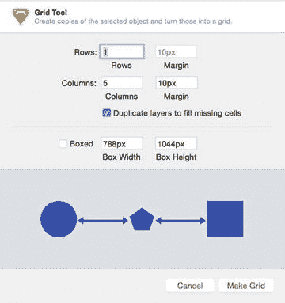

图 2-13. Sketch 3 中的 `Make Grid` 功能可帮助您复制和对齐画板

画布上的画板构成了您设计的整体结构。然而，有时您会希望或需要将画板分开。例如，如果您的设计极其复杂，并且希望使用多个画板来代表特定的流程，那么将设计分解成多个页面可能会更有好处。Sketch 支持这一功能。在画布的左上角，`Layers` 列表的上方，您会看到当前正在处理 `Page 1`。要添加页面，只需点击右侧看起来像向下箭头的按钮。点击后，该按钮会变成一个加号 (`+`) 符号，这样您就可以为您的设计添加后续页面。

## 标尺和参考线

首次打开 Sketch 时，您不会看到任何标尺或参考线。这是因为它们默认是隐藏的。您可以通过点击工具栏中的 `View` 图标来访问标尺。这会显示一个下拉菜单，允许您从标尺、网格和其他布局选项中进行选择，如图 2-14 所示。显示像素的选项也在这个菜单中。这些工具的目的是帮助您正确地对齐设计中的元素。

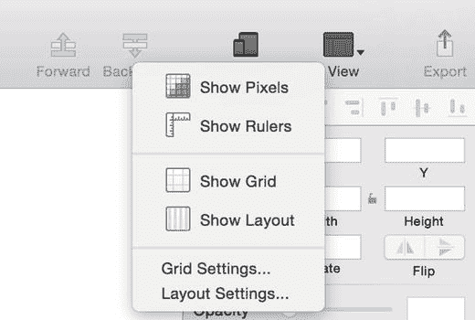

图 2-14. 从工具栏展开后的 `View` 菜单下拉选项

以下是各种选择及其含义：

### 显示像素

`Show Pixels` 选项将以像素模式在屏幕上显示您的元素。当您想了解基于矢量的设计在浏览器等环境中以像素形式呈现的效果时，这会很有帮助。

### 显示标尺和参考线

由于 Sketch 的无限画布特性，标尺不像其他图形设计程序中那样固定。这意味着您可以移动它们以适应您的设计。例如，如果您正在为预设画板模板中未包含的屏幕尺寸进行设计，您可以在画布上创建这些尺寸，并将其用作设计中的参考。当然，如果您移动了 Sketch 标尺的原点，原点之前的任何内容都会以负数显示。图 2-14 显示了一个调整了标尺的 Sketch 画布。如果因为某些原因需要重置标尺，只需点击水平和垂直标尺线相交的地方即可。这会将标尺恢复为其原始度量。

您可以通过点击标尺上的任意位置来在画布上添加参考线。参考线会显示为红色线条，并在您移除它们之前一直存在。图 2-14 已激活了参考线和标尺。水平和垂直标尺的原点也已调整。

### 显示网格

激活 `Show Grid` 功能后，画布上会创建网格线。这是一个典型的网格，由相交的线条绘制成方格，如同大多数图形程序中的常规设置。默认情况下，网格每 10 个方格会显示一条粗黑线。网格的默认大小为 20 像素。图 2-15 已激活网格功能。您也可以调整此设置。您需要返回 `View` 菜单，并从菜单中选择 `Grid Settings`。这将打开一个窗口，允许您更改网格块的大小和颜色，以及粗线出现的频率。

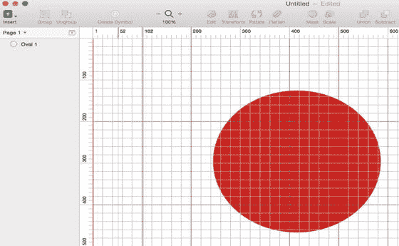

图 2-15. Sketch 画布上的网格线

### 显示布局

`Show Layout` 网格是 Sketch 中可用的另一种网格。它允许您定义列和行。如果您正在使用 Sketch 进行网页设计，您的网格设置会有所不同，您可能需要改用布局网格。这些网格也可以根据您的需求进行修改。

