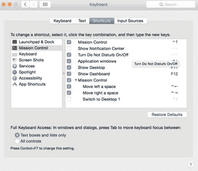
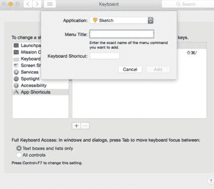
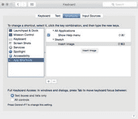

# 快捷键

在深入了解 `Sketch` 之前，你最好先学习它的一些快捷键。它们能极大地改善你的工作流程，并减少执行某些操作所需的时间。作为 Mac 用户，你很可能已经熟悉复制粘贴等通用快捷键。以下是从网络各处收集的 `Sketch` 快捷键综合列表。除了菜单中列出的快捷键外，你可以将此列表作为参考，直到你熟悉一些更常用的快捷键为止。

## Sketch 通用快捷键

*   `⌃L` 切换布局
*   `⌃G` 切换网格
*   `Enter` 编辑当前选中的图层
*   `⌘2` 缩放至选中图层
*   `⌘3` 在画布中居中选中图层
*   `⌘+` 放大
*   `⌘-` 缩小
*   `⌘1` 居中画布
*   `⌘2` 缩放选区
*   `Z` 缩放：按住并点击，或用鼠标拖拽区域
*   `⌥ Z` 反向缩放：按住并点击
*   `Esc` 退出当前工具或模式
*   `Space` 抓手工具
*   `Tab` 在当前组的图层间循环切换
*   `Shift + Tab` 反向循环切换

## 图层快捷键（插入）

*   `R` 矩形
*   `O` 椭圆
*   `L` 线条
*   `U` 圆角矩形
*   `T` 文本图层
*   `V` 矢量
*   `P` 铅笔
*   `A` 画板
*   `S` 切片

## 移动、隐藏和调整图层大小的快捷键

*   `⌥+ 拖拽` 复制图层
*   `⌥+ 悬停` 显示图层间距离
*   `⌥+ 缩放` 从两端缩放
*   `⇧+ 缩放` 保持宽高比
*   `⌘ Shift L` 锁定或解锁图层
*   `⌘ Shift H` 隐藏或显示图层
*   `...➔` 移动
*   `⌘...➔` 调整大小

## 文本与字体快捷键

*   `Cmd + B` 加粗
*   `Cmd + I` 斜体
*   `Cmd + U` 下划线
*   `Alt + CMD (+) +` 增大字号
*   `Alt + CMD (+) -` 减小字号

## 自定义快捷键

作为 Mac 用户，你可能也熟悉自定义快捷键。

*   `Control R` 切换标尺显示
*   `Control G` 切换网格显示
*   `Control P` 在像素和矢量之间切换
*   `Control L` 切换对齐参考线

你也可以为那些没有快捷键的操作创建自定义快捷键。因为 `Sketch` 被设计为在 Mac OS 中运行，所以你能轻松创建自己的快捷键。例如，你可能会留意到（也可能不会）`Sketch` 中的`插入图像` 并没有快捷键。你可以通过自己的键盘组合轻松创建一个快捷键。要创建自定义快捷键，请前往**系统偏好设置**并选择`键盘`。在窗口顶部的标签页中选择`App 快捷键`，如图 2-16 所示。

*图 2-16.* 你可以从电脑的“系统偏好设置”中创建自定义快捷键

做出以上选择后，点击窗口底部的“+”按钮。会出现一个新的下拉菜单，列出你电脑上所有应用程序。向下滚动并在该列表中找到 `Sketch`。在名为`菜单标题`的字段中，输入你想要创建快捷键的菜单项的确切名称，如图 2-17 所示。最后，在名为`键盘快捷键`的字段中，输入你新快捷键的对应按键，然后点击`添加`按钮。如果输入错误，你的快捷键将无法使用。

*图 2-17.* 为您的键盘快捷键创建菜单标题

一旦添加上，你会在该程序的快捷键列表中看到你新创建的快捷键，如图 2-18 所示。现在，你的快捷键应该可以在 `Sketch` 中使用了。你将能够从工具栏的下拉菜单中访问它。

*图 2-18.* 创建自定义键盘快捷键

至此，我们已经了解了完整的 `Sketch` 界面。因此，对于当你打开程序时屏幕上所见的一切的基本功能，以及按自己喜好自定义工具栏，你应该都相当熟悉了。如你所见，虽然界面简洁，但 `Sketch` 是一个功能强大的图形程序，它将使你的 iOS 应用设计成为一种愉悦的体验。

## 总结

恭喜！你已经安装了 `Sketch` 程序，并熟悉了画布、工具栏和检查器，甚至还学会了一些方便的键盘快捷键。这将是在 `Sketch` 中进行设计时，你花费大部分时间的地方。此后你做的所有事情都将在这个屏幕上进行，直到你的设计开始在画布上变得生动起来。

现在，你已经准备好进入下一章，与图形一起工作了。图形是你设计的基石。请继续阅读！

