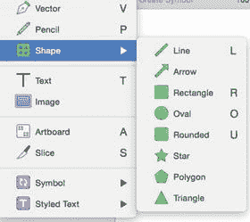

# 3. 为图形设置样式

到目前，你已经有了一些时间与 `Sketch` 界面互动并变得更加熟悉。本章重点介绍你可以用 `Sketch` 创建的图形。图形是你在 `Sketch` 中会用到的最重要的图层，你在 `Sketch` 中创建的每一个设计都将由你从`插入`菜单中选择的图形构成。它们是在 `Sketch` 中进行任何设计的基石。

正如第 2 章中提到的，你可以使用菜单中的`插入`工具将图形添加到画布上，也可以用鼠标、触控板或绘图板直接在画布上绘制。`Sketch` 中可以创建八种不同类型的图形：线条、箭头、矩形、椭圆、圆角矩形、星形、多边形和三角形。所有这些选项都可以在`插入 ➤ 图形`菜单中找到，如图 3-1 所示。有了这些图形，你几乎可以创建任何东西。

*图 3-1.* 点击工具栏上的`插入 ➤ 图形`会提供 `Sketch` 中可用的预设图形列表

一旦选择好你想要的图形，只需在希望图形出现的画布任意位置点击并拖拽鼠标。`Sketch` 将开始使用默认颜色创建该图形（通常填充为浅灰色，边框为深灰色）。当你松开鼠标按键时，完整的图形就创建完成并放在画布上了。你还会注意到图层列表会更新以反映该图层的名称（通常默认是图形名称加数字 1）。随着你继续添加未命名的图层，数字会以 1 的增量递增。只要该图形被选中，检查器也会更新以显示与该图形关联的属性。请特别注意`位置`、`大小`、`不透明度`、`填充`和`边框`中的值。如果你在检查器中更改或编辑这些值中的任何一个，`Sketch` 将自动更新图形以反映这些更改。

