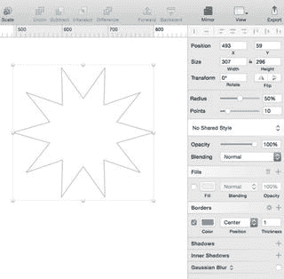

# 特殊形状

其中一些形状在`检查器`中具有特殊设置。例如，`圆角矩形`形状将具有用于编辑其圆角半径的额外`检查器`设置。将`半径`设置为`0`将没有圆角从而形成一个正方形，而最大设置为`40`将生成一个具有非常圆角的长方形。

> **提示**：要创建一个完美的正方形或圆形，请在创建形状时按住`Shift`键。这将约束形状的比例。

`星形`形状将具有额外的设置：一个`半径`和一个`点`设置在`检查器`中可用，它们将自动更新该星形上的点数以及该形状的中心半径。星形的`半径`指的是星形中心到顶点的距离。`点`指的是星形上的角点数。然而，星形的默认点设置是`5`。将点设置更改为最大值`50`将增加星形上的点数量。图 3-2 中的半径设置为 `50%`，点数设置为 `10`。

**图 3-2.** 一个 10 角星，半径为 50%

`多边形`形状也具有一个`点`设置，允许你将点数从默认的`5`更改到最大值`10`。

