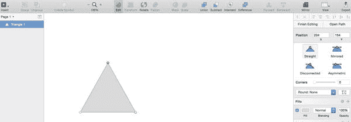
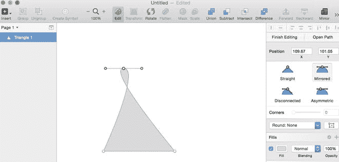

# 编辑形状上的点

要完全理解形状，你还必须理解点。点是形状的基本元素。也就是说，点构成了形状。连接两个点的线称为`路径`。因此路径结合两个点来创建形状。那么，一个形状就是点上的路径集合。

Sketch 还允许你编辑画布上现有形状的点。绘制形状后，选中它，你会看到允许你变换形状的白色手柄。这些手柄位于形状的顶部、底部和角落，允许你手动调整每个形状的大小。调整这些手柄将相应地增加或减少形状的高度和宽度。调整形状角落的手柄会同时改变高度和宽度。

但是，如果你在工作中发现想要移动形状中的实际点来改变它们该怎么办？只需双击该形状。你会注意到手柄消失，并变成点。根据形状的不同，会有多个点。当鼠标悬停在形状的交点上时，`钢笔`工具也会出现在画布上，如图 3-3 所示。

**图 3-3.** `双击形状即可调整点。请注意检查器中的贝塞尔曲线`

这将允许你根据在右侧`检查器`中选择的工具来编辑形状的点。你还会注意到，一旦形状的点变得可编辑，`检查器`中也会出现四个新的选项。这四种不同的模式允许你以各种方式操作这些点。这些模式是：`直线`、`镜像`、`分离`和`不对称`。在图 3-4 中，来自图 3-3 的三角形已使用`镜像`贝塞尔曲线进行了调整。

**图 3-4.** 一个三角形形状的点使用`镜像`模式工具进行编辑

## 直线模式

`直线`工具允许你沿直线编辑路径，控制点上没有手柄或曲线。

## 镜像模式

此模式提供两个相对且镜像的点，它们与主点的距离相同且角度相同。Sketch 将移除形状上的任何角。

## 分离模式

此模式创建两个相互独立的点。你可以更改每个手柄的点而不影响另一个。

## 不对称模式

此模式类似于`镜像`模式，但主点与控制点之间的距离将是独立的。

一旦你使点可编辑，你就可以单击任意两个点之间的线上的任何位置来创建一个新的编辑点，依此类推。

> **提示**：要退出此模式或任何其他模式，请按`Esc`键。

