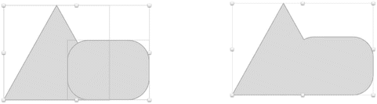

# 组合形状

有时，Sketch 的现成形状并非完全符合你设计中的需求，因此有必要组合形状以获得你想要的效果。Sketch 允许你组合形状以创建非开箱即用、或非立即可用的独特形态，方法是使用`插入`菜单。你可以通过将一个形状拖到另一个形状的上方或覆盖它，用鼠标同时选中它们，然后单击工具栏中的`联合`来实现。这样做会将两个形状合并。一旦它们合并，如图 3-5 所示，它们将像一个实心整体一样行动。

**图 3-5.** `一个三角形和一个圆角矩形在使用联合按钮组合前后的对比`

> **提示**：一旦两个形状被组合，它们在`图层`列表中会显示为一个组。文件夹图标表示一个组。如果你打开该文件夹，你可以再次访问这两个独立的形状并根据需要编辑它们。

