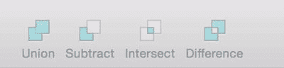
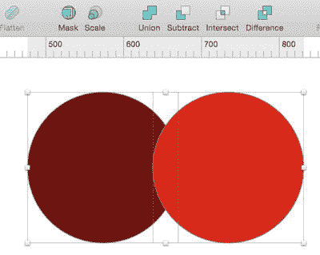
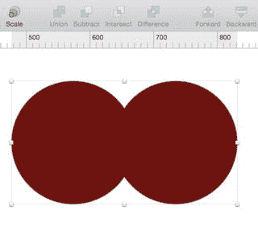
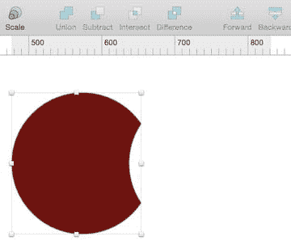
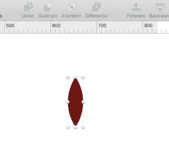
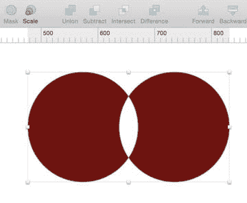

# 布尔运算

在设计过程中，有时您需要创建自定义形状。此外，使用矢量工具创建某些独特形状可能会有些挑战。有时，只有通过特定方式组合两个现有形状，才能创建这种独特的形状。这正是了解 Sketch 另一个便捷功能——布尔运算的绝佳时机。

许多图形程序（包括 Photoshop）都提供布尔运算功能。因此，如果您对 Photoshop 相当熟悉，应该对布尔运算这个术语及其含义不陌生。对于不熟悉 Photoshop 的用户来说，在设计软件中理解布尔运算的一个简单方法是：它们允许您创建由多条路径组成的更复杂形状。布尔运算可以将多条路径组合成更复杂的路径，并在此基础上执行操作。

在 Sketch 工具栏中，布尔运算的按钮被方便地分组在一起，如图 3-6 所示。它们代表在使用两个或多个必须以特定方式相互作用的形状时可以执行的操作。简单来说，这些操作包括`相加`、`减去`、`相交`和`排除`。这四种操作控制着特定图层、形状和路径之间的特定交互。

图 3-6. Sketch 工具栏中的布尔运算按钮

类似的概念也适用于 Sketch。这些按钮相关的图标，以及它们在工具栏中的分组方式，都是其用途的良好指示。为了说明布尔运算的效果，我们从两个并排的圆形开始，其中一个稍微与另一个重叠，如图 3-7 所示。然后，我们按住`Shift`键并依次选择每个形状，或者拖动一个选框同时选中这两个形状。您应该会看到每个形状周围出现控制手柄。

图 3-7. 两个略微重叠的圆形用于演示 Sketch 中的各种布尔运算。注意，两个形状均已被选中

## 相加

`相加`工具可以合并任意两个形状。要使用`相加`工具，先选中两个形状，然后点击工具栏中的`相加`按钮。顾名思义，两个形状将合并在一起，形成一个新形状。如图 3-8 所示，新形状将同时具有两个形状的属性。尽管如此，如果您需要，仍然可以单独编辑这两个形状。

图 3-8. `相加`布尔运算对我们的两个演示圆形产生的效果。两个形状已合并为一个新形状

## 减去

`减去`工具会遮罩重叠形状的区域，从而创建一个新形状，该形状是移除上方形状后，下方形状剩余的部分。由于我们的亮红色圆形覆盖在暗红色圆形之上，它已从结果形状中被减去。现在剩下的是暗红色圆形减去它与亮红色圆形重叠区域后的部分，如图 3-9 所示。

图 3-9. `减去`布尔运算对两个重叠圆形产生的效果

## 相交

`相交`工具会突出显示两个重叠形状之间的重叠区域，从而形成一个新形状。因此，看起来我们的两个圆形消失了，只留下了它们共同占有的区域。剩余部分正是由两者之前重叠的空间构成的，如图 3-10 所示。

图 3-10. 对两个重叠圆形使用`相交`布尔运算后产生的形状

## 排除

`排除`工具同样会突出显示两个重叠形状之间的重叠区域，但产生与`相交`工具相反的效果。产生的形状如图 3-11 所示。

图 3-11. 对两个相邻圆形应用`排除`工具后产生的形状

**提示：** 尽管 Sketch 工具栏中的图标表示的是对正方形和矩形的操作，但理解 Sketch 中布尔运算工作原理的一个好方法是，将每种操作想象成在重叠的圆形（最简单的形状）上产生的效果。

您也可以在图层面板中切换特定形状组的布尔运算。只需右键单击已应用布尔运算的图层，您会看到当前选中的运算以及一个下拉菜单，其中包含其他可应用的布尔运算。

