# 蒙版

蒙版功能有时会给新设计师带来问题。在 Sketch 中，蒙版是为原本单调的设计增添独特元素的绝佳方式。蒙版是一种形状，其他对象可以放置在其中。蒙版的一大优点是，您几乎可以使用任何形状来制作蒙版。例如，如果您希望一张图片看起来其轮廓被雕刻成特定的形状（如星形或圆形），就可以使用蒙版。这样一来，该形状就决定了蒙版的形状，并最终决定了被蒙版图片的显示方式。这种蒙版被称为轮廓蒙版。

当您在画布上应用蒙版时，所选组中的每个图层和形状都会受到该蒙版效果的影响。因此，如果您只想遮蔽特定图层而非其他图层，最好将这些图层移出该组。

例如，在图 3-12 中，您会看到画布上有三个项目。当您通过进入`图层`菜单并选择下拉菜单中的`用作蒙版`来应用蒙版时，除了被选中的项目外，所有其他项目都会从视图中“消失”。

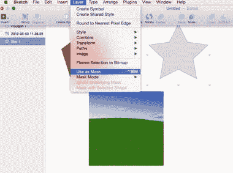

图 3-12. 从`图层`菜单中选择`用作蒙版`，可以让您使用一个形状来遮蔽其他形状

请放心，它们并没有真正消失。Sketch 正在将蒙版效果应用于要作为蒙版使用的图像之上的所有内容。发生这种情况时，它们会消失。然而，快速查看`图层`列表会发现，它们仍然位于画布上的原始位置。`图层`列表还会通过图层名称左侧的一个小圆点，明确指出哪些图层已应用了蒙版。

将鼠标悬停在图层上会高亮显示画布上的形状。如果您有一个属于蒙版组但不想受蒙版影响的图层，只需选中它，回到`图层`菜单，然后点击`忽略底层蒙版`。之后您应该能看到不受蒙版效果影响的形状，并且该图层上的小圆点也会消失。

## 轮廓蒙版

要查看蒙版效果的实际应用，只需将您的新形状拖到蒙版形状上，如图 3-13 所示。您会看到屏幕上，一个星形蒙版已被应用于图片。图片中落在星形之外的部分将不会显示。

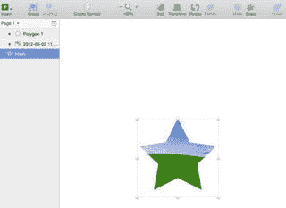

图 3-13. 应用了星形蒙版的图片

### Alpha 蒙版

Alpha 蒙版允许您将渐变效果用作蒙版。其工作方式与轮廓蒙版相同。要查看此效果，您需要从图层下拉菜单中选择`Alpha 蒙版`，然后需要在右侧的检查器中编辑颜色渐变和设置，因为渐变决定了填充内容，这与轮廓蒙版中的形状决定填充不同。接着，您可以根据想要创建的效果调整透明度并选择合适的渐变设置。

## 扁平化

扁平化是移除构成形状的路径和子路径层级的过程。如果您熟悉其他图形程序，可能已经养成了扁平化图层以减小文件大小并可能提升性能的习惯，因为较大的文件体积往往会拖慢电脑速度。在这方面，Sketch 也不例外。多个页面、画板和效果会显著拖慢运行速度。然而，如果您有一些包含多个子路径和交叉点的形状，将它们扁平化以保持图层的整洁与一致是个好主意，而且这样做也是良好的设计习惯。扁平化会移除多余的矢量点和贝塞尔曲线，同时也会使导出的文件更小。

## 缩放

在 Sketch 中，缩放有两种截然不同的方式。我们来讨论一下两者，因为它们会对您的形状产生截然不同的结果。如果画布上有一个特定形状，最直接的放大方法就是选择该形状并拖动手柄至所需大小。您会注意到，在调整形状边角时，检查器中的尺寸也会自动调整。但是，如果形状附带有轮廓或效果，那么拖拽缩放只会增加整体图像尺寸。实际的边框以及任何附加的相关效果并不会按图像比例增大。如果这正是您想要的效果，那没问题。但如果不是，您可能会想知道如何改变这一点。

如果您希望缩放形状及其关联效果（包括边框、阴影等），则需使用`缩放`功能。

您可以通过点击工具栏中的`缩放`按钮来访问该功能。选中后，会弹出一个窗口，允许您更改形状的尺寸。该窗口包含可编辑的字段（`高`、`宽`和`缩放比例`），您可以通过更改这些数值来相应地缩放图层。

图 3-14 展示了我创建的三个绿色矩形。从左到右，第一个矩形是原始形状。中间第二个矩形是通过拖拽手柄创建的，大小约为原始矩形的两倍。最右边的第三个矩形是使用`缩放`功能并将缩放比例从 100% 增加到 200% 创建的。注意第二个和第三个矩形之间的区别：第三个矩形的边框随形状大小按比例增粗，而中间矩形的边框大小与原始矩形相同，尽管矩形本身变大了。

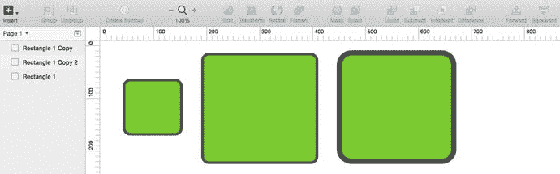

图 3-14.

`Sketch`的缩放功能演示

## 样式

现在您已经了解了界面和样式设置，我们将深入探讨检查器的细节与功能，以及如何为设计中的形状和图层应用各种样式。您的设计很可能包含图像和图形。自然地，它们也会包含多种填充和边框，所以我们先从这些开始。

### 填充

虽然我们在之前讨论检查器时简单提过填充功能，但现在我们将更详细地探索它。如前所述，大多数样式设置都在位于 Sketch 画布右侧的检查器中完成。填充有一些与之关联的额外属性。具体来说，当您在画布上创建了一个形状后，只需确保填充属性旁边的复选框已勾选，并点击旁边的默认灰色色板，即可轻松更改填充属性。这将打开颜色选择器，让您能从色谱中选取几乎任何颜色作为画布上选中形状的填充色。如果未激活其他任何选择，形状会立即自动更新为纯色。

当然，还有其他类型的填充，当您选择一个填充并打开颜色选择器弹窗时，它们都会作为图层样式的选项出现。除了`纯色填充`之外，还有`线性渐变`、`径向渐变`、`环形渐变`、`图案填充`和`噪声填充`，如图 3-15 从左到右所示。接下来是对每种渐变类型的解释。

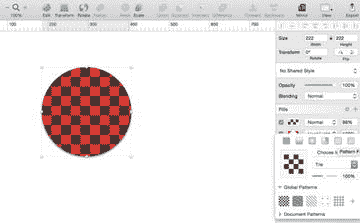

图 3-15.

`椭圆上的图案填充样式` 提示

要了解每种填充类型的名称，请将鼠标悬停在对应的方框上。稍等片刻，就会弹出显示填充名称的提示框。

#### 图案填充

此功能允许您将图像或带有图案的选区用作填充。这是一种为设计增添纹理的好方法。Sketch 还附带了一些预设纹理，您可以直接用在设计中。图 3-15 展示了一个`图案填充`样式的示例。

### 噪点填充
图 3-16 展示了一种噪点填充样式的示意图。
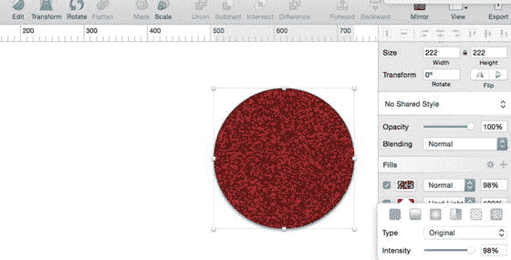
图 3-16. `椭圆上的噪点图案填充`

Sketch 允许你添加多个层次的填充，同时也允许你在同一图层上组合使用填充、颜色和渐变。

现在请注意图 3-17，在检查器面板弹出窗口的底部有一行字段。从左到右依次是 `Hex`、`R`、`G`、`B`、`A`。`Hex` 代表十六进制代码，是 HTML 和 CSS 中颜色的数字表示。每种颜色都有不同的十六进制代码。`Hex` 字样上方的字段是 Sketch 允许你输入特定颜色十六进制代码的地方，从而无需使用取色器。这些字母分别代表红、绿、蓝三种颜色。取色器下方的这些字母也表明 Sketch 当前处于 RGB 模式。

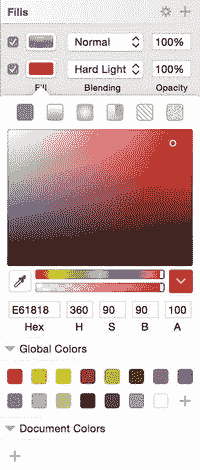
图 3-17. 检查器中展开的填充属性弹出窗口，显示了已保存的色板、十六进制代码、取色器、混合、不透明度选项和渐变

有时，你可能会看到取色器下方显示的是字母 `H`、`S` 和 `B`，如图 3-17 所示。`H`、`S` 和 `B` 分别代表色相、饱和度和明度。

如果在取色器内移动光标，你会注意到下方字段（`R`、`G`、`B` 或 `H`、`S`、`B`）中的数值会发生变化，十六进制代码也会随之改变。如果处于 HSB 模式，将指针向上移动会增加明度，从左向右移动则会增加饱和度。通常，在设计时你会希望使用 HSB 模式。

> **提示**  
> 按住 `Shift` 键并点击字母，即可在 RGB 和 HSB 模式之间切换。

你也可以保存经常使用或计划在未来使用的颜色色板。Sketch 会自动允许你通过点击取色器窗口右下角的加号（`+`）按钮，将颜色色板保存在取色器正下方。Sketch 也允许你通过取色器工具保存颜色色板。这让你可以从屏幕上的任何位置选取颜色，甚至包括程序外部。

### 渐变
渐变是一种从一种颜色过渡到另一种颜色的填充类型。使用渐变工具时，Sketch 会显示过渡点，你可以在画布上直接编辑这些点。

#### 线性渐变
顾名思义，线性渐变工具允许你创建沿一条直线从一种颜色到另一种颜色的逐渐混合。如果你选择了这种渐变，你会在画布的图层上看到两个可编辑的点。拖拽每个点可以调整渐变上的点。你也可以使用检查器中的渐变条来调整渐变中的点。你还可以通过单击线条上的任意位置来添加新的点。每个点都代表图层中渐变的一个颜色停止点。这些点允许你编辑和调整图层上渐变的平滑度。要删除线条上的某个停止点，请按 `Delete` 键。线性渐变样式如图 3-18 所示。

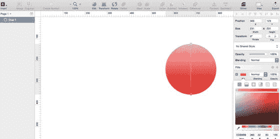
图 3-18. 线性渐变样式

#### 径向渐变
径向渐变工具会在你的图层上添加一个较大的圆形。在这个较大的圆形内，会有两个点：一个位于中心，用于设置半径的中心点；另一个位于半径之外，用于控制其大小。径向渐变工具使用圆形图案或运动方式，从一种颜色过渡到另一种颜色。你也可以在画布内扩展渐变的半径和形状。径向渐变工具如图 3-19 所示。

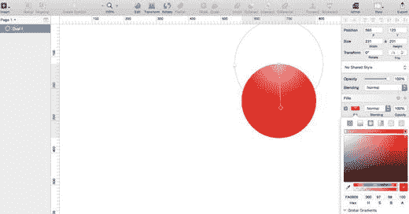
图 3-19. 径向渐变工具

#### 环形渐变
环形渐变工具会围绕图层的中心点顺时针进行颜色过渡。环形渐变工具如图 3-20 所示。

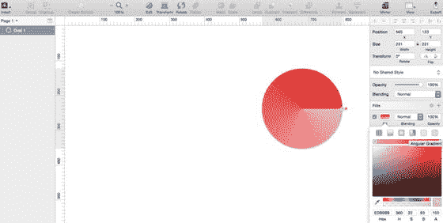
图 3-20. 环形渐变工具

#### 角度渐变
角度渐变工具会围绕一个特定点逆时针方向从一种颜色过渡到另一种颜色。

## 混合
Sketch 中提供了多种不同的混合选项。要查看所有选项，你需要点击混合选项上方的字段。下拉菜单会显示所选形状可用的所有混合选项列表。

### 不透明度
Sketch 中的不透明度设置是图层特定的，这意味着每个图层不仅有自己的填充样式和设置，而且还可以有不同的不透明度层级。你可以通过点击数字并调整 `Opacity` 标签上方的数值（以百分比表示）来调整相应图层的不透明度级别。

Sketch 的一大优势是能够为同一图层添加多种效果。因此，你可以为一个图层添加任意数量的填充。它们会从下到上层层堆叠。要添加一个填充，只需点击检查器中填充部分右侧的 `+` 按钮即可。

### 阴影
阴影在设计中的效果很棒，因为它们能让你的设计更具立体感。即使你在进行扁平设计，阴影也有助于使设计中的某些元素更加突出。即使在扁平设计中，你也必须考虑光线和角度等元素，这些元素使得某些元素实际上需要阴影——即使它很微妙。

虽然扁平设计明确摒弃了恼人的“投影”，但最近在扁平设计中使用长而扁平的阴影的趋势已经变得流行起来。这种效果在增加深度的同时，仍然保持了“扁平”的效果。不过，在大多数情况下，你可能会在设计中最少地使用阴影，尤其是在为 iOS 设计时。

Sketch 的阴影设置位于检查器中，这对图形程序来说非常典型。你可以更改阴影出现在 `x` 或 `y` 轴上的位置、模糊程度和扩展范围的设置。相同的设置也适用于内阴影。

> **提示**  
> 扩展功能不适用于文本图层。

## 模糊
Sketch 有四种不同的模糊效果模式：高斯模糊、动感模糊、缩放模糊和背景模糊。我们现在分别讨论它们，并将展示其中几种模糊效果的示例。

### 高斯模糊
高斯模糊是大多数图形程序的基本功能，用于减少图像中的噪点和细节。该效果会在受影响的图层（通常是图像）上产生均匀、平滑的模糊效果。高斯模糊效果以及所有其他模糊效果都可以在检查器的右下角找到。它是 Sketch 可用的额外模糊效果列表中的第一个选项。你可以使用选择此效果时出现的滑块，以像素为单位调整模糊量。图 3-21 显示了左侧的原图，以及右侧应用了 4 像素高斯模糊效果的同一张图片。

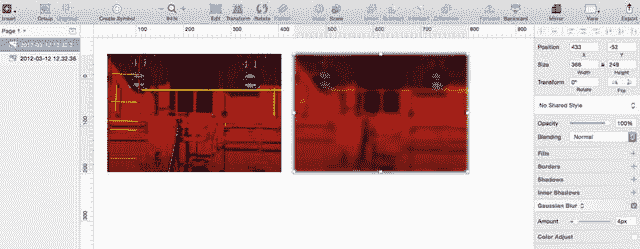
图 3-21. 左侧为原图，右侧为应用了 4 像素高斯模糊效果的同一张图片

### 运动模糊

顾名思义，`Motion Blur` 效果能营造出物体正在运动的感觉。该效果允许你沿特定方向进行模糊。与 `Gaussian Blur` 一样，从下拉菜单中选择此效果后，你可以使用提供的滑块以像素为单位调整模糊量。选择此选项后，你还可以使用出现的转盘来调整模糊角度。`Motion Blur` 效果如图 3-22 所示。

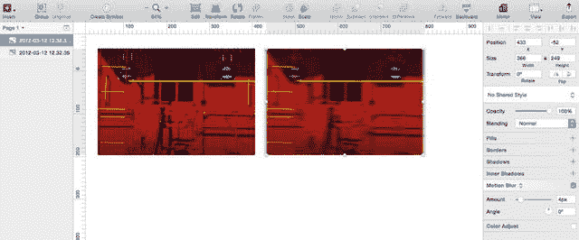

图 3-22. 左侧为原始图像，右侧为应用了 `Motion Blur` 效果的效果

### 缩放模糊

`Zoom Blur` 效果允许你从指定点向外模糊图层。选择此模糊效果后，Sketch 会提供选项，让你编辑模糊的起始点以及模糊的像素量。`Zoom Blur` 效果如图 3-23 所示。

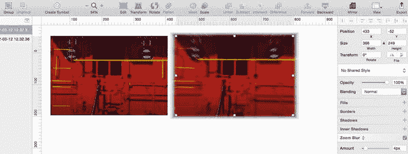

图 3-23. 左侧为未应用任何效果的普通图像，右侧为应用了 `Zoom Blur` 效果的同一图像

### 背景模糊

`Background Blur` 效果是波西米亚编码团队在 iOS7 重新设计后特别添加的。该效果在 iOS 系统中被广泛使用，因此你完全可以在应用设计中放心使用。它会使形状后方的背景变得模糊，但形状本身保持清晰。当你降低目标图层的不透明度后，该效果的表现最佳，否则很难看清效果。

`Background Blur` 效果会显著消耗你的计算机资源。你会发现它拖慢程序乃至整个电脑的速度。因此，明智的做法是谨慎使用它。

**提示**：`Background blur` 功能可用于创建“磨砂玻璃”效果，就像 iPhone 主屏幕上从底部向上滑出的控制中心一样。

## 共享样式

在你的设计生涯中，有时你会希望将相同的样式（如阴影、填充等）应用于特定形状或对象。使用 Sketch，只需几个简单的步骤就能实现。但首先，为什么要这样做呢？作为 UI 设计师，你深知在设计界面时速度和效率至关重要。你无疑会遇到需要同时发挥这两点的情况，并且你不仅需要是一名熟练的设计师，还要是一位快速高效的设计师。

共享样式可以帮助你做到这一点。例如，当你有一个已应用了某些样式的形状，并且需要将相同的样式应用于另一个不同的形状时，首先，你可以使用 `option+⌘+c` 组合键将一个对象的样式复制到另一个对象。这将复制一个对象的样式。然后，导航到新对象，选中它，并按 `option+⌘+v` 组合键将样式附加到新对象。请注意，这仅仅是简单地将样式从一个对象复制到另一个对象。但这两个对象彼此之间仍然是独立的。

如果由于某种原因你需要在多个对象之间共享一种样式，那么你应该使用 Sketch 的 `Shared Style` 功能。这允许你创建一个新样式，并将其归属于任何一个或一些新对象。该功能的妙处在于，一旦你创建了一种样式并将其附加到一个对象上，对该样式的任何后续更改都会更新所有附加了该样式的对象。

要创建新样式，只需点击检查器中显示为 `No Shared Style` 的下拉菜单，如图 3-24 所示。你可以在此处创建新的共享样式，它将自动与所选对象关联。

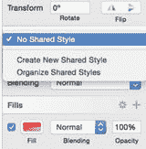

图 3-24. 点击检查器中的 `Shared Styles` 下拉菜单创建共享样式

图 3-25 显示了两个并排的图像。一个椭圆附有样式，另一个则没有。要将样式附加到新椭圆上，你必须选中该椭圆，然后从检查器的样式下拉菜单中选择所需的样式。该椭圆将自动应用新样式，并且之后对该样式的任何其他更改也会自动更新，如图所示。这些样式可以随时更新、删除或更改。只要一种样式已归属于某个对象，它们就会随该样式的更新而更新。

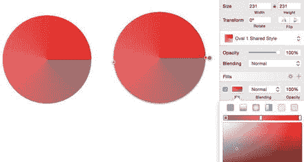

图 3-25. 两个对象使用同一个正在更新的样式

## 图像

正如本书第一章所述，Sketch 主要是为那些希望为网页和移动设备创建用户界面的设计师而设计的。由于它允许设计师处理矢量图形，因此 Sketch 可能不是图像编辑的最佳选择。如前所述，Photoshop 的初衷就是图像编辑。因此，在这种情况下，当你需要进行严肃的图像编辑时，我建议使用 Photoshop 或其他任何值得替代的软件。

话虽如此，Sketch 中也有一些相当不错的基础图像编辑工具，供你临时处理与图像相关的事务。

**提示**：选择多个图层后，可以通过从 `Layer` 菜单中选择 `Flatten Selection to Bitmap` 来将它们合并为位图。

Sketch 在 3.X 版本中改进了其图像编辑能力（特别是针对位图），并增加了图像编辑工具的数量。当你在画布上选择一个图像或位图并双击它时，图像编辑工具就会被激活。你会注意到检查器会更新，显示专用于图像编辑的工具。图 3-26 展示了一个选中的图像以及显示出的图像编辑工具。

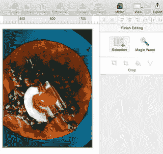

图 3-26. Sketch 中全新改进的位图编辑工具

可用于编辑位图的工具如下：

- **选择**：此工具允许你在图像上的任意位置选择一个矩形区域。
- **魔棒**：此工具允许你通过点击并拖拽来选择图像内的一个区域。
- **反向**：此工具允许你反转之前的任何选区。
- **裁剪**：此工具允许你选择图像的一个区域，并排除选定区域之外的任何内容。
- **颜色**：此工具允许你选择一个区域，并用从可用取色器中选择的任何颜色填充它。
- **矢量化**：此工具会将选定区域转换为一个独立的形状图层。

## 颜色调整

虽然 Sketch 编辑照片的能力有限，但你仍然可以进行一些微调。如果你需要调整图像或位图的颜色，Sketch 允许你通过移动 `Color Adjust` 面板中的滑块来调整图像的 `Hue`（色相）、`Saturation`（饱和度）、`Contrast`（对比度）和 `Brightness`（亮度），该面板如图 3-27 所示。导入图像后，点击检查器右下角 `Color Adjust` 标题旁边的复选框，即可调出 `Color Adjust` 滑块。

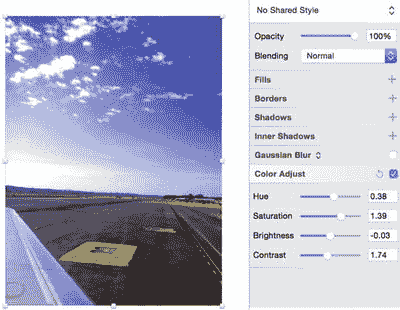

图 3-27. 使用 `Color Adjust` 工具调整后的图像

样式化形状是使用 Sketch 进行设计的一个重要部分，它能为你的设计赋予个性和独特的风格。请花些时间来熟悉每一种样式——实际上有很多——以了解它们如何提升你的作品。尽情实验、混合和搭配吧。

## 总结

形状几乎是所有设计的基石，既然你已经了解了如何通过可用的效果和样式来自定义形状，那么你已经走上了正轨。在进入下一章之前，花些时间练习一下你刚刚学到的样式和功能吧。

在下一章中，我们将讲解符号和文本，这将为你的设计增添一个激动人心的新维度。

