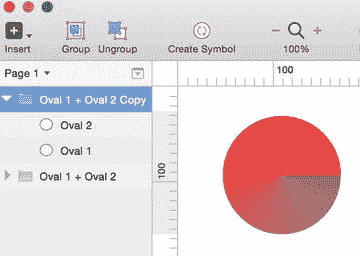
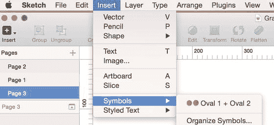
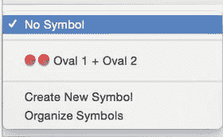
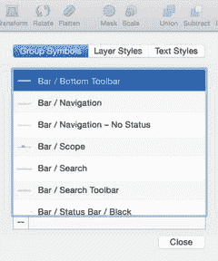

# 4. 符号与文本

在上一章中，你学习了如何在对象间共享样式，并且使用了 `option++c` 和 `option++v` 键盘组合键来在对象间复制和粘贴样式。这是在多个对象间共享样式的一种有用且简单的方式。在本章中，我们将讨论符号（Symbols），这是 Sketch 3 的一个功能，它将样式共享提升到了一个全新的水平，并将极大地改进你的工作流程。

符号是 Sketch 3 的新功能，也是设计师在新版本中最期待的功能之一。符号功能允许你选择并重复使用设计中的对象组，这些对象可以跨页面甚至跨画板。对设计师来说，符号功能是一个颠覆性的改变。

`SmartObjects`（智能对象）是 Photoshop 中最接近 Sketch 中“符号”的功能。它们使设计更简单，并允许你对图像或对象进行非破坏性编辑。通过在 Photoshop 中将图层转换为智能对象，你在设计中获得了更大的灵活性。

那些熟悉 Fireworks 的人会记得，一切都是上下文相关的，你只需点击图层即可进行编辑。属性面板会更新（就像在 Sketch 中一样），然后你就可以继续编辑那个图层了。Fireworks 还能够将样式应用于主页面，然后该主页面将控制文档中的某些样式，即使这些样式分布在多个不同的页面中也不行。这些是与 Sketch 中的“符号”最接近的功能。

在设计用户界面（UI）时，无论是用于移动端还是 Web 应用，屏幕上都必然会有许多可重复的元素。菜单栏、图标和按钮是其中最常见的。作为设计师，我们会经历设计中许多元素的多次迭代。如果被迫逐一更改每一个元素，那将是极其耗时且低效的。符号功能极大地减少了设计中页面和画板之间的重复性工作。我认为 Sketch 中的符号功能更接近于 Fireworks 中的样式功能，而不是 Photoshop 中的 `SmartObjects` 功能。

要理解符号功能的工作原理，从元视角审视你的设计会有所帮助。缩小视图，以便你能够在一个视图中看到多个画板。寻找设计中可重复的项目。哪些元素在多个屏幕、画板甚至页面上反复出现？你会发现有些对象会出现在每个屏幕上。按钮、标题栏和标签栏都是常见的。

虽然你可以复制一个屏幕及其完整的元素，但仅仅复制一个画板或复制一个样式并不能更新所有元素。如果客户要求稍微改变颜色或大小，你就得更新所有图标，那该有多繁琐？

我们在第 2 章讨论图层时已经讨论了编组。你可能还记得，编组由许多图层组成，这些图层可以根据它们的上下文进行组合。你可以通过选择要编组的图层，然后点击工具栏中的“编组”图标来完成操作。当图层在图层列表中合并成一个带有文件夹图标的组时，你就知道编组已完成。点击这个图标将显示该编组中的所有图层。

理解编组对于理解符号很重要，因为符号是图层的另一种编组形式。与编组一样，符号在图层列表中也由一个文件夹表示。但是，如图 4-1 所示，这个文件夹是紫色的，而不是蓝色的。该图像显示了一个由蓝色文件夹指示的图层编组，以及一个由紫色文件夹指示的符号。你还可以在工具栏中看到“编组”、“取消编组”和“符号”按钮。

图 4-1. 图层列表显示了一个编组后的图层集合，以及一组已制成符号的图层

要创建一个符号，你只需选择构成该符号的所有图层，然后点击工具栏中的“创建符号”按钮。

**提示：** 创建符号的另一种方法是转到“图层”菜单并选择“创建符号”。

如果你选择了多个单独的图层，Sketch 会将它们合并成一个组，并在右侧的图层列表中创建紫色文件夹。现在符号已经创建好了，你可以自由地在你设计的各个页面和画板中使用和重复使用该符号。请注意，符号不能跨不同文档中的不同设计使用。如果你希望在设计中重复使用该符号或任何其他符号，你需要转到“插入”菜单，然后从下拉菜单中选择“符号”，如图 4-2 所示。

图 4-2. 插入符号菜单

也可以从一个已有的编组创建符号。只需从图层列表中选择该编组，然后在屏幕右侧的检查器中选择“创建新符号”，如图 4-3 所示。那里的下拉菜单会提示你当前选择的图层不是一个符号，并显示可用符号的列表。一旦你创建了多个符号，你也可以从这个菜单中对它们进行整理。

图 4-3. 可用符号列表及其他符号选项

如果你在处理一个大型设计项目，你可能会发现自己在整个设计过程中创建了大量的符号，数量可能会变得非常庞大。Sketch 通过“管理符号”选项让你轻松地整理符号。你可以通过“插入 ➤ 符号 ➤ 管理符号”菜单访问该选项。“管理符号”选项允许你查看文档中所有符号的列表。然后，你可以重命名符号，甚至从这个菜单中删除它们以便于追踪。此外，还可以从这个菜单中整理所有符号。只需从“插入 ➤ 符号”菜单中选择“整理符号”，就会弹出一个窗口，提供按你所需方式整理符号的选项。图 4-4 所示的“整理符号”窗口是一个方便的工具，可以让你对所有符号进行排序。

图 4-4. 整理符号窗口

**提示：** 来自“整理符号”菜单的符号是按字母顺序列出的。

