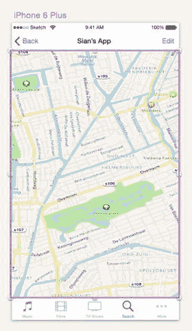

# iOS 模板符号

在第 2 章中，我们讨论了 Teehan+Lax 设计的 iOS 设计元素模板，这些模板现已包含在 Sketch 3 中，并介绍了它们将如何让您在为 iOS 进行设计时更加得心应手。值得注意的是，这些 UI 元素中的大部分都已作为符号添加。除了标签栏和背景之外，所有各种 iOS UI 元素都是符号，并在图层面板中显示为紫色文件夹。这意味着，当您使用这些元素构建页面时，您将能够在各个设计页面和画板中编辑和更新这些符号。下面让我们来了解一下这些符号，并使用 iOS 模板中的一些符号为基本应用设置一个画板。

首先，从 iOS 模板创建一个新画板，方法是选择您要设计的设备的尺寸。我将选择 iPhone 6 Plus。选择设备尺寸后，Sketch 会在画布上添加一个合适尺寸的新画板。现在，您可以使用地图、标签栏、状态栏等项目填充它。这些符号可以组成一个基本的应用页面，如图 4-5 所示。

图 4-5. 使用 Sketch 3 内置的 iOS 模板中的符号创建的简单 UI

