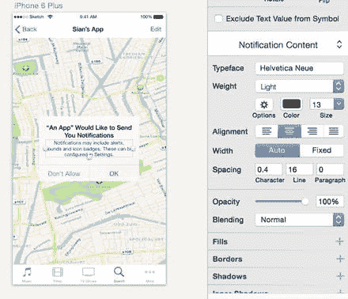
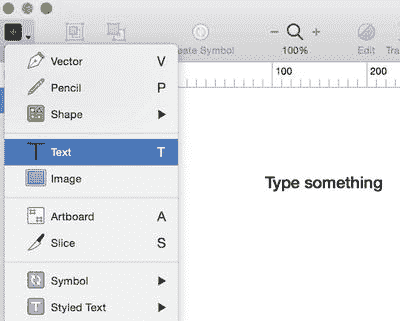
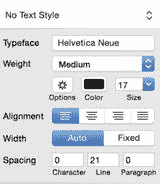

# 文本与字体

我们提到过符号如何在页面、画板和图层间全局关联，因此在这里讨论文本也很有意义，因为文本样式的工作方式与符号在页面和画板间的工作方式非常相似。您已经知道可以管理多个符号，并在设计迭代过程中随时对其进行修改。Sketch 也允许您对文本执行此操作。此外，由于 Sketch 3 现在使用 OS X 的原生字体渲染，这意味着文本（特别是为 Web 设计的文本）看起来很棒。但在 Sketch 3 中，您还可以对文本做更多操作，这正是优秀设计与伟大设计之间的区别。

通常，应用设计中的排版至关重要，特别是因为用户必须交互内容的屏幕空间有限。虽然某种字体在您的设计中可能看起来很酷，但您必须始终考虑用户。因此，应用中的文本必须始终保持清晰易读。确保您的字体大小在不同页面之间保持一致也是一个好主意。在这方面，您可能希望在开始繁重的设计工作之前为您的应用创建一个样式指南。虽然对于更喜欢“直接上手”的设计师来说，创建样式指南可能很繁琐，但这是一个很好的实践，有助于在设计交接给其他设计师和开发人员时保持一定程度的一致性——尤其是在字体和字号方面。

对于那些为 Web 进行设计的人来说，Sketch 附带了一个预加载的模板，您可以在创建新文档时选择它。与 iOS（iPhone 和 iPad）图标模板类似，Sketch 为设计 Web UI 的人员提供了一个模板。甚至还有一个材料设计模板，供那些为 Android 设备进行设计的人使用。

当您从预加载的 iOS 应用模板中选择一个 UI 元素时，会包含关联的样式，例如文本样式。例如，假设您想选择推送通知符号并将其添加到您的某个画板中。将符号复制到您的设计后，您很可能需要编辑通知消息的副本。为此，您选择该符号并双击文本字段以编辑内容。

如图 4-6 所示，选择一个文本字段会在检查器中显示与其关联的样式。您可以编辑符号中的副本并保留关联的样式。在图中，样式被列为“通知内容”。但是，该样式可以更改为列表中的任何其他文本样式，甚至可以更改为您自己创建的样式。在这种情况下，您只需要选择副本并可从下拉菜单中选择新样式。

图 4-6. 选择文本字段会在文本检查器中高亮显示其关联样式

提示：由于模板中的许多样式都遵循苹果的人机界面指南，您可能希望尽量保持原样，只做最低限度的编辑。

要将文本插入到现有设计中，请转到“插入”菜单并选择“文本”。这会将光标变成文本工具。一旦出现文本工具，您就可以开始键入。Sketch 会提示您在画布上插入一段预格式化的文本，显示为“输入内容”，如图 4-7 所示。一旦文本框出现，您就可以自由开始键入。该框会自动扩展以容纳您键入的额外文本。然而，您在图上看不到的是文本周围的控制手柄。与 Sketch 中的任何其它图层一样，画布上的文本有其自己的带手柄的文本框。其它图层在四个边上都有手柄，但文本框中只有三个。在自动模式下，您可以轻松调整这些手柄来更改文本大小，就像处理形状、图像或矢量一样。拉动文本框左侧或右侧的手柄将展开文本框并使其更宽。当拖动底部手柄时，文本框内的文本会变大或变小。这是在文本字段中更改字体大小的便捷方法，无需调整检查器中的数字。

图 4-7. 空白画布上的默认文本工具

不过，文本字段也可以通过选择右侧检查器中的“固定”选项来限制大小。您还可以进行许多其他选择，这些选择会影响您当时在画布上键入的文本。目前，图 4-8 中的文本设置为在您键入时自动调整框的大小，因为“自动”按钮处于高亮状态。如果选择了“固定”按钮，则文本框的大小将被限制，文本将自动换行以适应框内。

图 4-8. 仔细查看用于样式化文本图层的文本检查器选项

