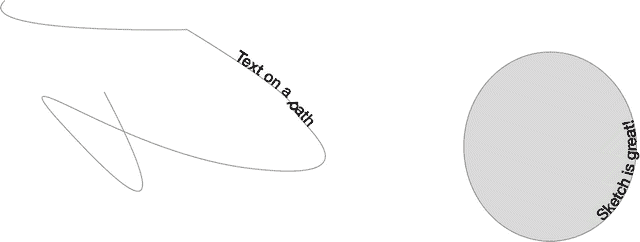
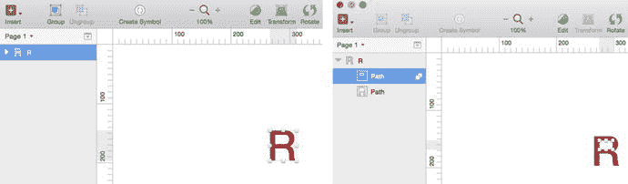
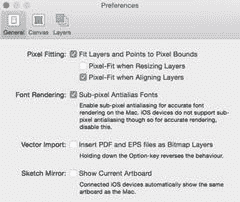
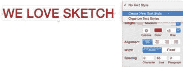
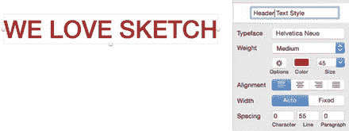
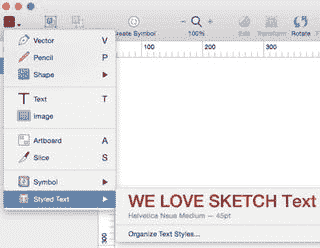

# 文本检查器

与任何其他文本编辑器一样，Sketch 为您提供了多种编辑字体粗细、颜色和大小的方法。点击“字体”选项会列出您计算机上的所有字体以及每种字体的预览。要选择一种字体，只需点击它即可。粗细选项会显示您所选字体的粗或细程度，还有其他选项，如斜体、纤细、粗体和黑色。

如果您想创建带下划线或各种列表类型的文本，可以点击颜色选择器色块旁边的“选项”按钮找到这些功能。Sketch 提供双下划线文本、项目符号列表和编号列表作为选项。

您还可以在 Sketch 中调整间距。您可以调整字符间距，即每个字符之间的空间。行间距指的是多行文本之间的垂直空间量。段落间距将调整程序在您按下回车键开始新段落后自动分配的空间。

提示：如果您想插入换行符而不是段落分隔符，在键入文本时请按 `Shift+Return` 而非仅按 `Return`。

## 文本对齐

Sketch 中的文本对齐相当直接，其工作方式与文字处理器和其他图形程序大致相同。您可以使用各种设置来左对齐或右对齐文本，或者居中或两端对齐文本。

### 路径文本

有时，您可能希望文本沿非直线路径对齐。您可能希望文本跟随曲线或路径。Sketch 3 通过 `Text on a Path`（路径文本）功能实现了这一点。首先，创建一个非直线的矢量或路径。您可以使用 `Vector`（矢量）工具，甚至可以使用椭圆等形状。创建好形状后，插入一个文本框并添加一些文字。选中文字，导航到 `Type`（类型）菜单，选择 `Text on a Path`（路径文本）选项。当您将文本框移近目标形状或路径时，文字将沿着曲线吸附到路径上，如图 4-9 所示。

*图 4-9. 使用矢量和椭圆绘制的路径文本功能*

### 文本轮廓

`Text Outlines`（文本轮廓）是 Sketch 中另一个强大的功能，当您希望实现一些独特效果时会派上用场。文本不能像操作形状那样被直接操纵，也不能附加某些操作。借助 Sketch 中的 `Text Outlines` 功能，您可以让文本表现出类似于形状的特性。要使用此功能，您可以在画布上添加一个或多个字母作为示例。选中这些字母，导航到 `Type`（类型）菜单，选择 `Convert Text to Outlines`（将文本转换为轮廓）选项。如果您只在画布上输入了一个字母，当您将该选中内容转换为 `Text Outline`（文本轮廓）时，您会看到该字母上出现了控制手柄，并且 `Layers`（图层）列表会更新以反映此变化。这表明 Sketch 已将文本转换为一个形状，如图 4-10 所示。现在，您就可以像编辑任何其他形状一样编辑这个字母了。

*图 4-10. 使用 `Convert to Text Outlines`（转换为文本轮廓）功能将文本图层转换为形状前后的状态*

如果您选择使用 `Text Outlines` 功能转换多个字母或一组字母，请注意这可能会占用大量计算机资源。原因在于，将包含多个字母的长文本项转换为矢量，需要 Sketch 创建许多小的子路径。创建子路径需要 Sketch 对文本字符串中的每个字母执行大量布尔运算。如果必须转换长文本项，最好始终将文本拆分为多个图层。这样，您可以分别转换每个文本项，但这同样可能给计算机资源带来负担。

### 抗锯齿与文本

Sketch 使用 macOS 的原生字体渲染能力，因此，在某些情况下，操作系统无法控制文本的外观。在这些情况下，它会使用**次像素抗锯齿**来改善文本在屏幕上的显示效果。这意味着每个像素都混入了红、绿、蓝光。由于每个像素实际上由红、蓝、绿子像素组成，其原理是，当从正常的观看距离（例如您与电脑显示器之间的距离）观察时，您的眼睛不会注意到这些彩色像素，而会看到尽可能清晰的文本。

然而，有时次像素抗锯齿和图层混合无法生效，因为它需要在不透明背景上绘制，并在透明背景上渲染。当 Sketch 无法渲染启用次像素抗锯齿的字体时（例如在导出的 PNG 中），您会清楚地看到这一点，因为背景是透明的，无法渲染。

与 macOS 不同，iPhone 不会使用次像素抗锯齿来渲染文本，这在为 iOS 设计时带来了一些问题。因为您的设计在 iPhone 或 iPad 上的显示方式与在电脑屏幕上（尤其是在 Retina Mac 上设计时）不同，所以您需要停用设计中的抗锯齿功能。（该功能默认是自动选中的。）您可以通过导航到 `Sketch` 菜单，选择 `Preferences`（偏好设置），然后取消选中该选项来禁用它，如图 4-11 所示。

*图 4-11. Sketch 中的 `Preferences`（偏好设置）面板允许您关闭字体的次像素抗锯齿功能*

### 文本样式

Sketch 还允许您为文本附加样式，并可以轻松地将这些样式应用于设计中的文本块。例如，虽然您的应用中可能通篇使用同一种字体，但您可能希望在不同的地方（如标题、正文等）使用不同的字重和字号。这时，Sketch 中的文本样式功能就派上用场了。您可以为文档中的图层应用无限数量的样式，并通过 `Text Inspector`（文本检查器）轻松管理它们。

> **提示：** 文本样式仅在文档内可用。因此，它们可以在页面和画板之间共享，但**不能**跨不同的文档共享。

当您在画布上创建初始文本时，`Inspector`（检查器）会指示选中的图层是否已赋予了样式。通常，在最初添加文本时，是没有样式的。一旦您添加了颜色、大小、大小写等属性，您可以通过在 `Inspector`（检查器）中选择下拉菜单来将这些属性创建为样式，如图 4-12 所示。

*图 4-12. `Text Inspector`（文本检查器）允许您创建新的文本样式，并将其分配给文档中的任何文本图层*

选中下拉菜单后，Sketch 允许您创建一个新样式。默认情况下，新样式的名称将与文本内容一致。因此，此处的新样式将命名为“WE LOVE SKETCH Text Style”，并且会高亮显示，以便您编辑样式。然后，您可以将样式名称更改为您选择的任何名称。在图 4-13 中，我将文本样式的名称改为了“Header Text Style”。

*图 4-13. `Text Inspector`（文本检查器）允许您更改样式的名称*

现在，如果您正在处理一个包含文本的全新图层，您可以转到 `Inspector`（检查器），选择要分配给它的样式，然后应用它。

您还可以通过导航到 `Insert`（插入）菜单，然后从下拉菜单中选择 `Styled Text`（样式文本）来为文本赋予样式，如图 4-14 所示。

*图 4-14. Sketch 允许您从 `Insert`（插入）菜单以及 `Text Inspector`（文本检查器）中选择已保存的样式*

## 总结

符号是在设计应用时改善工作流程的绝佳方式。在为 iOS 设计时，您可以使用 Sketch 附带的模板，将原生 iOS 符号添加到您的设计中。Sketch 还提供了在设计中跨文件使用这些符号时进行管理的能力。同时，Sketch 也允许您为设计创建和管理各种文本样式及效果。

既然我们已经介绍了文本样式和符号，下一章我们将深入探讨苹果公司创建的人机界面指南，帮助设计师和开发者了解与 iOS 设计相关的最佳实践，从而讲解如何开始为应用设计做准备。

