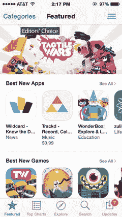

# 5. 应用设计准备

到目前为止，我们已经介绍了 `Sketch` 的大部分基础知识。现在你应该熟悉这个程序及其运作方式——它的界面、如何创建基本形状、以及如何执行各种设计操作，这些在你开始设计应用时会派上用场。我们目前所做的基本上是对 `Bohemian Coding` 提供的基础指南和文档内容进行扩展。然而，这本身并不能直接构成一个应用。在本章中，我们将为你实际设计应用做好准备。

## 人机界面指南

你要做的第一件事是确保你已经熟悉了苹果公司的人机界面指南（HIGs）。虽然我在之前的章节中已经提到过它们，但如果你还没有研究过，现在正是个好时机。我在之前的著作《Learn Design for iOS Development》（Apress 2013）中非常详细地介绍了 HIGs。这是熟悉苹果公司为那些打算为 iOS 创建应用的设计师和开发者制定的设计标准的好方法。在这些指南中，苹果提出了它的期望和原则，这些原则使其能够在整个移动设备生态系统中创造一致的体验。无论你是为 iPhone、iPad Air、iPad Pro 还是 iPad Mini 进行设计，都应将 HIGs 视为关于所有苹果移动设备设计元素和原则的最终指南和权威标准，并加以参考和考虑。

**提示**

你可以通过 `http://www.developer.apple.com/` 访问 iOS 人机界面指南。

当你设计一个符合 HIG 原则的 iOS 体验时，你增加应用成功的几率，因为你使用的是用户已经熟悉的元素和行为。虽然之前已经在一定程度上介绍过 HIGs，但在我们开始着手设计应用之前，有一些原则值得重申。

自从第一个 iPhone SDK 发布以来，该文档已经不断演变以适应各种软件版本，尤其是 iOS7 带来的颠覆性视觉变化。建议你在每次操作系统新版本发布时都检查一下这些指南。然而，这些指南的主要宗旨——**顺从**、**清晰**和**纵深**——依然不变。它们正是赋予苹果著名设计美学的原因。

## 顺从

简而言之，顺从指的是创建一个不干扰屏幕上其他内容的用户界面。这是苹果在 iOS HIGs 中提出的第一个主题，并且可以说是最重要的主题之一。在扩展和解释这个主题时，苹果鼓励设计师首先考虑应用的功能，然后再思考某个特性是否与应用的整体功能绝对相关。如果不是，那么最好将其舍弃。

其次，确保你的应用设计能够适应生态系统中的各种设备，这样无论用户碰巧使用哪种设备，都能体验到你的应用。这个体验应该针对每种设备进行定制。

这可能看起来要求很高，但当你意识到苹果自带的应用程序中有很多可以遵循的例子时，就不会这么认为了。苹果的应用涵盖了从实用工具到效率工具等各个类别，因此你应该能找到符合需求、说明某个原则或展示你正在考虑使用的 UI 元素的例子。如果你觉得任何 iOS 设备预装的苹果自带应用列表没有帮助，那么查看苹果 App Store 中推荐的应用程序也是个好主意，如图 5-1 所示。这些应用提供了出色的设计范例，它们要么严格遵守苹果的设计原则，要么在现有范式的基础上进行了优美的创新。

图 5-1。Apple App Store 经常会展示一些应用，它们是设计原则的最佳实例，或者是在这些原则基础上进行了出色创新

在设计你的应用时，你还应让你的内容优先于屏幕上的任何其他元素。本质上，这意味着你的用户界面设计应该如此无缝，以至于用户几乎注意不到它。你的内容应该闪耀光芒，并将整个屏幕作为其画布，让最重要的信息脱颖而出，高于一切——包括 UI。事实上，HIGs 明确指出，UI 应该只为屏幕上的其他内容扮演“辅助角色”。

如果你打算使用非常流行的**高斯模糊**（在第 3 章中讨论过），应采取这样的方法：使用模糊和透明效果来进一步引导用户了解屏幕上正在发生的事情，并为元素在屏幕上的位置提供整体上下文。半透明效果让用户知道面板后面还有其他元素，而模糊效果则可用于为整体设计增添一些上下文。

