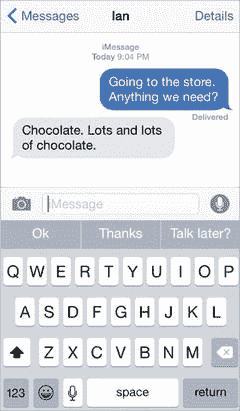

# 清晰性

在为移动设备进行设计时，清晰性至关重要。由于屏幕空间有限，设计师们被迫将众多不同的选项塞进一个非常小的屏幕，同时还要保持清晰和用户友好，这确实是一个挑战。然而，为了帮助那些为 iOS 设计的人应对这一挑战，苹果将清晰性的需求提升到了其他一些设计原则之上。

设计中的清晰性侧重于元素在屏幕上相互排列的方式，以便用户能成功与应用进行交互。如果你的工作做得正确，那么用户第一次看到应用中的某个屏幕或页面时，就会本能地知道如何与他们面前的元素进行互动。如果用户需要费很大力气或花很长时间才能理解元素是什么以及它们之间如何关联，那么他们就会失去兴趣，你也可能因此失去这位用户。

《人机界面指南》（HIGs）指出，设计师可以通过使用留白在设计中提供清晰性。留白是一个重要的设计元素。简单来说，留白在设计里就是指“空白”或“留白空间”。它是未被设计元素或内容填充的空间。优秀的设计师会善用留白。有时，设计师，尤其是经验不足的，往往会认为有必要用东西填满屏幕上的所有空间。但情况远非如此。留白的一个关键特征是，它有助于将用户的注意力集中在对象本身，而非其周围的事物上。留白帮助聚焦用户的注意力。

留白在标志设计中是一个相当常用的工具。平面设计师会利用文字或标志中的留白来吸引人们对某种形状的注意。但留白同样可以用于网站设计来平衡内容，以及用于应用设计。在你的应用设计中使用留白，有助于进一步突出内容，并引导用户到达你希望他们去往的应用区域。

HIGs 以 `iMessages` 应用为例，展示了在 iOS 设计中运用留白的典范。这是一个极好的例子，因为这里的留白增强了可读性。由于 `iMessages` 应用主要由屏幕上的文字构成，因此确保内容对于应用的用户和聊天中的参与者来说清晰可读至关重要。

让我们仔细看看 `iMessages` 应用。图 5-2 显示了两个人的一段对话。我们这些熟悉 iPhone 和 `iMessages` 的人会认出这是一段双方都在使用 iOS 的对话。在这段对话中，蓝色气泡代表你发的消息，灰色气泡代表接收方的消息。如果对方不使用 iOS，对话则显示为绿色和白色的文字气泡。注意文字气泡是如何出现在屏幕两侧以形成平衡并展示“对话流程”的。通过在屏幕两侧留出空间，用户的眼睛会自然地跟随对话。这就是在应用设计中使用留白的效果。想象一下，如果文字气泡排成一行，都出现在屏幕的同一侧，而不是分别位于两侧，那会是什么效果。

图 5-2. 在 `iMessages` 应用中运用留白

苹果以其对留白的运用而闻名，因此，为 iOS 设计应用的设计师们也应当将这种留白的使用融入自己的设计中。在你开始设计应用之前，思考一下如何利用留白来提高可读性，引导用户在页面内或在整个应用中的探索路径。

留白甚至可以在处理间距和边距，乃至摄影时使用。屏幕上所有这些元素以及它们之间的相对位置，都会影响用户以及他们在应用中的导航能力，以及他们的整体体验。

另一个帮助用户理解应用屏幕上内容的工具是色彩。事实上，色彩是一种强大的工具，能帮助用户在屏幕上定位内容和元素。你可以通过应用的设计，利用色彩与用户“对话”。关于设计中的色彩及色彩理论，完全可以（我相信也已经）写一整本书。由于我们已经专门讨论过与 Sketch 相关的色彩问题，这里就不再赘述。我们将简要讨论的是在应用设计中使用色彩，以及它与为 iOS 设计的关系。

HIGs 鼓励设计师使用色彩为应用的用户提供视觉提示。iOS 系统本身就有系统颜色，这些颜色被用于其自带的应用程序中。例如，`Notes` 应用拥有相当简洁的用户界面，并使用黄色来突出显示屏幕上的某些元素以引导用户，如图 5-3 所示。

图 5-3. `Notes` 应用及其使用高亮色帮助用户定位用户界面的示例

HIGs 鼓励设计师首先为他们的应用创建一个调色板，其中的颜色既相互协调，又能在浅色和深色背景下都显得出色。对设计师来说，确保在不同的时间段检查他们的颜色也很重要，以保证每种颜色（尤其是那些带有自定义色调的）即使在最强烈的阳光下或最阴沉的天气里也清晰可见。

