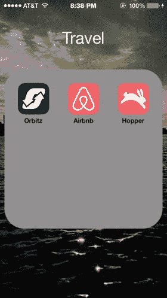

# 纵深性

苹果为 iOS 应用设计师设定的最后一个主题是纵深性。纵深性真正随 iOS7 的操作系统重新设计而体现出来，并自此成为 iOS 外观和感觉的一部分。它为与 iPhone 和 iPad 屏幕交互的体验增添了亟需的层次感和丰富度。设计中的纵深性是一个有趣的概念，因为它要求设计师为传统的二维体验增加一个维度。

为 iPhone 设计带来纵深感的方法之一是让对象相互重叠。当屏幕上有重叠的对象时，你就在为用户创造一种纵深的感觉。具体如何实现取决于你。与 iOS 的其他设计主题一样，你可以从自带的应用中获取灵感。即便在“扁平化设计”出现并流行之后，纵深感仍然是应用中一个理想的设计元素。

如果运用得当，纵深性会为你的设计增加非常清晰的视觉层级，并有目的地引导用户关注屏幕上的内容。例如，一旦 iPhone 或 iPad 主屏幕上的某个应用被放入一个文件夹，访问该文件夹会弹出一个与屏幕共享相同背景的窗口，这样用户始终知道自己处于主屏幕环境中。文件夹的标题会出现在页面顶部以提供额外的上下文。这种布局如图 5-4 所示。

图 5-4. iOS8 中 iPhone 主屏幕上的一个应用文件夹展示了纵深性如何成为 iOS 设计生态中的自然组成部分

