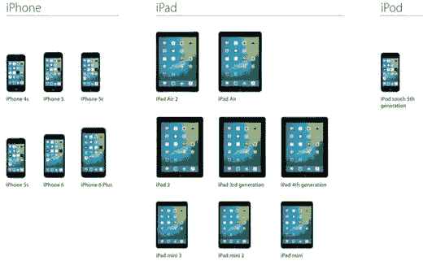
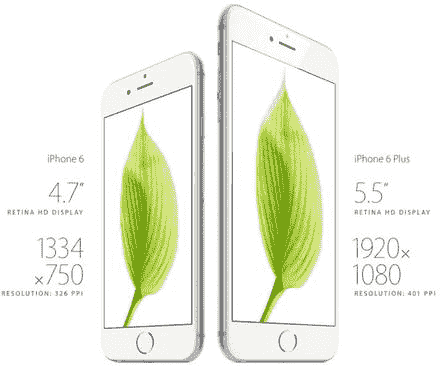
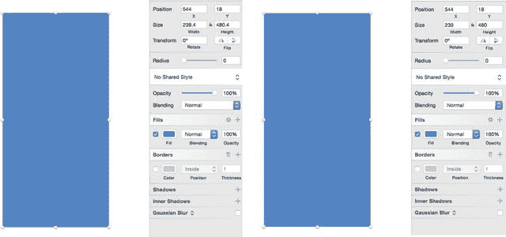

# 设备与分辨率

在开始设计应用之前，你需要考虑应用将运行在哪些平台上，以及哪些设备最适合运行你的软件。自 2007 年首次发布以来，运行 iOS 的移动设备数量持续增长。如今，设计师在开始设计应用前，必须考虑苹果产品线中的所有不同设备。`Sketch` 确实提供了不同尺寸的模板，帮助你快速启动应用设计，但了解不同设备及其分辨率仍然是明智之举。

随着 iOS 操作系统每次新版本发布和更新，苹果会偶尔淘汰旧款 iPhone。自 iOS8 起，支持的最早设备是 iPhone 4S。这并非意味着操作系统无法在更老的手机上运行，而是指其性能无法达到最优。随着 iOS9 的发布，兼容设备列表有所变化。所有当前支持的 iOS 设备如图 5-5 所示。

*图 5-5.* iOS9 所有兼容设备列表

这些设备构成了应用发布后运行的全部设备体系。思考用户与这些设备交互的不同方式，以及他们将如何与应用交互，至关重要。例如，许多 iPad 用户将其用作台式电脑或笔记本电脑的替代品，而 iPhone 则更偏个人化，常用于移动或通勤途中。这些都是会影响用户何时以及如何与应用交互的条件。

近年来，随着更多设备的发布，设备分辨率也在提高，提供了更大、更清晰、更锐利的屏幕来呈现内容。首款 iPhone 的分辨率为 `320 × 480` 像素。然而，当 iPhone 4S 发布时，它配备了 Retina 屏幕。因此，尽管屏幕物理尺寸完全相同，其分辨率却达到了 `640 × 960` 像素，大约是前代产品的两倍。如果将方块与像素的概念视为 `1:1`，那么 Retina 屏幕在相同空间内像素数量翻倍。作为比较，新发布的 iPhone 6 Plus 在其 `5.5` 英寸屏幕上拥有 `1920 × 1080` 像素的 Retina HD 分辨率。iPhone 6 系列机型的屏幕分辨率如图 5-6 所示。当你考虑到我们之前讨论的所有元素——如色彩、谦逊、负空间和清晰度——时，必须意识到屏幕上的细节水平也显著提高了。

*图 5-6.* iPhone 6 和 iPhone 6 Plus 的屏幕分辨率与显示尺寸

市面上有众多设备，你需要为设计考虑多种分辨率，但你仍希望创造出像素完美的设计，无论用户选择哪种设备，都能呈现出色效果。理解点与像素的区别至关重要。像素实际上是组成设计中形状的小方块。对于处理多种屏幕尺寸和分辨率的设计师来说，锐利度很重要。如果你的设计不够清晰，瑕疵就会显现——尤其是在高分辨率屏幕上——并且会显得模糊。

有些设计师通常按 `1×` 设计，然后放大以适应更高分辨率。另一些则按 `2×` 设计，然后缩小到 `1×`。如果你从 `2×` 开始设计，最好使用偶数，这有助于避免在需要缩小到 `1×` 时出现问题。

如果你在设计时，设计中的像素数量不是偶数，那么在尝试导出作品以及为新的分辨率缩放时，都会遇到问题。原因如下：在为更高分辨率屏幕设计时，像素数量呈指数级增长。这不仅会导致设计上的问题，也会给 iOS 开发带来困扰。因此，苹果在推出 iPhone 4S 的 Retina 屏幕时引入了点系统。为了更好地理解这一点，请思考以下示例：iPhone 4S 和 iPhone 3G 拥有相同的物理尺寸。然而，由于 Retina 屏幕的引入，4S 的分辨率基本上使屏幕分辨率提升了四倍，而屏幕尺寸保持不变。这是因为苹果增加了一个点内的像素数量。之前，`1 点 = 1 像素`。随着 Retina 屏幕的出现，`1 点 = 4 像素`。点系统使 Retina 屏幕的开发变得更加容易。

因此，如果你有一个尺寸为 `100 × 100` 像素的图像，它在标准非 Retina 屏幕上会以 `100 × 100` 像素渲染。然而，同一张图像在 Retina 屏幕上也会渲染为 `100 × 100` 像素，但看起来会小一半。这是因为 Retina 屏幕以更高的像素密度渲染图像。但是，使用点系统，同一张 `100 × 100` 像素的图像现在在 Retina 屏幕上会以 `@2×` 的尺寸渲染，以便标准化用户看到的内容。

在 `Xcode` 中，一切以点为单位。然而，在 `Sketch 3` 中，一切以像素为单位。对于追求设计中像素完美的设计师来说，设备和分辨率的数量有时会很棘手。设计师现在可能需要为三种不同的分辨率进行设计：`@1×`（iPhone 3）、`@2×`（iPhone 5 和 iPhone 6）以及 `@3×`（iPhone 6 Plus）。

`Sketch` 包含一个名为 `四舍五入至最近像素边缘` 的功能。如果你的形状没有使用偶数，而是使用了小数或半像素，那么使用此功能可以帮助你将设计尺寸修剪到最近的偶数值，从而确保导出和缩放无缝衔接。

图 5-7 展示了其工作原理。该图显示了 `Sketch` 画布上的一张图片。请注意，右侧检查器中的尺寸不是偶数。事实上，这些尺寸包含小数。假设图片已经是 `@2×`，这些小数将使得将图片缩小到 `@1×` 变得困难，因为尺寸需要再次被分割。这种分割会导致新图像在针对不同分辨率导出时，无法保持原始偶数设计的锐利度。通过使用 `四舍五入至最近像素边缘` 功能，你会看到尺寸被四舍五入为可轻松向上或向下取整到其他分辨率的整数。

*图 5-7.* 在 `Sketch` 中使用 `四舍五入至最近像素边缘` 功能

