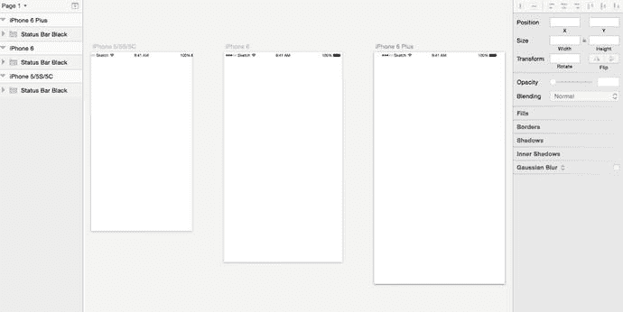

# 使用标准 iOS 尺寸

我们已经讨论过如何使用 Sketch 自带的模板来开始设计你的应用，但你是否也知道这些模板中包含了一些几乎一成不变的标准元素？通过遵循 Apple 的指南，并让你的应用 UI 尽可能简单，你可以在将 Sketch 文件交给开发人员时，让他们的工作变得轻松。由于你可能会在不同设备的不同画板上使用 Sketch 中的某些元素，接下来我们来聊聊如何在不同分辨率之间移动它们。

打开 iOS 模板文件后，你会看到所有 iOS UI 元素都是已创建好的可供选择的符号。虽然使用它们做简单的原型图很不错，但仔细看会发现，这些符号是以 `@1×` 分辨率创建的，如图 5-8 所示。

图 5-8. Sketch 的 iOS UI 设计模板中有一条注释，提示用户这些符号是按 `@1×` (375pt) 分辨率创建的

这意味着，当你在设计中为其他分辨率（`@2×` 和 `@3×`）使用这些标准元素时，需要进行一些调整。如果你尝试直接缩放这些元素，你会注意到，需要对整个元素以及构成符号的各个元素进行位置调整。要做到这一点，你需要先取消组合，然后再缩放——先缩放到 200%，如果你还要为 iPhone 6 Plus 做设计，再缩放到 300%。这适用于标签栏、状态栏等。注意，如果你只是用 Sketch 创建原型图，可以跳过这一步。但是，如果你正在创建一个将在多个设备上使用并交给开发人员的设计，那么这将是一个值得纳入工作流程的好习惯。图 5-9 展示了一个标准 UI 状态栏被导入到为 iPhone 6 和 iPhone 6 Plus 创建的画板中。

图 5-9. 三个画板模板，每个都导入了一个标准 UI 状态栏元素，并固定在顶部。状态栏未进行任何缩放

仔细看图 5-9，你会看到状态栏是 100% 比例。当未进行任何调整和缩放时，它完美地适配了 iPhone 6 的画板。这个版本的 Sketch 默认 `@1×` 对应 375 × 667 像素的屏幕尺寸，但由于 iPhone 6 屏幕的实际分辨率要高得多，因此有必要为每种分辨率调整和缩放元素。

现在，你已经差不多可以开始设计你的应用了。

## 总结

每一位为 iOS 创建应用的设计师都需要学习和熟悉 HIG——这是 Apple 创建并维护的一套文档，用于描述设计师和开发者的最佳实践。虽然我们在本章中概述了 Apple 为 iOS 设计提出的五个要点，但在你使用该平台工作时，经常回头查阅这份文档会是个好主意。

在下一章中，我们将讨论如何设置你的设计偏好以优化工作流程。你将看到，如何在开始设计之前做这件事会如何让你更轻松，以及它将如何简化你的设计过程。

