# 6. 优化你的工作流程

如果你正在读这本书，那么你可能是 Sketch 的新手，要么是设计领域的新人，要么是从其他图形程序（如 Photoshop 甚至 Fireworks）转过来的。如果你是从其他设计程序转来的，你会想看看这一章，因为在这里，我将与你分享一些优化工作流程的绝佳技巧。

通常，对于图形程序，优化工作流程涉及你的电脑硬件设置、偏好设置、文件的保存与恢复，以及提升程序的整体性能。但工作流程也包含那些能帮你节省最宝贵的资源——时间——的小事。

如果你是设计新手，你可能还在摸索自己的工作流程是什么样子。而如果你是 Sketch 新手，你可能听说过或读到过 Sketch 能帮你快速完成某些设计任务，并为你的工作流程节省宝贵的几分钟时间。即使你是一位经验丰富的设计师，在设计时你也会对节省时间感兴趣。这可能出于个人原因，或者因为你需要取悦客户。在设计时，时间通常不是你的朋友，你能越快完成设计就越好。

有一些众所周知的通用技巧、窍门和策略可以用来加快通用任务，也有一些更具体的技巧只适用于 Sketch。在本章中，我们将首先关注一些你可以做的通用事情，然后转向一些更针对 Sketch 的技巧。我们已经在第 X 章中介绍过快捷键，所以如果需要，你可以将它们添加到你的提速事项清单中。一旦你熟悉了快捷键列表（我们也会介绍如何创建你自己的快捷键），再加上本章的技巧，你应该就能顺利加快你的设计过程了。

不过，有必要提一下，虽然速度很重要，但它无法与质量相比。所以请确保你平衡了两者。如果工作需要重做，那么快速完成就没有意义了。最好一开始就用正确的方式完成。

## 自定义你的工作空间

每个设计程序在打开时都会有默认设置。这意味着，当你首次启动程序时，某些设置会有一个基准线。这些设置是为了满足使用该程序的设计师们的共同基本需求而设定的。它也是一块白板，你可以在此基础上开始按照自己的喜好进行设置。你会发现大多数设计程序都很容易自定义。这意味着，你可以根据自己的选择显示或隐藏面板和窗口，具体取决于你正在进行的项目以及你从事的领域。例如，如果你主要设计应用的用户界面，你的自定义设置可能与设计网站的人不同。同样，如果你为 Android 进行设计，你的设置可能也与主要为 iOS 甚至 OS X 进行设计的人不同。

你可能某些工具和功能比其他用得更多，你可以确保这些工具随时可用，而无需费力去寻找。如果你想自定义网格和标尺，你也可以轻松做到，以便按照自己的喜好来设置设计。

你可以随时回看第 2 章，我在那里描述了如何自定义你的工具栏，以便让 Sketch 中最常用的功能触手可及。如图 6-1 所示，Sketch 的工具栏远不止表面上看到的那些。默认显示图标和文本，但你可以将其改为只显示图标或只显示文本。你还可以添加或移除任何你喜欢的项目，来替换默认工具栏中的项目。这可能是让 Sketch 为你所用的首要步骤之一。只需按照你喜欢的方式设置好，就能为你的工作开个好头。将经常使用的图标直接放在工具栏中，总比需要点击两下甚至三下才能找到要好得多。

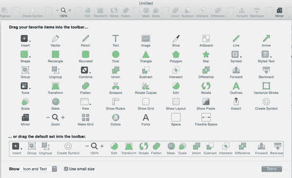

图 6-1. Sketch 允许你自定义工具栏，添加最常用的项目，并移除不常用的项目

### 整理文档

如果你正在从头到尾设计一款应用，一个好的做法是在进入设计阶段之前对整体方案进行充分思考。有些设计师使用 `Sketch` 进行线框设计，但目前市场上也有许多工具允许你先绘制线框图，然后直接导入 `Sketch`。其他人则会使用传统的手绘和纸张来设计线框图，并在正式设计前反复迭代应用的整体流程。无论采用何种方法，在开始设计过程之前考虑如何组织文档都是一个好主意。如果使用纸笔，你可以轻松地为你的画作拍张照片，并将其直接导入 `Sketch` 作为参考。这样一来，你就可以将图纸作为设计背景中的指南，或者并排放置作为参考。图 6-3 展示了如何将纸质图纸作为图像导入到设计中供参考。

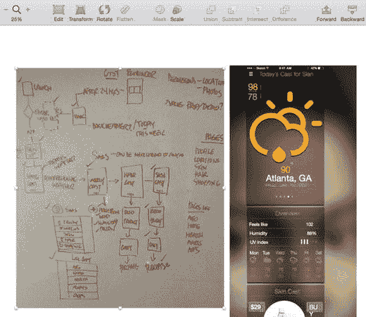

图 6-3.

你可以将纸质图纸或线框图导入 `Sketch` 作为参考，以辅助设计过程

使用 `Sketch`，你可以选择将整个应用创建**在一个文档**中，或者根据应用的复杂程度将其拆分成多个文档。这是一个变革性的功能，因为它允许你利用 `Sketch` 的无限缩放功能进行缩小，从而鸟瞰整个应用。这在设计包含多种不同流程和使用场景的复杂应用时也很有帮助。虽然你可以为整个应用创建一个文件，但 `Sketch` 允许你将应用拆分成多个页面，这样你就可以在整个文档中共享符号，从而在发生更改时同步应用到你的应用中。图 6-4 展示了我名为 `Cast` 的应用中所有屏幕的鸟瞰图。尽管 `Cast` 是一个简单的应用，你可以轻松地使用页面来拆分应用的主要部分，然后使用这些页面中的画板来概述特定流程中的各个步骤。

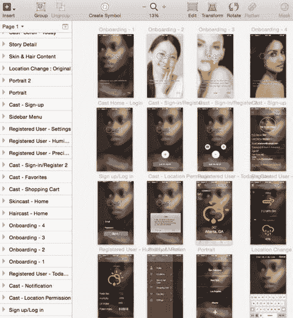

图 6-4.

应用多个屏幕在 `Sketch` 中布局于一个页面上的鸟瞰图

#### 扁平化图像

这个特定的过程旨在让 `Sketch` 尽可能快速高效地运行。`Sketch` 本身就是一个相当精简的程序，但图形往往会拖慢一切。众所周知，`Sketch` 的强项不在于处理照片。正如我们在前面章节讨论过的，它可以处理照片，但因为 `Sketch` 是一个矢量程序，我们建议尽量减少照片的使用。话虽如此，你可能仍然希望在设计中包含照片。应用是视觉化的，因此在某些情况下，照片有助于为你的应用带来一定程度的真实感。因此，创造一种处理图像的方法会很有帮助。

由于图像包含的信息量远多于原生创建的形状，它们需要 `Sketch`（以及你的计算机）在渲染时使用更多资源。例如，假设你在应用中使用了一张非常显眼的背景图像。这很可能意味着该图像会用在多个屏幕上。但让我们把情况复杂化：假设同一个图层上还应用了一些效果。导入图像时，始终确保将整体大小优化到能保持最佳质量的最小文件大小是一个好习惯。我们知道文件越大，图像显示效果越好。然而，你还必须考虑是否会对图像应用特殊效果。例如，如果你要对图像应用广受欢迎的高斯模糊效果，你可能需要考虑使用较低质量（因此也是较小尺寸）的文件。导入图像后，你可以应用效果并将其扁平化。这将减少 `Sketch` 文档的整体大小，并最终提高文档打开时计算机的响应速度。图 6-5 展示了两个使用相同背景图像并应用了模糊效果，且在使用前已进行扁平化处理的屏幕。虽然你可能不会立即看到效果，除非你的计算机内存低得惊人，但你会在文档的整体文件大小上看到结果。

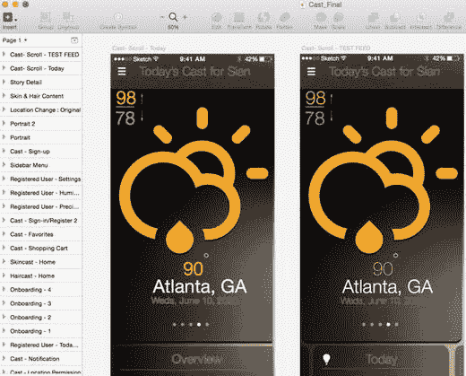

图 6-5.

两张以图像为背景的文件，一张已优化，一张未优化

### 命名图层和符号

这是一个棘手的问题。对我来说，命名图层可能真的很麻烦。在使用 `Sketch` 设计和绘制线框图时，我动作很快。我常常没有花时间尽可能高效地命名图层。虽然在制作原型或线框图时这还不算太糟，特别是如果只供你自己查看的话，但当你设计一个需要与其他设计师以及最终与开发人员共享的产品时，你需要确保你命名图层和符号的方式既高效，又对其他使用你文件的人来说直观易懂。这是一个硬性设计规则，无论你使用什么图形程序都应遵守。创建有意义的图层名称是最佳实践。不建议使用晦涩或过于取巧的名称。

如果你还没有组织好图层，它们开始变得难以管理，我会提供一些技巧来帮助你有效地管理它们。在移交文件之前，甚至在设计过程中，能够组织好图层非常重要。关键在于在设计过程中、在图层失控之前就对其进行组织。

我们之前讨论过将设计中彼此相关的元素进行分组，但有时，为了更好的组织而对元素进行分组也是个好主意。例如，如果你正在设计一个带有标签栏的应用，你可能希望将该标签栏中的所有元素都包含在一个组中。并且，在必要的情况下，你还可以在组内创建组，即嵌套组。因此，虽然你的标签栏图标在一个组中，但如果有多个形状构成了一个特定的图标，那么这可以成为更大标签栏组内的一个嵌套组。这样一来，任何使用你文件的人都可以轻松找到他们需要的元素，而无需进行大量猜测。相信我，他们会因此感谢你。图 6-6 展示了我如何为 `Cast Beauty` 应用组织图层。列表显示了带有文件夹的主要组，但每个文件夹内部还有许多额外的嵌套组，并且所有这些都与该页面中的一个特定画板相关。

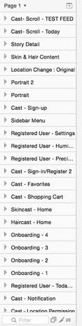

图 6-6.

应用图层的命名列表

说到符号，你可以确信这和图层是一样的道理。当需要为客户甚至创意总监快速修改设计时，使用符号是加快工作速度的关键。如果你的文档包含 10 个页面，你需要更新某个标题栏的颜色，当然你可以逐个修改应用每个页面中的每一个画板或屏幕。或者，你可以将符号命名为类似 `"header bar"` 这样直观的名称，而不是 `"purple stripe"`，然后轻松地一次性修改颜色，并立即更新文档中所有地方。你不想因为符号名称没有意义而浪费时间寻找正确的符号。然而，和所有事情一样，要注意在何处以及多久使用一次符号。如果在整个设计中更改了符号，最好进行一些设计质量检查，以确保所做的更改是相关的，并且更重要的是，是准确的。

### 创建自定义网格

我们已经介绍了 Sketch 布局和网格设置的强大功能。因此，在着手进行最伟大的应用设计之前，请先通过调整列数、宽度和间距来设置布局参数。然后，你可以点击图 6-7 左下角所示的按钮，将其设为默认设置，这样每次开始新设计时就无需重复此过程。

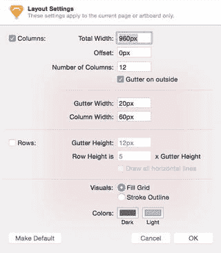

图 6-7. Sketch 中的布局设置面板。用于设置画布并保存为默认设置，以加快启动速度

### 演示模式

有时，不受干扰地查看作品至关重要。如果你需要在屏幕上向你的上级、同事，甚至客户展示工作成果，那么演示模式将是理想之选。按下  + `.`，即可将屏幕切换为演示模式。这意味着菜单栏、文档以及屏幕上所有无关元素都会消失，只留下你的设计。你可以在特定页面内自由移动。通过上下左右滚动，你可以在各个画板之间切换。

**提示**  
按下  + `.` 同样可以退出演示模式。

### 设置默认样式

在 Sketch 中创建形状时，它会始终以 Sketch 的默认样式显示。通常，形状会带有浅灰色填充和深灰色边框。但与 Sketch 中的大多数功能一样，这可以轻松更改。如果你发现自己经常使用特定颜色或色板工作，你可以随时通过创建新样式并将其设为默认值来更改此默认颜色。例如，假设你希望所有新形状都显示为特定色调的红色填充且无边框。首先，创建一个红色形状，并将填充颜色从默认的灰色更改为你指定的红色色调。然后，移除边框设置。最后，导航至 `编辑 ➤ 设为默认样式`，如图 6-8 所示。这将确保所有新创建的形状都将采用你指定的新默认样式。这适用于任何形状：圆形、星形、三角形等。

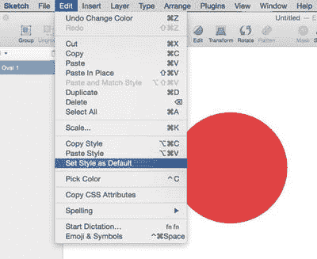

图 6-8. 如何设置默认样式以应用于所有新形状

**提示**  
但需要注意的一点是，边框圆角、阴影和反射等样式无法设置为默认样式。

### 定义你的色板

在实际开始设计你的应用之前，你需要选择一套特定的色板。这将包括你的主色、强调色和突出显示色等颜色。有一些出色的工具可用于选择色板。选定色板后，Sketch 可以让你轻松地在检查器中设置这些颜色，使你的颜色在整个项目过程中始终易于访问。你可以从 Adobe 的 Kuler 等在线工具中获取色板的屏幕截图，并将其导入到你的 Sketch 画布中，如图 6-9 所示。

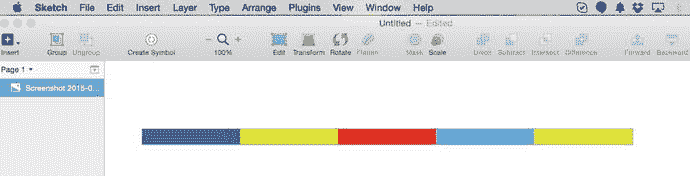

图 6-9. 导入 Sketch 中的一系列彩色色块，用于创建色板

导入图像后，将光标移到检查器面板中的吸管图标上。单击该图标以显示一个放大镜，然后你可以将其移到画布上，并悬停在色板图像中所需的颜色上，如图 6-10 所示。

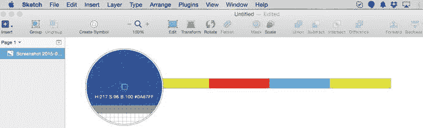

图 6-10. Sketch 中的吸管工具，用于提取色块的颜色

点击该颜色后，将光标移回检查器，然后点击 `“+”` 按钮。完成此操作后，Sketch 会将所选颜色添加到你的色样列表中，显示在图 6-11 右下角的“文档颜色”区域。

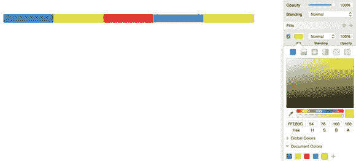

图 6-11. 使用吸管工具从画布上的色板图像中复制颜色，从而创建的新文档颜色集

轻松访问色板中的所有颜色将在你进行设计时节省时间。并且，颜色可以像添加一样轻松地从检查器中移除。要从检查器中移除颜色，只需单击并将其拖到画布上即可。松开鼠标后，它会在动画烟雾效果中消失，并从面板中移除。

**提示**  
Sketch 不仅可以提取画布上的颜色，还可以提取屏幕上的任何位置，包括你的 Mac 桌面甚至浏览器窗口中的颜色。

## 旋转工具

Sketch 提供了一个鲜为人知的工具，可以帮助你在设计中节省时间。它被称为旋转工具，虽然你可能不常使用它，但作为设计师，有时需要创建某种效果，如果手动操作，将极其耗时。你需要沿路径均匀地间隔每个元素，并确保它们大小相同且彼此等距。这就是旋转工具的用武之地。诚然，我尚未需要使用此工具，但我知道它会在某个时候派上用场。使用此工具时，你需要在画布上创建一个形状。可以是任何颜色、任何形状。在我们的示例中，我们将使用一个红色圆形。创建红色圆形后，导航到“图层”菜单，选择 `路径 ➤ 旋转副本`，如图 6-12 所示。

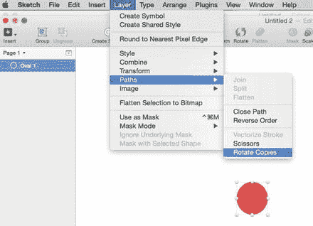

图 6-12. 从“图层”菜单访问旋转工具

选择 `旋转副本` 后，Sketch 会询问你要创建多少个副本。默认数量为 6，Sketch 会告知你任务完成后将生成的总图层数。你选择的副本数量及生成的图层结果如图 6-13 所示。Sketch 沿圆形路径创建了多个形状，每个形状都在其自己的图层中。每个图层或形状之间的距离可以通过移动附加到原始图层的控制柄来调整。每个形状可以彼此移近或移远。

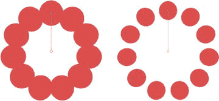

图 6-13. 旋转工具将沿圆形路径快速无缝地创建同一图形的多个副本

