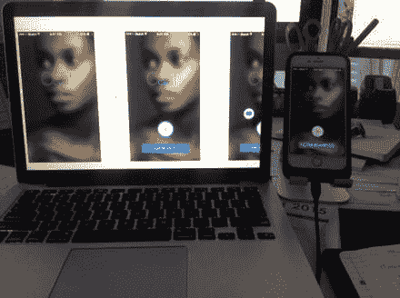

# Sketch Mirror

虽然我在第 1 章中简要提及了 Sketch Mirror，但毫无疑问，在为 iOS 进行设计时，这项功能可以节省大量时间。`Sketch Mirror` 是 Mac 端 `Sketch` 应用程序的配套应用，它让你在设计过程中就能直接在设备上预览设计方案。还记得使用其他图形程序时的情形吗？你通常需要以正确的分辨率导出图像，发给自己，然后在目标设备上打开预览。确实有些繁琐。现在，有了 `Sketch Mirror`，你可以在 iPhone 或 iPad 上安装该应用，确保它与你的电脑连接到同一个 Wi-Fi 网络，就能直接在设备上预览你的设计。在查看设计时，根据你的画板设置方式，你可以在显示预览的设备上，于 `Sketch` 文档的画板和页面之间滑动切换。`Sketch Mirror` 的另一个优点在于，你可以设置多台设备来查看你的设计。这使得通用应用的设计变得更加轻松顺畅。`Sketch Mirror` 让设计者查看并进行必要调整的过程变得极其简单，而且只需从 Mac 应用的工具栏中即可轻松访问。图 6-14 展示了一个画板在 Mac 上以及通过 `Sketch Mirror` 在 iPhone 6 上预览的图像。

图 6-14. `Sketch Mirror` 让你在 Mac 上查看设计的同时，也能在设备上直接预览。

