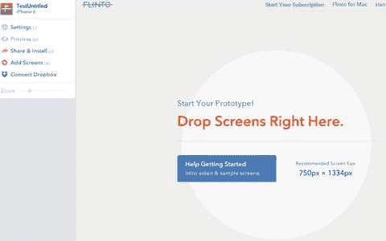
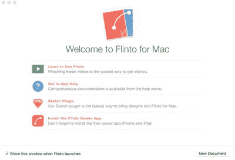
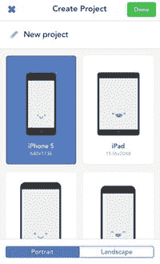
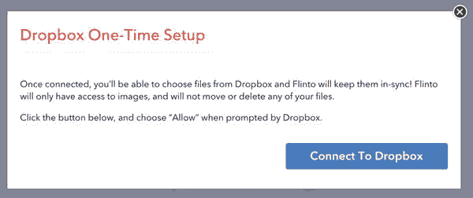
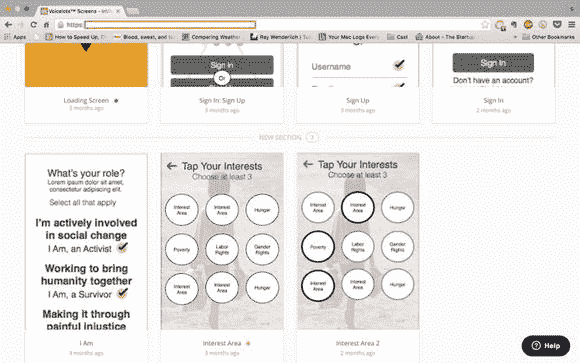

# 其他工作流工具

你会发现，作为设计师，最终不可避免地需要跳出你偏好的图形程序，与团队其他成员进行协作。下面我将介绍一些我个人使用过的工具，但你可能会发现自己更倾向于不同的程序，这完全没问题。目标在于找到那些能与你自身风格和工作方式相辅相成的程序，从而节省处理琐事的时间，将更多精力投入到你所热爱的事情上，希望那就是设计本身。

## Flinto

`Flinto` 是一款原型设计工具，它能让你轻松地将所有画板导入，在它们之间创建链接和交互，并生成一个原型。虽然市面上的原型工具不少，但我发现 `Flinto` 是最易上手的一款。由于 `Sketch` 的画板已经是正确的尺寸，`Flinto` 能让你轻松查看、理解并创建应用中各个屏幕之间的关系。这样一来，工作重心就从单纯的设计应用，转变为真正关注应用的工作方式以及用户将如何与之交互。这便是从 UI（用户界面）到 UX（用户体验）的必然转变，也是许多设计师当前正在应对的重要转变。

用户只需通过拖放，或者通过 Dropbox（该应用提供了便捷的 Dropbox 集成功能）将屏幕导入 `Flinto` 画布即可，如图 6-15 所示。之后，你可以添加所需的连接和交互，并在设备上或程序界面内直接预览。如果某些功能不工作，可以快速修复，更新链接或更改过渡效果。要替换某个屏幕，只需将新屏幕拖放到旧屏幕上，`Flinto` 便会自动更新。

图 6-15. `Flinto` 界面易于使用，允许你通过拖放将屏幕导入界面。

`Flinto` 还会模拟一些标准的 iOS 过渡效果，并且你可以轻松地为大多数页面添加返回按钮。你甚至可以添加启动图像和应用图标，让用户获得真实的应用体验。

全部完成后，你可以通过电子邮件将原型发送给潜在用户，甚至可以通过短信发送。当你不断迭代你的应用时，你的用户会自动看到更新后的版本；如果出于任何原因你需要撤销对应用的访问权限，操作过程也非常简单。市场上有很多原型设计工具，但 `Flinto` 无疑是其中最易上手的之一，也是我的最爱。

## Flinto for Mac

`Flinto` 团队近期发布了 `Flinto for Mac`，这是一款适用于 OS X 的原型设计应用，允许设计者创建简单或更全面的、包含复杂交互的原型。尽管我个人还没有尝试过 `Flinto for Mac`（在我撰写本文时它几乎还是全新的），但它已获得我所信任和尊敬的设计师们的高度评价。它允许你无需编程，在同样直观易用的界面内（与 `Flinto` 网页应用类似，参见图 6-16）创建一系列复杂的动画。你可以从任何图形程序中拖放资源，或者使用 `Sketch` 插件，该插件能让你自动将设计从 `Sketch` 导入到 `Flinto for Mac` 中。该应用还允许你在设备上进行预览，以便也能在应用上测试你的过渡效果。

图 6-16. 全新原型工具 `Flinto for Mac` 的欢迎界面。

## Marvel

`Marvel` 是另一款有用的原型设计工具，它让应用原型制作变得非常简单（见图 6-17）。它的工作原理与 `Flinto` 大致相同。你可以通过 Dropbox 将屏幕导入 `Marvel`，添加热区、链接和过渡效果，然后进行测试。当你准备好与他人分享原型时，你可以通过电子邮件（唯一 URL）、短信、二维码发送，甚至可以直接将原型嵌入到你的网站中。如今，鼓励设计师频繁迭代和测试。有了这些原型设计工具，这项工作变得容易得多，让你无需编写任何代码就能进行必要的更改。同样值得注意的是，`Marvel` 也有一款移动应用，它将网页应用的某些功能带到了你的 iPhone 上。你可以实际拍摄你绘制的草图，并直接在应用内将它们链接起来。

图 6-17. `Marvel` 移动应用的屏幕截图，可以让你随时随地进行原型创建。

### Dropbox

在工作流程部分，最后但同样重要的的是 `Dropbox`，这款流行的云存储工具。虽然 `Dropbox` 并非纯设计工具，但它对设计师来说是宝贵的工具，不仅能存储，还能与全世界分享他们的设计。你可能也注意到了，我在本节中已经提到的一些原型设计工具要么是基于 `Dropbox` `API` 构建的，要么是使用它进行身份验证。这意味着，如果你已经使用 `Dropbox` 存储设计稿，你可以轻松地将它们导入到 `Flinto` 或 `Marvel` 中，从而加快工作流程，让你更专注于工作质量，而非文件大小和类型。使用 `Flinto`，你可以将所有图像存储在 `Dropbox` 中，如果对它们进行了更改或更新，`Flinto` 会保持同步。这两个程序都需要访问你的 `Dropbox` 帐户才能维持此功能。`Flinto` 会要求连接你的 `Dropbox` 帐户，如图 6-18 所示。

图 6-18。`Dropbox` `一次性设置`窗口

这些只是你在 `Sketch` 中设计应用时可以整合到工作流程中的一部分工具。有些你会更喜欢，有些不那么喜欢。真正重要的是尝试一些工具。这些应用大多提供免费试用期，你可以在此期间进行实验，看看哪些最适合你和你的设计需求。尝试完成特定任务，看看在哪里可以节省时间会很有帮助。如果某个工具能为你节省处理某一过程或任务的宝贵时间，那就保留它。此外，探索如何进一步定制这些程序以满足你的需求。对于其中一些程序，定制是关键，就像 `Sketch` 一样。

### InVision

`InVision` 是一款基于网页的原型设计工具，在设计界已经变得相当流行。当有大量人员需要快速对设计进行评估时（包括客户、其他设计师、项目经理，或整个团队），它非常适合与大型团队协作。`InVision` 允许你在界面内收集反馈，并能精确跟踪设计稿的多个版本，这在大型团队协作时可能是一个问题。如图 6-19 所示，其界面相当简洁，你可以免费注册并使用一个设计进行尝试。根据你的需求，还可按月度付费获得更多设计容量。

图 6-19。`InVision` 界面

## 本章小结

本章列出的所有内容都是可选的。然而，你设计得越多，就越会明白速度和效率是成为优秀设计师的关键——尤其是在与客户和团队打交道时。诸如设置偏好、精确调配配色方案以及设置好文档等技巧，将极大地帮助你成为一名高效的设计师。

但 `Sketch` 只是一个程序。本章提到的其他程序旨在增强 `Sketch` 的功能。它们中的许多都提供试用，因此你可以免费试用，直到找到你想要购买的那一个。

在下一章中，我们将讨论如何使用 `Sketch` 和前面列出的工具开始为你的应用绘制线框图。然后，你就应该准备好深入实践了。

