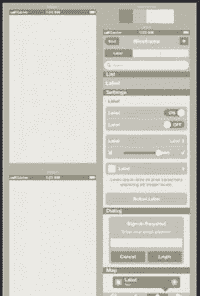
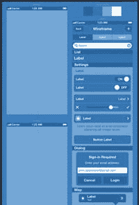
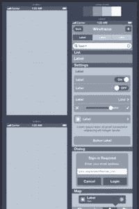
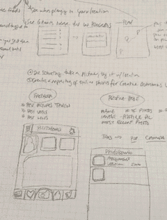
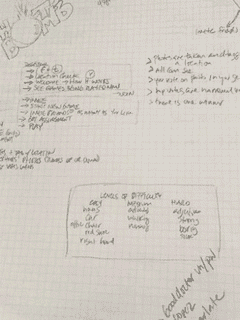
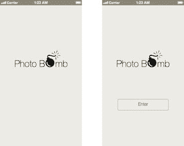
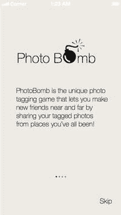
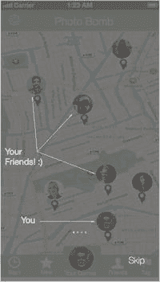

# 7. 使用 Sketch 为应用绘制线框图

你可能已经知道，在进入设计阶段之前，线框图是描绘你的应用将做什么以及如何做的好方法。线框图是应用的蓝图。它们通常没有颜色或样式，你可以先专注于应用的基本功能，然后再添加我们之前讨论过的漂亮颜色和效果。在为应用绘制线框图时，你的目标是关注应用所有屏幕中用户交互的功能和细节。

如果你的应用相当简单，你或许可以完全不绘制线框图。但我建议始终经历线框图绘制过程。它有助于在早期阶段明确功能，并让你清楚地了解应用在构建后的行为方式。有许多可用于线框图绘制的工具：`Balsamiq`、`MockFlow`、`UXPin`、`Omnigraffle` 和 `Axure` 等。它们的价格从完全免费到单个许可证几百美元不等。如果你一直使用某个特定工具来绘制应用的线框图，并且它对你的工作流程很有效，我建议你继续使用它。但如果你正在寻找一个能帮助加快整体流程的新工具，那么我建议你直接看看 `Sketch 3`。既然我们无论如何都要在 `Sketch` 中设计应用，为什么不同时用它来绘制线框图呢？我们在之前章节中学到的许多流程不仅适用于设计，也同样适用于你的线框图。

有些人认为线框图绘制过程应该非常简单快捷。我不是这种人。我认为线框图绘制，最重要的是要详尽。如果这需要一小时或五天，那就这样吧。最终，你将沉浸在创建应用的过程中，并成为最有资格和能力设计它的人。线框图绘制是你真正开始理解即将设计的应用的阶段，所以我认为这个过程可长可短，但更重要的是它应该完整，并且绝不应该仓促行事，因为仓促将不可避免地导致项目后期在设计及构建阶段出现问题。你将探索应用中的元素如何放置在屏幕上以供用户访问，因此花时间理解这个 `UI` 至关重要。因此，如果你需要一些额外的时间来完成线框图，那完全没问题。

在本章中，我们将简要讨论使用 `Sketch` 创建线框图的各种技巧和流程。我们已经讨论过 `Sketch` 拥有一个蓬勃发展的社区，现在有不少网站专门提供 `Sketch` 资源。我们会在本书后面列出它们，但为了线框图绘制，你可以在谷歌上简单搜索 `Sketch 线框图工具`，看看有什么可用的。你会发现有大量的线框图模板，你应该能找到适合你需求的那一个。

如果你和我一样，倾向于使用几乎或完全没有品牌元素的低保真线框图，你可能会想尝试下载那些提供简洁外观和感觉、能让你尽可能专注于用户体验的众多模板之一。尝试找到一个能利用 `Sketch` 某些出色功能（这些功能将极大改进你的工作流程）的模板也是一个好主意。例如，`Sketch` 大师 `Meng To` 在他的网站上有几个线框图模板，这些模板相对单色，使用了微妙的蓝色和灰色调。它们看起来相当不错，可以免费下载，并且是 `Sketch` 文件，你可以直接导入到你的画布中开始工作。

提示

`Meng To` 的网站上有很棒的 `Sketch` 技巧：[`http://blog.mengto.com/`](http://blog.mengto.com/)。

孟的线框图模板的一大亮点在于，他是一位 **Sketch** 大师，并且会特意确保其模板中包含的 iOS 元素尺寸完全符合 iOS 设计规范。这些模板还使用了链接样式，这非常棒，因为你可以轻松更新颜色以符合自己的喜好，并便捷地更新整个线框图。

当然，你也可以直接使用 Sketch 自带的 iOS 模板，或者用你信赖的纸和笔来为你的应用创建自己的线框图。对于那些喜欢用纸和笔的人，可以使用 `UI Stencils`——这是一套包含许多常用 iOS UI 元素的 iPhone 和 iPad 模板工具包。他们还提供一系列带有 iPad 和 iPhone 轮廓的记事本，让你能轻松开始线框图绘制过程。虽然并非绝对必要，但这些模板确实能为传统的纸笔线框图增添一丝专业感。这些工具如图 7-1 所示。一旦你用纸笔画好线框图，就可以将它们导入 `Sketch` 以辅助整体设计流程。但现在，让我们专注于在 `Sketch` 中实际创建你的设计。

**图 7-1.** 来自 Meng To 网站的灰色和蓝色线框图模板

## 应用

为了本次练习的目的，我们决定为一个名为 `PhotoBomb` 的虚构应用创建几个关键界面。该应用允许用户拍摄照片，并将带有地理定位信息的照片标记在地图的 landmarks 或特定位置上。用户可以查看朋友的照片，了解他们在特定地点做了什么。该应用将使用用户的位置信息和相机。用户还可以通过他们的 Facebook 或 Twitter 账户登录。我们将使用 `Sketch` 为这个应用创建几个关键的线框图界面。我已经在我的记事本上用铅笔做了初步的草图。我记录了应用的功能、UI 可能的样子，以及对应用整体功能至关重要的其他一些元素。

根据我的笔记

这个应用旨在简单易用且有趣，融合了 Facebook 和 Twitter 等热门社交网站的元素。我们的线框图顺序如下：

应用启动时会显示一个简短的启动屏或介绍屏，包含应用 logo 和介绍。用户将点击一个 `Enter` 按钮，进入一些介绍性页面，解释应用的工作原理以及用户应如何在应用的各个页面之间导航。用户可以随时跳过介绍页面，直接进入注册和认证页面。

用户可以通过三种方式之一注册：Facebook、Twitter 或电子邮件。我决定在我们的线框图中只展示电子邮件认证页面。用户输入标准的电子邮件和密码组合，然后进入主页。这是应用的主页面，用户进入应用后首先到达这里。用户从这里导航到应用的所有其他页面，并返回此处。完成此页面后，我们将展示一个设置页面的示例，用户可以在其中调整位置和隐私设置，快速展示用户个人资料页面的样子，然后进入权限和拍摄页面，这些页面将展示用于获取用户相机和位置使用权限的自定义页面。我们将绘制的最后一个页面是一个简单的拍摄页面，它将说明我们的自定义相机拍摄界面。

我手写的笔记如图 7-2 所示。必要时，可以将笔记作为注释添加到你的线框图中，以向设计师或工程团队解释预期操作。

**图 7-2.** 我为 PhotoBomb 应用做的笔记。我将使用这些笔记来创建线框图，并在必要时添加注释

在创建线框图的过程中，我将参考我的纸笔草图和笔记，并将其作为指南，帮助我检查各个界面以及特定元素、按钮和图标的位置。如果你没有这样的文档，那么最好在开始绘制线框图之前就创建一个。你可以将其称为你的初步应用规范，这将是一份动态文档，指导你完成线框图的创建过程。

我们将从 `PhotoBomb` 应用中创建几个特定的界面，向你展示如何在进入设计阶段之前创建线框图。

### 启动屏

要创建我们的启动屏，这可以说是应用中最简单的界面，我们实际上只需要 logo 以及应用标题和名称的放置。使用孟的线框图模板，我复制了一个空界面，并创建了一个名为 `PhotoBomb` 的新 `Sketch` 文件。然后我从模板中复制了一个空白界面到新文件中。这将成为我应用的启动屏。我们的启动屏上将只放置 logo 和应用名称。人机界面指南规定，启动屏实际上只在屏幕上显示很短的时间。我们计划通过添加一个用于注册和进入应用的按钮来缓解这一点。

在空白界面上，我输入了文字并导入了图形以产生效果，从而创建了 logo。然后我使用了一个没有填充的圆角矩形形状来创建按钮。这就是第一个界面，如图 7-3 所示。请注意，正如我们之前学到的，我已经适当地命名了我的图层并对元素进行分组，以防之后需要快速更新。屏幕上所有元素都已分组，以防止混淆并便于访问。

**图 7-3.** 我们的 PhotoBomb 应用线框图中的启动屏和进入界面

创建好我们的启动屏后，我们现在可以进入一个新的界面，用户将在此选择他们希望如何认证和使用应用。

### 新手引导

`新手引导`是一种较新的实践，本质上包含在用户进入应用前加载的几个屏幕，旨在帮助用户——尤其是首次使用者——理解应用，并向他们展示应用将如何运作。可以说，有些应用并不需要引导界面或操作指引。如果你的应用相对简单，那么可以选择完全忽略引导界面。但如果你的应用处理任务的方式比较独特，用户可能无法立刻明白，或者包含用户不熟悉的新界面元素，那么你就应该考虑加入一些引导界面。

引导界面有时也被称为“操作指引”。它们专门用于让用户熟悉你应用所特有的、或全新的交互方式。在这种情况下，操作指引用于精确地向用户展示如何与应用中更独特的部分进行互动。在为用户提供引导界面或操作指引时，请记住，向用户“展示”比“告诉”他们更重要，并且要确保展示的是整个过程。用户想知道如何在应用中完成特定的关键任务，所以一定要向他们展示该过程中涉及的所有界面。他们还想了解你的应用能为他们做什么，也就是说，你应用的总体价值主张是什么？

虽然视觉元素在你的引导界面和操作指引中很重要，但确保你使用的语气和语调是友好、对话式的，并与应用中的其他文案保持一致也同样关键。因为这些界面将是用户与应用进行的第一次互动，它们通常决定了用户是否会继续注册流程并持续使用你的应用。如果要进行新手引导，就必须做好。对于我们的`PhotoBomb`应用，我们将包含几个引导界面，解释应用的目的以及用户能从中获得什么。

初始引导界面解释了应用的目的。这个界面是通过复制启动屏幕，将 logo 稍微上移，并添加一段描述应用的文字块来创建的。然后，我从`Sketch`的 iOS 模板中导入了页面控制器符号，并将其定位在屏幕上。

第二页展示了主界面，并叠加了一些操作指引文案，为用户提供关于各个元素位置及其在整体游戏玩法中意义的背景信息。我稍后会解释主界面是如何创建的。但本质上，这个界面是通过在屏幕上方添加一个黑色矩形，并降低其不透明度，让底层的页面透出来。完成后，我就能在屏幕上方将文案作为新图层添加上去，以解释屏幕上的各个元素。

两个引导界面如图 7-4 所示。

图 7-4.

我们`PhotoBomb`应用的两个引导线框图界面。左侧是解释应用价值主张的界面，右侧是一个基本覆盖层，展示了主界面上某些元素的位置。

