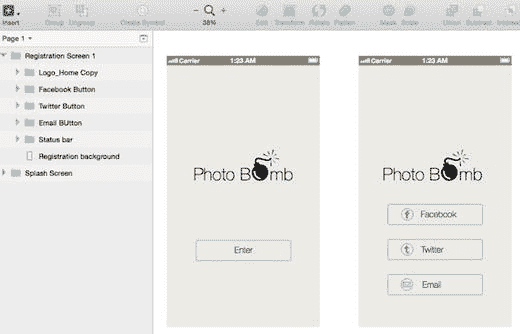

# 身份验证

大多数应用都需要某种形式的身份验证，用户才能进入并使用应用的服务。如今，一些应用发现使用大多数用户都已加入的流行社交网络会更便捷。这简化了注册流程。由于社交网络已经对用户进行了身份验证，通过其 API 进行注册，并且大多数用户对此流程都很熟悉，他们只需选择想要用于身份验证的适当社交网络即可。如果他们愿意，也可以通过电子邮件进行注册。通常没有必要为社交媒体注册流程绘制线框图，因此我们将创建两个页面：一个让用户选择他们想要使用哪个社交媒体进行注册，另一个是他们通过电子邮件注册的流程页面。

我们通过复制上一页的背景和状态栏来创建第一页。现在我们有了一个空白屏幕来构建新页面。新页面必须包含三个注册按钮以及应用的 logo。图 7-5 显示了新创建的页面。

图 7-5.

包含社交媒体和电子邮件注册按钮的新注册页面

为了在尺寸上保持一致性，我从启动页面复制了按钮三次，分别为`Facebook`、`Twitter`和电子邮件按钮各创建一个，然后从`Pixel Love`提供的免费图标集中导入每个按钮的图标作为 PNG 文件。调整大小并对齐后，我们就得到了新页面。将它放在原始页面旁边，两者看起来还不错，我们的线框图进展顺利。现在我们有了两个页面，可以继续进行身份验证流程的下一步了。你可能想知道为什么我选择不布置单个的`Facebook`和`Twitter`身份验证流程。这主要是因为那些屏幕大多由其各自的发布方控制，设计人员对其外观的控制权微乎其微。这些应用要求你通过那些社交媒体服务进行身份验证，然后返回你的应用，因此这些服务的弹出屏幕不需要我们做过多的设计或布局决策。因此，我选择只展示电子邮件身份验证流程，并在下一节展示几个屏幕。

**提示**

`Pixel Love`图标可在以下网址找到：[`http://www.pixellove.com/free-icons`](http://www.pixellove.com/free-icons)。

