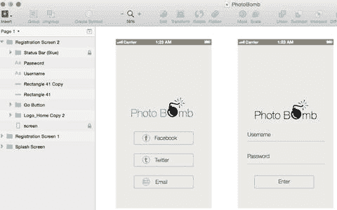
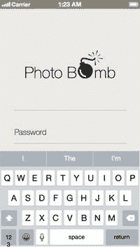

# 电子邮件注册

接下来我将创建的页面是电子邮件注册页面。一旦用户选择使用电子邮件认证来注册我们的应用，应用将要求用户输入用户名、电子邮件地址以及用于登录应用的密码。在屏幕最底部，我们将添加一个提交按钮，该按钮将启动与后端服务器的注册流程。

我们需要在此页面上创建三个输入字段：一个用于用户名，一个用于密码，另一个用于确认密码。然后，我们可以添加按钮。在页面上仔细排列所有元素时，我们可以参考之前的页面，以确保所有元素对齐，如图 7-6 所示。

图 7-6.

第二个注册屏幕，包含用户名、密码、密码确认的输入字段以及一个“进入”按钮

在设计线框图时，通常会创建一个备用屏幕，展示当键盘弹出且用户输入信息时，屏幕上的元素将如何移动。在线框设计过程中，最好展示尽可能多的视图，以便明确内容在屏幕上的放置位置，不留疑问。

图 7-7 展示了 PhotoBomb 登录屏幕，其中键盘已弹出，光标位于用户开始输入用户名的地方。理念是页面内容及关联字段会随键盘弹出而上移。初次设计者最好与工程师讨论此功能，因为键盘遮挡文本字段在新设计中相当常见。

图 7-7.

PhotoBomb 登录屏幕，键盘和光标作为开发者的参考

在电子邮件注册中，通常用户会收到一封发送至注册邮箱的验证邮件，以验证其身份。验证通过后，用户将被带回应用完成注册流程。通常情况下，用户会直接在移动设备上验证邮箱，因此整个过程相对顺畅。

