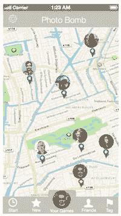

# 主页

现在，用户已完成应用注册且身份得到确认，他们正式进入应用。主页是用户在注册后看到的第一个页面，也是每次打开 PhotoBomb 应用时都会返回的页面。因此，此屏幕上的元素比应用中几乎任何其他页面都更重要。该页面必须兑现应用的承诺。无论最初是什么原因促使用户下载应用，他们都会期望在此屏幕看到这些内容。页面必须在极短时间内引导用户理解应用的完整用途。同时，页面还必须包含导航元素，以便用户从此处导航至应用的其他页面，并在需要时随时返回。在思考此页面时，我将参考图 7-2 中的笔记。这将帮助我提醒自己应用的总体目标，并始终牢记在心，确保页面上的所有内容都易于访问和查找。这是应用主要功能所在的页面。

参考列表后，我们决定对该页面采用直观的设计方法。作为一个基于位置的应用，该页面将在主屏幕上放置一张地图，并在底部添加一个标签栏，用于引导用户进入应用的其他区域。此外，页面上还设有区域，供用户查看附近其他用户“轰炸过”或标记过的照片位置。用户还可以看到每个用户的头像，便于识别。

在图 7-8 中，我们展示了主页的基本线框图。如同线框图一样，图标仅用于占位，并粗略表示元素在屏幕上的位置。该页面通过导入来自 Death to Stockphotos 的免版税图片以及 Pixel Love 的图标创建而成。标签栏中的图标是线框模板的一部分；我们只是更改了每个图标对应的标题。

图 7-8.

PhotoBomb 应用主页的线框图

我们的地图图钉图标是通过互联网搜索随机找到的，而地图背景则从包含在 Sketch 中的 iOS 设计模板中导入。

