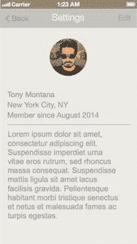
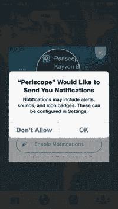
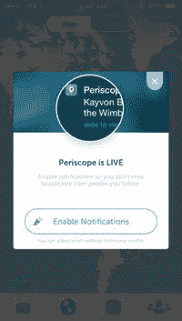
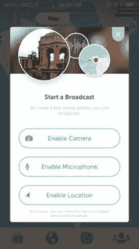
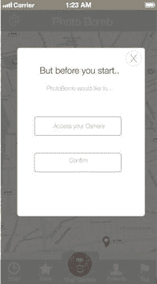

# 个人资料页面

如果用户需要注册应用并从其相册中选择照片作为头像，那么通常建议在应用中添加一个个人资料页面。这样，用户可以随时更改其个人资料。有时个人资料页面可以在“设置”页面内编辑，有时则不能。我认为展示 PhotoBomb 用户个人资料页面的样子是有价值的，因为作为移动设计模式，该页面的呈现方式有多种。我决定尽可能保持个人资料页面的简洁，但对该页面形态进行快速线框设计，将有助于我们后续进入应用的设计阶段。

个人资料页面是一种常见的设计模式，快速搜索 Pttrns、Mobile Patterns 或 Inspired UI 等流行设计模式网站，会发现有多种不同的方式来呈现这类信息。不过，大多数页面都有几个共同点，例如用户照片以及与应用相关的其他信息，如关注者、点赞数、访问过的地方、好友等。你可以查看并决定哪种方式最适合自己，或者创建自己的设计。但请记住，个人资料页面应提供比应用其他位置更详尽的用户信息。

此页面是通过从早期屏幕中复制一个空白屏幕开始创建的。设计思路是，用户在上一页的线框图中点击“编辑个人资料”单元格后，会跳转至此页面。进入此页面后，用户可以点击“编辑”按钮进行任何修改。

我从主页导入了用户图像，并将其放大并居中。通过使用不同大小的文本块创建页面的其余部分，最终形成了图 7-11 所示的个人资料页面线框图。

图 7-11.

PhotoBomb 个人资料页面

### 权限

iOS 要求获取用户许可，才能使用其手机上的某些服务和功能。用户必须明确允许，第三方应用和软件才能访问其麦克风、摄像头、通讯录以及位置等信息。软件开发人员请求这些信息的方式多年来一直在演变。最初，请求权限的小通知会弹出在用户屏幕上。随后，用户可以选择允许或拒绝应用使用该服务。图 7-12 展示了一个典型的权限通知示例。

图 7-12. Periscope 应用的标准权限通知弹出窗口。这是 iOS 的标准通知格式

然而，最近设计师们开始重新思考应用请求使用设备服务权限的方式。这些权限页面越来越频繁地被巧妙措辞和精心设计，以引导用户允许使用开发人员认为能提升其整体应用体验的特定服务。图 7-12 展示了视频流应用 Periscope 如何处理请求用户启用应用内通知权限的示例。请注意，尽管标准通知仍然会出现，但用户已通过一个设计巧妙的屏幕被引导，从而允许应用使用其设备的所有必要服务。这无疑是一个额外的步骤，并非完全必要。但由于如今的用户过度关注隐私，这个额外的页面会付出更多努力，以在用户可能本能地说“不”的情况下，真正获得权限批准。注意图 7-13 中，文案是如何诱导用户启用通知，以免错过正在发生的内容。图 7-11 中第二个屏幕的底部也用文案安抚用户：“别担心，你可以在每次直播前选择隐藏你的位置。”这条信息是刻意的，旨在向用户表明 Periscope 关心他们的隐私，并提供了这些额外控制来保护用户隐私。

图 7-13. Periscope 应用在隐藏权限流程方面做得非常出色

要启用通知，用户点击“启用通知”按钮；若要保持关闭，则点击应用右上角的“x”。其不同之处在于请求的措辞。

专为请求权限创建一个页面，能让开发人员更好地控制措辞。这里的措辞更加友好，为用户提供了更清晰的解释，而不是告诉他们如果关闭通知会错过什么。这里的消息是：“启用通知，这样你就不会错过你关注的人的直播。”

值得注意的是，一旦用户点击“启用”按钮，旧的系统标准通知仍然会弹出，并且必须被接受。iOS 通知会说：“Periscope”想要给你发送通知。通知可能包括提示、声音和图标角标等。顺便说一句，这个措辞是固定的，不可更改。

但通过这种方式，用户在接受或拒绝之前，会得到一个更清晰的解释，说明应用需要哪些服务。如果你的应用需要使用多种设备服务，你可以考虑如何错开权限请求。例如：你是同时请求所有权限？还是等到用户尝试使用需要特定服务的功能时再请求？这两种方式我都见过。这是你在设计应用线框图时需要思考的问题，因为每个页面可能需要不同的文案和不同的设计。

对于我们的`PhotoBomb`权限页面，我们将创建一个简单的页面，请求使用那些让用户充分体验应用所需的服务。该页面的线框图如图 7-14 所示。

图 7-14. `PhotoBomb`权限页面

我通过使用之前新建页面弹出窗口的一个版本来创建了`PhotoBomb`权限页面。由于该页面已经拥有我所需的大部分元素，这是一个简单的选择。只需对按钮和文案的尺寸稍作调整，我就能复制该页面并进行一些编辑，以创建新的权限页面。更多的修饰将在设计阶段进行，但这展示了其结构。

