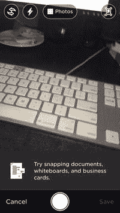
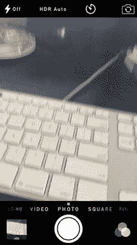
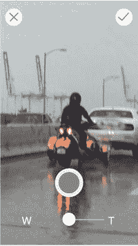
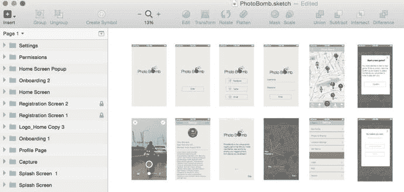
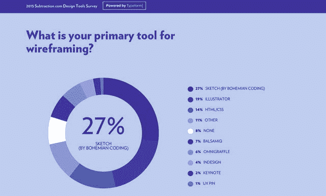

# 相机拍摄

如今，越来越多的设计师会在应用中修改相机视图，以契合应用期望的用户体验，并加入针对应用的个性化偏好。当然，你可以直接使用 iOS 标准的相机视图进行拍摄。它运行良好，能提供所有 iOS 用户习以为常的基础功能。但对于以图像拍摄为主要功能的 App 来说，有时会选择为用户设计独特的相机视图。在我们的应用中，我们不会这么做，但在此处提出这一点，是因为你的线框图应当在此阶段包含相机视图的任何新颖或独特的设计元素。你还需要与开发人员特别讨论这个功能，因为要实现任何非标准相机 UI 视图，都需要特殊的编程。图 7-15 展示了一些与标准 iOS 相机视图差异显著的相机视图示例，特别是热门照片应用 Instagram 和生产力应用 Evernote。

图 7-15. Instagram 和 Evernote 都创建了独特的相机拍摄视图，以紧密贴合用户需求和自身品牌

我决定为我们的应用简化典型的相机界面。因此，我们会剥离所有无关或非必要的元素。最终只保留我们认为用户使用应用拍照所需的关键元素。在图 7-16 中，我们在屏幕顶部添加了两个特别创建的“删除”和“批准”按钮，并导入了一张图片以显示相机正在运行。屏幕下方中央的按钮允许用户拍照，底部的滑块则用于放大或缩小图像。一切从简。

图 7-16. PhotoBomb 拍摄界面。用户可以拍照、批准或拒绝，以及缩放画面

我们刚刚使用 Sketch 完成了 PhotoBomb 应用主要页面的线框图绘制。虽然这个过程需要我们额外思考应用的工作方式，但实际上创建这些页面的过程相对简单。图 7-17 展示了在 Sketch 的一个页面中所有线框图的鸟瞰图。

图 7-17. 我们在 Sketch 中为 PhotoBomb 应用绘制的线框页面

对于使用 Sketch 创建线框图是否仍有疑虑？那么无需再寻找答案了。今年早些时候，前《纽约时报》设计总监 Khoi Vinh 对设计师进行了一项简短的调查，名为“当今设计师使用的工具”，以了解当下最受设计师欢迎的工具。这是一个很合理的问题，因为最近设计师在设计时有了更多工具可供选择。

Khoi 询问了设计师们在从头脑风暴、线框图绘制，到界面设计和原型制作等各个环节中最喜欢的工具。当来自 200 个国家的 4000 多名参与者提交结果后，设计师们表示，他们最喜欢的线框图绘制工具是 Sketch，获得了 27% 的选票，领先于 Omnigraffle、Illustrator 和 InDesign 等流行的线框图工具。调查网站的一张图表如图 7-18 所示。同样重要的是，Sketch 主要被科技公司和初创公司使用，这些公司拥有大量早期采用者，而自由职业者和大型机构则构成了其余的主要用户群。

图 7-18. Khoi Vinh 的设计工具调查结果显示，Sketch 是设计师进行线框图绘制的首选工具

值得一提的是，Sketch 还以 34% 的得票率击败了所有对手，成为设计师进行界面设计的首选工具，领先于业界老牌工具 Photoshop。不过，我们将在下一章详细讨论这一点。

## 本章小结

总体而言，线框图绘制是设计过程中的重要环节。如果线框图绘制得当，你的设计流程将会顺畅得多。虽然你可能很想快速推进像素级设计，但请花点时间在线框图绘制过程中仔细思考整个应用，确保你设计的应用满足目标用户的需求。这个过程有时可能会令人沮丧，但市场上有如此多的工具可供选择——无论你使用本章列出的高保真工具，还是使用经典纸笔——这都是你在设计之前深入了解应用和用户的阶段。这个话题将在下一章中讨论。

