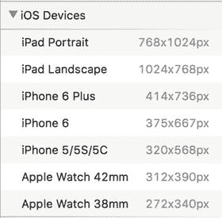
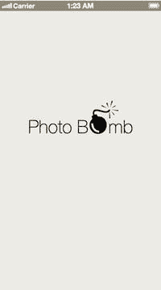
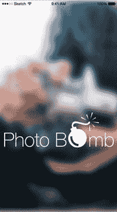
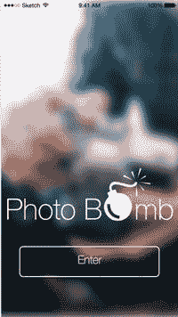
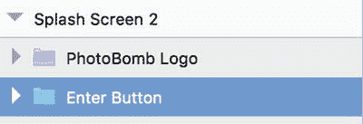

# 8. 设计你的应用

我们已经涵盖了所有基础知识，甚至探索了使用 Sketch 绘制应用线框图。所以现在你无疑既急切又兴奋，想要真正开始设计你的应用了。在开始为应用添加颜色、品牌标识和风格（这是任何应用设计阶段都会涉及的内容）时，你需要手边备好线框图。如果你是为客户工作，你会拥有他们的品牌指南，甚至可能有一个与其品牌相符的调色板可供选择。你线框图中的元素在设计阶段可能会被保留，也可能被更改，这意味着一旦你对某些图标应该是什么样子达成一致，你可能想要更改线框图中使用的某些图标。你甚至可能决定从头开始创建一些图标。使用我们迄今为止学到的所有技能，这将很容易实现。如果你需要退后一步复习一下，现在就可以做。如果没有，那我们就直接开始设计我们的应用吧。

## 色彩

既然我们已经进入了设计阶段的核心，现在谈谈色彩是个好主意。到目前为止，我们还没有就从应用色彩方面进行过讨论，我们的线框图也排除了任何实际的调色板，或者对 PhotoBomb 应用中最突出颜色进行真正的思考。

色彩可以在很多方面影响你的应用。色彩心理学已有详尽记载，在本书前面部分，我提到了一些很酷的在线工具，可以帮助你为应用的整体设计挑选搭配和谐的色彩。如果你正在开发一个有明确品牌指南的应用，那么你应该参考那份文档。

大多数主要品牌都有指南，不仅规定了在涉及该品牌的特定情况下可以使用和应该使用哪些颜色，还会规定字体、定位和其他设计元素的使用。如果你正在开发的主要是自用应用，即使你并非知名品牌，品牌标识仍然很重要。首先，查看你应用所处类别中的其他应用，了解哪些趋势流行，这会很有帮助。然而，潮流来来去去。对于色彩，你需要思考所选择的颜色将如何影响或引导你的用户，当然还有整体游戏体验。主色需要由次要的、互补的颜色来衬托，这些颜色在屏幕上（尤其是并排放置时）要表现出色。

同时，也要思考哪些颜色能很好地突出和衬托应用内的特定操作。如果你的应用主要以照片为基础，那么不会与照片争辉的柔和颜色效果最好。对于我们的 PhotoBomb 应用，氛围应当唤起熟悉感和愉悦感。目标是让用户每次回到主页时都感到舒适和受欢迎。我喜欢蓝色，而且众所周知蓝色对用户有镇静作用，那么我们就以蓝色为起点，并使用 Sketch 的检查器来尝试在整个应用中将不同色调和深浅的蓝色作为点缀色。

## 准备工作

在我们开始设置页面设计之前，如果你还没有按照第 6 章所述设置好偏好，那么现在正是时候。同时，你也需要考虑将要设计的屏幕尺寸。如你所知，Sketch 提供了多种尺寸的画板，这些尺寸与当前的 iOS 设备屏幕相对应。在开始设计之前，你应该确定目标设备尺寸，并选择合适的画板。在选择合适尺寸的画板时，Sketch 提供了一系列预设尺寸，如图 8-1 所示。

图 8-1. Sketch 3.3.3 中提供的预设画板尺寸列表

由于本书主要针对 iPhone 进行设计，因此我们将只关注这些设备。通常，约定如下：

*   选择 iPhone 5、5S 或 5C 被视为按 `@2×` 分辨率设计。
*   在低于 `@2×` 分辨率下进行设计被视为 `@1×`。

这些分辨率适用于 iPhone 4 系列及更早的设备。这些设备大多已停产，因此如果你刚开始设计，你应该按 `@2×` 或更高的分辨率进行设计。较新的设备（iPhone 6 Plus 及以上）被视为 `@3×`。

你开始设计时所用的分辨率或画板，将取决于最终产品的目标设备以及个人偏好。我通常从选择 iPhone 6 的画板开始设计，因为它能让我捕捉到所有细节。同时请记住，当你准备导出资源用于开发时，需要为多种屏幕尺寸和分辨率进行导出。

我们将在第 10 章讨论导出资源。不过现在，我将使用 iPhone 6 的画板开始设计我的应用界面。

## 启动画面

我们已经准备好了线框图，接下来将从启动画面开始。幸运的是，我们的 Logo 已经完好无损，可以直接从线框图中使用。将 Logo 中的所有元素编组并重命名以便于使用，这是一个不错的主意。如果你还记得，完成这一步后，我们还可以轻松更改 Logo 的颜色，并在整个设计中统一更新，从而在设计阶段方便地进行修改。

正如我们在创建线框图时所做的那样，我们将从启动画面开始，这是用户下载应用后看到的第一个页面。尽管它在屏幕上只会显示很短的时间，但这个页面却奠定了基调，甚至可能影响用户是否会继续探索你的应用。因此，把这个页面做好非常关键。

从设计的角度来看，这个页面相对简单。考虑到应用的主题，摄影是一个关键元素，我没有使用纯色背景，而是决定采用全屏照片作为背景。我浏览了免版税图片文件夹，最终选择了 Death to Stockphotos 的一张图片。他们提供基于订阅的免版税图片选择，每周会发送到你的收件箱。这张图片的主角是一位摄影师和他的相机。我认为这张图片暂时够用。我将照片导入到 Sketch 画布上，调整了大小，添加了 `10px` 的高斯模糊，并将我们的 Logo 重新定位到屏幕较低的位置，以便让用户更好地欣赏照片。我还更改了 Logo 的颜色。线框图中的 Logo 是黑色的，但我将其改为了白色。这样能让它更突出一些；请记住，如果我们之后决定更改它，我们可以随时修改并让所有地方同步更新。请参见图 8-2 中启动画面线框图和刚刚创建的设计图之间的关键差异。左侧是线框图，右侧是设计图。这里重要的收获是，设计图与实际线框图有何不同，以及我们如何已经并将继续把线框图作为应用的指南，同时根据需要自由地偏离它们。

图 8-2. PhotoBomb 启动画面的线框图形式和设计图形式

创建图 8-2 所示的初始界面，需执行以下步骤：

1.  创建一个新的空白画板。
2.  导入所需的图片。
3.  选择图片，然后勾选检查器面板中的复选框，添加高斯模糊效果。
4.  通过滑块或直接在字段中输入数字，将高斯模糊设置调整为 `10px`。
5.  复制 PhotoBomb Logo 并将其添加到页面中。
6.  更改 Logo 的颜色。

要添加“进入”按钮：

1.  从“插入”菜单中选择矩形形状。
2.  创建一个尺寸为 `298 × 65` 的圆角矩形。
3.  使用“插入”菜单中的文本工具为按钮添加标签。
4.  将这些项目（矩形和标签）编组，以便于引用并在需要编辑时保持它们在一起，如图 8-3 所示。

图 8-3. “进入”按钮组包含矩形形状以及按钮的标签。PhotoBomb Logo 以符号形式显示

完成启动画面后，我们可以继续其余的设计。使用 Sketch 的一大优势不仅在于其易用性和低入门门槛（正如我们在本书中所看到的），还在于它能大大缩短完成设计所需的时间。虽然我非常支持花必要的时间来仔细构思线框图，但设计阶段才是你真正想要节省时间的地方。设计可能很繁琐，尤其是对于更复杂的设计。一旦你熟练使用 Sketch，无疑会缩短你的设计时间。如果与 Photoshop 和其他一些设计工具相比，你的设计时间没有显著减少，那么正如他们所说，你的使用方法有问题。接下来，我们开始设计 PhotoBomb 应用的认证界面。

