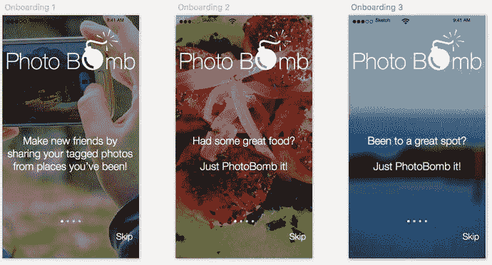

# 引导页

我们的引导页线框图最初只包含两个界面。但在设计阶段，我们会稍作调整。如前所述，近年来引导页在应用设计中变得非常重要。在此，我们想花些时间展现创意，真正运用设计感来吸引用户，并讲述一个关于我们应用的故事。

我们将复制之前的页面来创建新界面。将它们添加到设计画布中对应的画板后，我们会为新页面寻找一张新的背景图。在设计阶段，尤其是引导页设计中，我们希望将应用的每个界面视为用户正在经历的一段旅程。之前的页面是对应用的介绍，图片展示的是手持相机的人，我们希望在某种程度上，将新背景图片以及整个系列作为上一页面所开启的旅程的延续。这里我选择了一张能够体现应用内实际图片效果的照片，画面是旧金山的金门大桥。我将使用其他几张图片带领用户继续这段旅程，并在引导页上添加一些说明文字，向用户解释应用的核心功能。文字与图像的结合对于应用以及吸引首次用户至关重要。对大多数用户而言，这是他们第一次也是最后一次看到这些界面。多数引导页只在首次打开时显示，但有时用户也可以在后续或设置中再次查看。我主要关注文本和图像。图 8-4 展示了我最终完成的效果。

图 8-4

PhotoBomb 应用的一组三屏引导页。请注意文字与图片的结合，以串联视觉元素并引导用户踏上旅程

这些引导页使用了与创建启动屏相同的技术。现在你应该已经知道如何导入图片、复制 Logo 并添加文字。每个界面底部的页面控制器是 Sketch 自带的 iOS 模板中的符号。最后，为了提高每个界面文字的可读性，我按照以下步骤创建了一个遮罩：

-  创建一个与画板尺寸相同的矩形。
-  选择黑色（`FFFFF`）作为填充颜色。
-  移动图层位置，使其完全覆盖画板。
-  将矩形的透明度降低到 33%。
-  在图层列表中将该图层置于图片上方。

此时也是开始思考和讨论动画效果以及元素如何在页面上移动的好时机。请注意，我们启动屏中的 PhotoBomb Logo 位置与引导页中的不同，因为我们需要调整 Logo 的大小和位置，为引导页的文字腾出空间。那么，我们如何在这两个界面之间进行过渡呢？这正是设计师和开发者必须共同讨论这些过渡效果的地方。它们可能看起来简单，但时机至关重要。从主界面直接切换到另一个界面可能会让用户感到突兀，导致 Logo 像“跳切”一样从一个位置跳到另一个位置，而文字则突然出现。一种更微妙且友好的过渡方式是：当用户点击“进入”按钮后，启动屏缓慢溶解到引导页。背景变化后，Logo 可以以不令用户惊讶的方式平滑上移。

另一点需要注意的是，我们在第一个引导页上使用了高斯模糊效果，但在后续页面中移除了它。这种变化也可以通过一张图片缓慢溶解到另一张图片的方式来处理。在某些情况下，设计师还必须考虑用户如何与界面交互以在应用中导航。也就是说，用户是通过滑动还是点击屏幕来推进引导流程？大多数用户会滑动或点击，因为这些是自然的触屏交互方式。有时，页面会有轻微的弹动感，提示用户滑动以查看下一页。这些交互和过渡细节同样可以通过标注、创建简单原型，或与开发人员沟通来处理。

