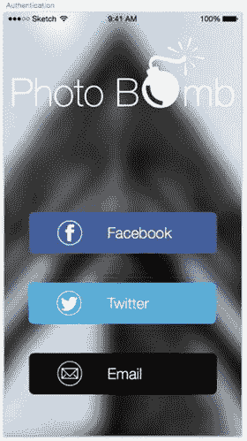

# 身份验证

我们设计的身份验证页面将与线框页面高度一致。如果用户能深入到应用的这一步骤，那么他们就已经准备好并愿意注册了——至少我们希望如此。这些页面的核心在于展示带有品牌的 Facebook 和 Twitter 按钮，让用户可以快速选择自己偏好的社交网络，从而尽快进入应用并开始游戏。我们还会为按钮赋予与 Twitter 和 Facebook 匹配的特定蓝色调，使其品牌标识易于识别。

我们将通过复制之前的某个页面并删除背景图片来创建新页面。找到适合该页面的图片后，我们会进行优化、导入并调整尺寸，使其适配屏幕，同时确保不会像照片通常那样导致文件体积过大。

我希望应用内所有按钮的尺寸保持一致，因此我会从启动页复制按钮到当前页面，并将其复制三次，以创建所需的三个身份验证按钮。放置好之后，我们需要调整颜色（复制的按钮原本是透明的）、重命名标签，并添加相应的图标。

由于身份验证页面代表了用户流程中的一个新阶段，我们还需要创建一个新页面，以区分这一流程与引导/启动页流程。这样在必要时，我们展示和呈现工作成果会更容易。设计时务必牢记，演示和组织的条理性在工作中至关重要。

通过检查按钮之间的间距，我们可以轻松分布空间，确保它们使用参考线在屏幕上垂直和水平居中，然后逐一为每个按钮设置样式。我们先处理 Facebook 按钮。这个按钮将和线框一样，使用 Facebook 的“F”标志并采用其独特的蓝色调。在我看来，拼写出完整的名称并无必要，因为如今地球上几乎所有人都知道这个社交网络。为了获得准确的 Facebook 蓝色，我只需打开一个新的浏览器页面访问 Facebook，在检查器中选择颜色，并用吸管工具从页面上“偷取”该颜色。这是 Sketch 最便捷的功能之一，它让设计中的颜色匹配和线框制作变得异常简单。完成 Facebook 按钮后，我们按照同样步骤处理 Twitter 按钮。目前我打算让电子邮件按钮保持透明，以便能看到其后的背景图片。不过尝试之后，我决定将电子邮件按钮设为纯色，以与上方的其他按钮保持一致。

我已经通过 Pixel Love 导入了按钮图标，调整了大小和颜色使其匹配，并为按钮标签设置了样式以确保它们也保持统一。添加图标后，我们可以缩小画布，看看新创建的身份验证页面。效果如图 8-5 所示。

图 8-5. PhotoBomb 应用经过品牌化设计的身份验证页面

请记住，这些页面的设计理念是在各页面之间实现无缝过渡。PhotoBomb 的标志在每个页面上应处于相同位置，并且当用户切换到新页面时，每个页面上的元素只需微妙地变化。如果用户决定返回流程中的上一步或前一页，元素应反向变化。我的目标是，让用户在每一个流程中都拥有对整个过程的最大控制权。请记住，我们的最终目标是，通过清晰地向用户展示注册并开始使用应用后能获得什么，来吸引用户。这种体验是整体应用内体验的准备，用户现在看到的内容将为他们在应用中的体验奠定基础。

