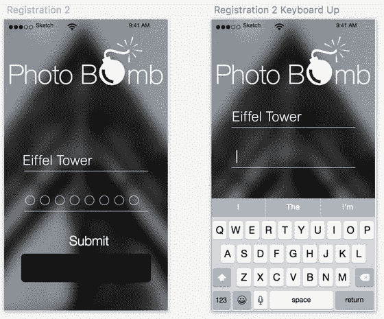

# 电子邮件注册

我们的应用身份验证流程已经完成。现在可以进入电子邮件注册页面。该页面包含我们的标志、供用户输入用户名和密码的字段，以及一个“进入”按钮。相当直接，对吧？我们的用户名和密码标签将与上一页的标签保持相同大小——这又是一致性原则的体现。而且我们不会真的画一条线（虽然 Sketch 支持且很容易做到），而是创建一个 1 像素的矩形用于每个字段，然后复制它来创建两个字段。

这个页面实际上可以被视为身份验证流程的一部分。不过，我们会在此添加一些线框中没有包含的元素。例如：通常输入密码时，密码会被某种方式隐藏。在设计阶段，我们需要选择如何保护密码，以及采用何种创意技巧来遮蔽用户的密码。遮蔽密码是一种常见做法，但不同应用的处理方式可能不同。也有一种观点认为，在注册时遮蔽密码会带来糟糕的用户体验（UX），因为用户会犯更多错误，尤其是在需要输入两次密码的情况下。如果要求用户输入两次密码，且两者必须匹配才能注册，那么对于密码更复杂的用户来说，同时遮蔽两个密码可能很棘手。因此，一些设计师选择仅在用户登录时遮蔽密码，因为此时用户已经选定了密码，理论上对其很熟悉。

尽管这是一个非常现实的问题，但我们暂时搁置，假设它不存在。这很可能是一个应该在项目的线框阶段就评估并确定的问题。如何创意地遮蔽密码是另一个议题，所以我们将专注于这一点，并假设已经就此做出了决定且大家达成一致。

遮蔽密码的典型方式是使用星号或圆圈。在图 8-6 中，我使用圆圈来遮蔽密码。保持圆圈空心能带来不错的视觉效果，并让背景图片透出，这在应用的这一阶段至关重要。

图 8-6. 在密码和用户身份验证页面中，我使用了空心圆圈作为密码遮蔽符，并沿用了 PhotoBomb 应用中的相同样式

