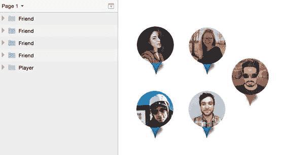
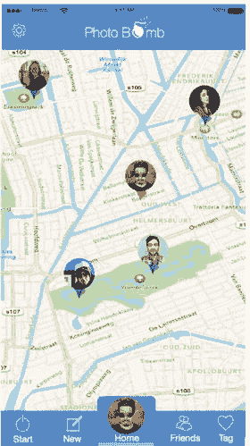
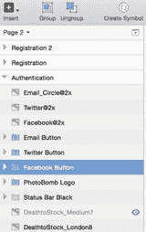
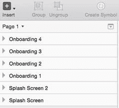

# 主页

众所周知，主页是应用程序中最重要的页面。正如我们在线框图中确立的那样，主页是用户在注册时到达，并在完成应用内其他页面的任何任务后返回的页面。因此，为了完成用户初次熟悉应用时开启的旅程，这个页面必须以某种方式让用户感到熟悉。但一个用户从未见过的页面，如何能让人觉得熟悉呢？此时，退后一步，从鸟瞰视角审视我们设计的所有页面，以充分熟悉到目前为止的流程，会有所帮助。

我经常这样做，以确保我能延续应用的总体流程，并开始从创意角度思考，我希望应用如何继续发展。

线框图阶段的主页缺少一些关键元素，而现在我们在设计它时，需要添加并完善这些元素。从标签栏开始，我使用了线框图模板工具包中的图标，但我决定选择更合适的图标，使其更贴近它们所代表的动作，并添加了一个高亮条，旨在通过标签图标标题下方一条沿屏幕底部移动的细小横条来突出显示用户当前所在的页面。我选择了那些我认为用户熟悉的图标来代表相关操作。这些是我在此做出的个人设计选择——你可能同意或不同意——所以请随意探索你为何或如何在设计中采取不同的方法。

虽然我仍然使用地图背景作为主屏幕和整体游戏玩法，但我必须对玩家朋友在屏幕上的显示方式做出一些具体调整。虽然线框使用蓝色地图图标来显示朋友的位置，并用红色图标来标识玩家在主页上的位置，但我开始觉得这两个元素在游戏屏幕上占据了太多空间。因此，我决定将它们合并起来。这将会呈现一个更简洁的界面，屏幕也会保持整洁无杂乱。

为此，我创建了一个新的 Sketch 文件，并将这两个视觉元素导入屏幕。在将它们靠近并让地图图标位于个人资料图像后方之后，这有助于我设想新图标的样子。然后我创建了一个新形状，复制了地图标记和阴影。我将所有形状分组并创建了一个符号，这样我以后如果需要，就可以更改屏幕上所有图标的颜色。最终结果如图 8-7 所示。虽然某些单个图像可能需要稍作调整，但你可以看到总体思路。

图 8-7. 为 PhotoBomb 主页重新创建的玩家和朋友的新标记

图标完成后，我将它们导入回新设计的主页中，如图 8-8 所示。

图 8-8. PhotoBomb 主页的最终设计

新页面包含了我们的主色调蓝色、我们的高亮色、最终图标，以及用户到达应用主页时将会看到的布局。标签栏是从线框图中引入的，并针对设计阶段进行了重新编辑。我更改了颜色，并调整了标签栏的大小，以适应新图标、标题和高亮条。

完成此页面后，我们可以继续处理线框图中的其他页面，这些页面构成了 PhotoBomb 应用的其余部分。

顺便提一下，为了贯彻我们迄今为止在本书中学到的关于如何创建和组织 Sketch 文件的技能，我在进行设计时始终记得恰当地命名我的图层、组和符号。当需要调整时，这会让查找内容变得更容易，并且在我们准备导出设计并将其交给开发人员时也会大有帮助。我现在在 Sketch 文档中有多个页面，每个图层都已被命名和标题化，以便于参考。应用的每个阶段都被放在单独的页面上，以保持整洁。如果由于某种原因需要添加新页面，这也更容易处理。你可以在图 8-9 中看到当前的图层列表。如果你的设计进展太快，请花些时间返回并恰当地对图层进行分组和命名。清理工作只需几分钟，但如果你需要将文件交给其他人，这将节省大量时间。

图 8-9. 带有标题和页面的 PhotoBomb 应用图层列表

