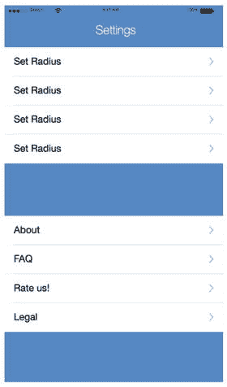

# 设置

接下来要设计的是我们的“设置”页面。此页面是用户管理其应用各项元素的地方，例如隐私设置、前面提到的游戏半径，以及谁可以在应用中看到他们等隐私信息。此页面的设计将相对简单。我们将使用如设置页面第一层级线框图中所示的标准表格视图。

带有表格视图的页面在 iOS 中非常标准，可能应该是任何 iOS 设计师最早学习设计的页面之一。表格视图在 iOS 中是一种常见的设计模式，因为它是按层级显示信息的绝佳方式，因此它通常包含在一些更流行的 iOS 设计模板中，包括 Sketch 预先打包的那个。要获取你可以使用的表格视图符号，请转到“文件”菜单并选择“从模板新建”。应该会列出“iOS 设计”选项，你可以从中选择。模板打开后，你可以将表格视图符号复制到你当前的项目中，并对其进行自定义以适应你的设计。

我们的设置页面将通过以下方式创建：新建一个纵向屏幕，包含状态栏和背景，然后从 iOS 模板中导入表格视图符号。完成后，我们必须自定义它们以匹配我们应用的配色方案。使用取色器，我们可以更新表格视图符号并更改每个标签上的文字，然后我们的页面就创建好了，如图 8-10 所示。

图 8-10. 设计好表格视图的设置页面

