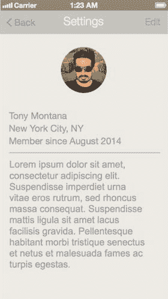
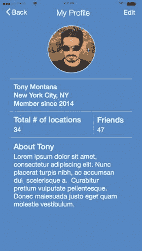

# 个人资料页面

回顾线框图中呈现的个人资料页面，我发现它还有改进空间。目前线框图显示，页面上只有用户基本信息以及城市和州的字段。但我考虑采用与线框图中不同的设计思路。毫无疑问，在实际工作中这种情况可能会出现。在设计阶段，有时你会希望做出调整。如果你是负责线框的人，这通常不成问题。但如果不是，最好能达成共识。老实说，无论如何达成共识都是个好主意。不过我们在此假设，这个决定是由其他力量推动的，比如客户、客户经理，甚至创意总监。这意味着改动势在必行，而且宜早不宜迟。如何在设计阶段进行可能影响应用用户流程的修改？幸运的是，我们即将做出的改动不会造成这种影响，但这个问题值得探讨。如果时间允许，你可以返回线框图快速制作页面原型并修订流程。此外，获得团队全体成员的认同以快速推进也至关重要。

同时，需要向前和向后审视几个步骤的流程，确保所做的改动不会影响整体流程和用户体验。当我审视个人资料页面的改动方案时，已经评估过这不会造成太大影响。我只是想稍微扩展页面内容。很简单，对吧？我们拭目以待。接下来讨论我打算做的改动。查看个人资料页面时，你希望了解与游戏玩法相关的用户信息。个人资料页面不仅用户本人可见，其他玩家或游戏中的好友也能查看。他们会觉得哪些信息重要？这就是我在重新设计个人资料页面时自问的一些问题。重新设计的结果如图 8-11 所示。

图 8-11. 重新设计的个人资料页面，包含新内容和编辑按钮。旁边是原始线框图

页面上的改动虽微妙，但我认为它让个人资料页面看起来更美观。我们新增了两个区域，分别显示用户关联的地点总数和好友数量，随后是个人简介信息，可置于页面底部的"关于"部分。我还为个人资料图片添加了浅蓝色边框。请记住，浅蓝色是应用主页的高亮色。这是在整个应用中保持品牌一致性的巧妙点缀。

