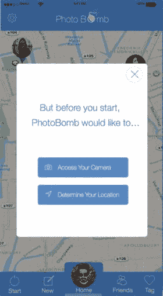

# 权限设置

我提到过，如今 iOS 应用中权限页面呈现出焕然一新的外观。因此，我想在此尝试一些不同的设计。由于 PhotoBomb 需要访问用户的相机和位置信息，我添加了这些选项，让用户提前了解我们需要获取的权限。实现方式有很多种，但最成功的方法是通过有效的设计和文案。我不敢自称文案高手，所以图 8-12 中权限页面的文案或许还需打磨，但从设计角度来看，该页面达到了预期效果。这个弹窗会在用户通过身份验证后、开始游戏前出现。用户点击确认按钮后，将看到 iOS 提供的标准默认通知页面。

图 8-12. 权限页面，带有弹窗和变暗的主页背景

该页面的制作方法是：直接复制主页，创建一个黑色矩形覆盖屏幕，然后降低其不透明度，使主页内容透出。设计思路是：弹窗显示时主页变暗，用户关闭窗口或确认后，弹窗消失，背景恢复正常亮度。弹窗是一个圆角半径为 11 的矩形。按钮尺寸与应用中其他按钮一致，图标来自 Pixel Love。关于图标的一点说明：我打算使用用户在与 iOS 交互时熟悉的相机图标和位置图标，因为这些图标非常接近。关闭按钮为手工绘制；我用两个长度相同、宽度为 3 像素的矩形组成十字，然后旋转形成"X"形，再将其添加到一个圆形中。这三个形状组合成一个符号，便于重复使用。

