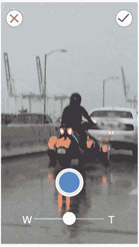

# 相机拍摄

我们设计的最后一个界面是拍摄界面。根据线框图，你们还记得我们决定创建自定义相机拍摄界面，以更好地贴合应用目标。这不是必需的，但算是一个贴心设计。请注意，"X"图标为红色，对勾图标为绿色，拍照按钮采用 PhotoBomb 专属的蓝色色调（见图 8-13）。

图 8-13. PhotoBomb 相机拍摄界面

这个最终页面标志着我们应用设计阶段的结束。我尝试挑选了对应用整体功能至关重要的页面，同时让你能够利用 Sketch 的最佳特性，使设计阶段和工作流程尽可能顺畅。现在你应该拥有了一套令人满意且得心应手的设计方案。

下一章，我们将讨论应用图标的设计，这已成为设计阶段日益重要的环节，并且可以借助 Sketch 的优势来实现。

## 总结

本章我们介绍了 PhotoBomb 应用的多个页面设计。其中涉及的大部分技巧你应该已经熟悉。我们设计了欢迎界面以及构成 PhotoBomb 应用的其他主要界面。建议你回顾并熟悉每个页面各节中概述的步骤，以便能够复现它们。当然，尽管这些页面体现了一些流行效果和移动设计模式，但培养自身的设计感同样重要。因此，在复现步骤的同时，务必尝试不同的效果和自己的风格。

形成自己的风格和视觉语言是成为设计师的重要环节。当你对自己的设计感到满意后，就可以继续设计应用图标了，这将是下一章的内容。

