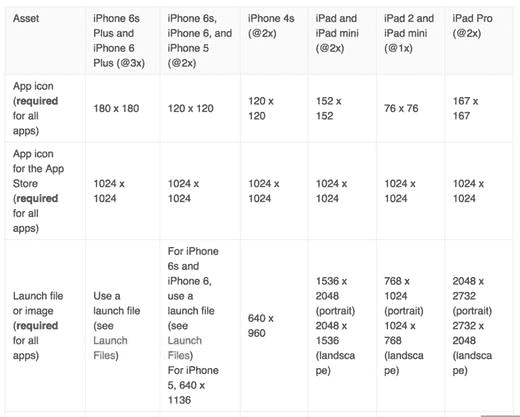
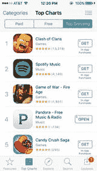
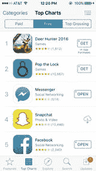
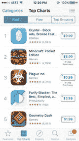

# 设计你的应用图标

到目前为止，我们已经为应用绘制了线框图并完成了设计。你可能会认为我们已准备好将设计交付开发，在某些情况下，这取决于你的流程和工作方式，确实如此。但如果你和我一样，你会希望继续设计过程，同时着手设计应用图标。过去，应用图标设计常被视为事后考虑，如今它几乎已成为一门独立的艺术形式。例如，有些设计师专门以设计应用图标为专长。如果你搜索应用图标，会发现大量文章和讨论、一些教程，甚至还有一些应用图标生成器。给你一句忠告：如果你重视应用图标，请远离那些一键式应用图标生成器。

你的应用图标很可能是用户在浏览 App Store 时首先看到的东西。因此，你希望它既独特又设计精良。如今，设计糟糕的应用图标已毫无借口可言。坦白说，一个设计糟糕的图标可能决定你的应用是成为拥有成百上千次下载的热门应用，还是无人问津。当我在 App Store 浏览新应用时，在阅读应用描述或功能介绍之前，我会先看图标。如果它不够格，我就会直接划走。我敢说大多数消费者都和我一样。仅 Apple App Store 就有超过一百万个应用，消费者没有太多时间阅读应用描述和评论。通常，应用图标对他们来说起着决定性作用。因此，它是设计过程以及应用品牌营销的重要组成部分。

本章专门讨论应用图标。我们将探讨应用图标为何如此重要，什么造就了一个出色的应用图标，然后为我们的 PhotoBomb 应用设计一个图标。

首先，最好先阅读《人机界面指南》，看看 Apple 对图标设计有何建议。这应当是你创建图标时实际遵循的清单。每个应用都需要图标，没有图标，你的应用将无法被 App Store 接受。因此，你需要非常认真思考你的图标将传达关于应用的什么信息。该图标将在 iOS 系统中用于代表你的应用，因此需要以多种不同尺寸进行复制。

以下是 Apple 《人机界面指南》中的一份“该做与不该做”清单：

- 使用人们能识别的通用图像。
- 追求简洁。
- 对你应用的核心概念进行抽象诠释。
- 避免使用透明效果。
- 不要复制 iOS 界面元素或 Apple 硬件产品。

由于图标在 iOS 系统中随处可见，《人机界面指南》也精确列出了这些图标应有的尺寸。由于所有应用都必须有图标，指南中附有一张便捷的表格供设计师参考，其中列出了所有图标和图像所需的尺寸。

我在图 9-1 中收录了《人机界面指南》中的部分内容。

**图 9-1.** Apple 《人机界面指南》中显示图标尺寸要求的表格

## 什么造就了一个出色的应用？

面对 App Store 中海量的应用，你如何打造一款能在用户滑动浏览时抓住他们眼球的应用？除了《人机界面指南》提出的要点外，应用图标设计还有一些基本原则，你在设计应用时需要牢记在心。让我们来探讨一下。

### 避免使用文字

应用图标很小。当用户查看应用排行榜时，他们看到的应用图标与应用名称的尺寸是 57 × 57 像素。这并不大。那么，你的应用如何在不使用文字的情况下传达信息呢？其实可以传达很多信息。这并不是说有些应用图标上完全没有文字，这并非硬性规定。浏览一下 App Store 你会发现，仍然有很多应用图标带有文字。然而，你也会注意到，许多其他应用图标没有文字。大多数带有文字的应用图标似乎是游戏或趣味应用。另外，请考虑这一点：使用文字很容易。不用文字，你就必须真正投入一项设计练习，思考如何在不直接告诉用户预期内容的情况下，传达应用的核心概念。就像我们在探讨引导页时讨论的总体叙事设计一样，我们同样必须思考图标如何从视觉上吸引用户，并在用户下载应用之前就将应用的理念传达给他们。

图 9-2 展示了 App Store 中的一些截图。如你所见，这个选集展示了撰写本文时 Apple App Store 中部分精选和收入最高的应用。它们中的大多数图标上都没有使用文字。

  

**图 9-2.** Apple App Store 的热门排行榜显示，大多数流行应用的图标上没有文字

### 明智地使用色彩

设计应用图标时，其次要记住的是要非常谨慎地选择颜色。如果你已有包含配色方案的品牌标识，那么应坚持使用该配色以保持一致性。即便如此，你也不必在图标中使用配色方案中的所有颜色。问问自己，哪种颜色最能代表你的品牌，同时也能让你的应用在 App Store 中最出挑。如果你的应用已经大量使用某种颜色，可以考虑将该颜色或其色调用作图标的背景。

对比度也很重要。如果你的图标具有特定或独特的形状，你会希望它在背景色中脱颖而出。当然，白色形状搭配彩色背景是我见过的 App Store 图标中最流行的组合之一。但如果你能驾驭，也可以选择其他路线。图 9-3 展示了我最喜欢的一些应用图标。其中包括一些我们熟知的最受欢迎品牌的例子，以及其他可能不那么受欢迎的例子。例如，Craftsy 选择将他们的名称添加到图标中，但请注意它是如何从背景中突显出来并易于阅读的。此外，Green Kitchen 非常出色地创建了一个使用照片或逼真设计的图标，让浏览者一眼就能明白该品牌的定位。

**图 9-3.** Apple App Store 中受欢迎的应用图标

### 保持简洁

图标很小，没错。57×57 像素的空间不大。但是，仍然有可能在这个有限的空间内创造出传达应用核心概念的东西。最好的方法就是保持想法简单。图 9-3 中展示的应用在创建图标时充分利用了那点小空间，并且做得非常出色。思考你希望用户如何以最简单的方式理解你的应用，然后围绕这一点开始设计。这将需要大量修剪。你可能从整个单词开始，最终缩减到一个字母。或者从某个词开始，创建一个比这个词本身更能唤起其感觉的图像。头脑风暴在此很有帮助，然后通过多次迭代将想法浓缩成一个单一的视觉元素，用户看到它就能立即联想到你的应用。但请相信我，以及 App Store 中一些设计最佳的应用：简洁是关键。

