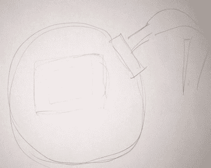
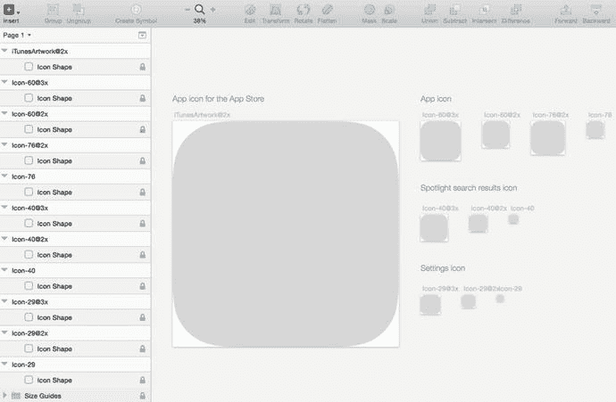
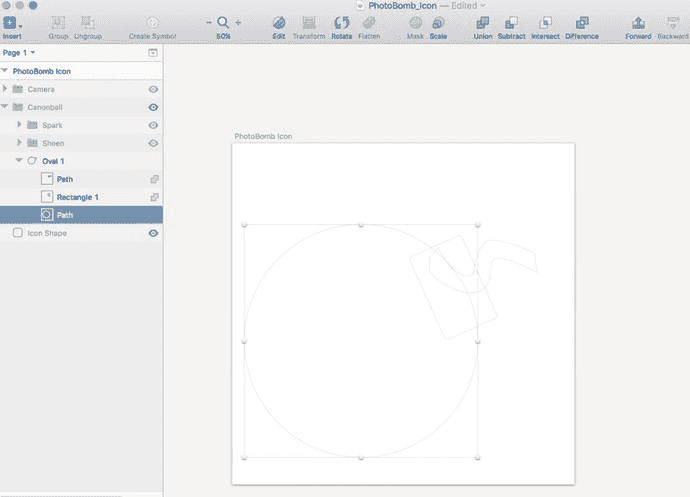
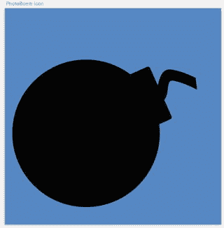
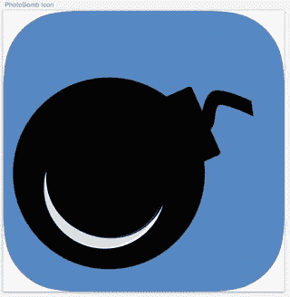
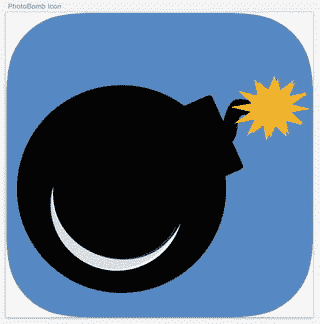
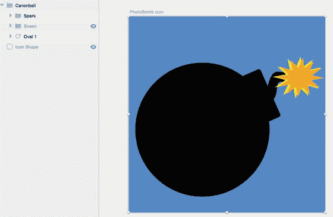
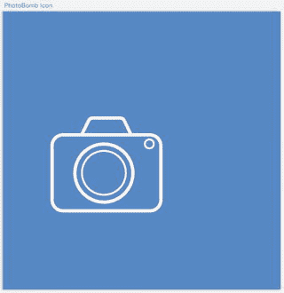
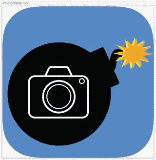
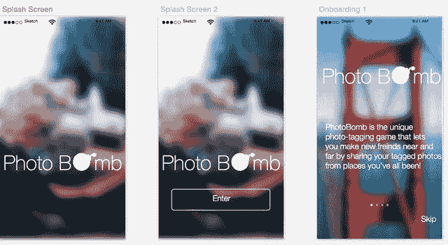

# 受他人启发

抄袭是不对的，但在设计领域，借鉴其他设计师的作品作为自己的灵感却是完全可以接受的。对有些人来说，这可能是一个危险的滑坡，需要明确的是，我绝不提倡抄袭他人的作品。但如果你刚接触图标设计，尚未培养出这方面的技巧，那么你绝对应该在 App Store 上花些时间，仔细浏览一些更流行的应用、它们的设计，当然还有它们的图标。通过下载这些应用并探索它们的设计风格和美学来支持这些设计师。在这个过程中，你或许能为自己的应用和图标找到一些灵感。现在，我们继续来实际设计我们的 `PhotoBomb` 应用图标。

## 使用 Sketch 设计你的图标

由于 `Sketch` 是一款以苹果为中心的产品，与其他模板一样，该程序也附带一个用于设计 iOS 图标的模板。如今，它也提供了供 Android 设计师使用的模板。但我们在这里要讨论的是 iOS 设计。因此，我们将进一步探索用于设计 iOS 应用图标的模板，并随后用它来设计我们自己的图标。

与我们虚构应用迄今为止所做的一切一样，我也是先用铅笔和纸画出草图，把大致构思从脑子里倒出来。有时我会不止有一个想法，就会为每个想法画出粗略的草图。有时我会将多个想法融合成一个组合体。图 9-4 是我为 `PhotoBomb` 应用提出的图标铅笔草图照片。虽然它看起来很初级，但对我而言，足以让我把握住想融入应用图标设计的基本概念。

图 9-4.

PhotoBomb 应用图标的初始草图

如上所示，草图中画了一个炸弹，里面装有相机的图像。这个炸弹让人联想到我们用在应用内页面上的 `PhotoBomb` 标识中使用的炸弹，尽管它们在呈现方式上有关键差异。我想让图标上的炸弹略有不同。那么，我是如何根据这张基本草图创建出图标的呢？

首先，我从 `Sketch` 的 iOS 图标模板开始。如图 9-5 所示，打开模板后，其中包含了所有预期的图标尺寸。这里有适用于 App Store、Spotlight 搜索和设置等场景的模板。对于我们的应用设计，我们不会用到所有其他模板，所以我删除了它们，以便能专注于主图标。图 9-5 显示了首次打开应用图标模板时的所有模板。

图 9-5.

Sketch 的 iOS 应用图标模板

### 设置背景颜色

删除所有其他图标图层后，我更改了图标背景的颜色。我考虑过使用我们在应用中用于高亮色的浅蓝色，但为了让图标更醒目、对比度更强，最终决定采用应用中从头至尾使用的深蓝色（十六进制代码 `4A90E2`）。这样，我们在其之上做的任何设计都会更突出一些。需要注意的一点是，在创建用于 iOS 的图标时，我们会以正圆形提交图标。圆角是之后由 iOS 系统添加的。模板中包含了一个圆角图层，所以我会先关闭该图层，专注于整个画板。我会时不时地打开该图层，以便了解最终图标的样子，接下来的图片中会展示这种来回切换的效果。

### 创建炸弹图标

接下来，我开始利用形状来创建炸弹图标。以下是我创建它时采取的步骤。

1. 从 `插入` 菜单中选择 `椭圆` 形状。
2. 按住 `Shift` 键，绘制一个完美的 700 × 700 像素的圆。
3. 暂时移除边框，并选择黑色作为填充颜色。
4. 从 `插入` 菜单中选择 `矩形`，创建一个 170 × 272 像素的矩形。
5. 将矩形的边框半径设置为 `11`。
6. 将矩形移动到圆的右上角，并旋转到合适位置。
7. 创建另一个 322 × 158 像素的矩形。

图 9-6.

显示用于创建 PhotoBomb 图标中炮弹的每个元素的路径和形状

为了创建引信：

1. 将新矩形旋转到合适位置，使其看起来是从另一个矩形中伸出来的。
2. 双击该矩形，调出 `Sketch` 的贝塞尔曲线选项。
3. 结合使用直线和镜像选项，调整矩形，为其直线部分增加一些弧度。
4. 选中所有三个形状，从 `布尔运算` 菜单中选择 `联合` 按钮将它们合并。

按照上述步骤操作后，我的图标设计如图 9-7 所示。

图 9-7.

合并基本形状以创建我们的炸弹

### 添加光泽

创建完基本的炸弹形状后，我们可以继续进行点缀。我最初的想法是在炸弹的左下象限添加一些光泽或闪光，以表现出有光线照射。为此，我采取了以下步骤：

1. 创建两个相同的白色圆形，并将它们移动几个像素的距离，以便你能同时看到两个圆。
2. 移除两个圆的边框。
3. 同时选中两个圆，从 `布尔运算` 菜单中选择 `减去` 按钮。
4. 将得到的一个形状改为浅灰色，并将不透明度降低到 34%。我使用了十六进制代码 `9B9B9B`。

这些操作的结果如图 9-8 所示。

图 9-8.

我为炸弹底部添加了一些光线照射效果

### 创造火花

每根引信都有火花，对吧？那么让我们为炸弹创造一个吧。用 Sketch 实现这个再简单不过了。以下是创建炸弹火花的步骤。

-   从`插入`菜单选择`星形`形状，并在画布上炸弹引信的末端绘制一个星形。
-   转到`检查器`，将星形的角点数增加到 12。
-   移除边框，并将填充颜色更改为十六进制代码 `F5A623`。
-   重复步骤 1 和 2 创建另一个星形。
-   将新星形从第一个星形移开几个像素。
-   移除第二个星形的边框，并将填充颜色更改为 `F8E71C`。

现在，你的引信末端应该有火花了，你的图标设计应该看起来像图 9-9 中的图形。

*图 9-9. 引信末端添加了新火花的 PhotoBomb 应用图标*

添加了火花后，我们的图标开始初具雏形。回顾我们最初关于设计应用图标的建议，我希望用户看到这个应用时，能非常清楚地了解它的功能和用途。PhotoBomb 这个词通常意味着照片被另一个人闯入画面并破坏了镜头。但我们的应用不是这样的。那么，我们如何让潜在用户非常清晰地了解这款应用是做什么的呢？嗯，这就是相机派上用场的地方。但是，它真的能放进炸弹里面吗？嗯，这需要我们移除刚刚添加的光泽。但这是设计过程中必要的一步。

让我们开始吧。首先，我们对光泽图层进行分组和隐藏，以免它们碍事。

-   选择炸弹图像上构成光泽的所有部分。
-   点击`页眉`菜单中的`分组`按钮，创建一个包含这些形状的新文件夹。
-   将该组重命名为`"光泽"`或类似的变体名称，以便你能轻松找到它。
-   将鼠标悬停在该菜单上，点击出现的眼睛图标，将其从画布上隐藏。

结果显示在图 9-10 中。

*图 9-10. 我们现在已经适当地清理并命名了图层，并隐藏了光泽，以便我们可以继续将相机添加到图标的工作*

### 添加相机！

接下来，我们来添加相机。当然，我们可以导入一个相机的图标，但在此，我们希望充分利用在前几章中学到的所有技能。使用 Sketch，我们可以用易于创建的形状来制作我们自己的相机图标。以下是创建相机的步骤：

**首先，我们将创建相机机身。**

-   创建一个 `412 × 290` 的矩形，圆角半径为 `46`。
-   移除填充，并将边框厚度设为 `12`。

**接下来，我们将创建镜头。**

-   从`插入`菜单中选择`椭圆`工具：
-   绘制圆形时按住 `Shift` 键，使其成为 `214 × 214` 的正圆。
-   转到`检查器`工具，将圆形的厚度设为 `12`。
-   使用 `↑ + D` 复制第一个圆形。
-   将第二个圆形的大小调整为 `162 × 162`，并将这个新圆形的厚度设为 `7`。
-   将第二个圆形放置在第一个圆形内部。

**接下来，我们将创建相机顶部的闪光灯：**

-   通过从`插入`菜单中选择`矩形`工具来创建另一个矩形。
-   转到`检查器`工具，将其厚度设为 `12`。
-   双击形状以调出`贝塞尔`工具。
-   选择`直线`工具，将两个顶角向中间拖拽，以创建闪光灯的形状。
-   将这个新形状移动到相机机身形状的顶部。

**为了创建拍照按钮：**

-   从`插入`菜单中选择`椭圆`。
-   绘制圆形时按住 `Shift` 键，使其成为 `32 × 32` 的正圆。
-   转到`检查器`工具，将圆形的厚度设为 `7`。
-   将圆形放置在相机机身的右上角。

我们的相机现在创建完成了。我隐藏了图标的其他图层，包括炸弹、引信和火花，以便专注于相机。图 9-11 显示了我们在画布上刚创建的相机（没有其他元素）。

*图 9-11. 完成后的相机图标，将被添加到设计的其余部分*

相机图标完成后，我们现在可以将所有部分组合起来，看看最终的应用图标是什么样子。

为了进行最后的调整，我需要取消隐藏画布上所有其他图层，以确保它们协同工作。为此，我只需点击每个被隐藏图层上的眼睛图标，就可以看到它们重新出现在画布上。在对间距进行最终调整后，最终的图标如图 9-12 所示。它可能不是世界上最好的图标，但它牢牢遵循了我们本章前面概述的一些原则。如果你有时间，你可能希望将这款应用放在非正式的焦点小组面前，看看潜在用户是否能理解这款应用是做什么的。

*图 9-12. 完成的 PhotoBomb 应用图标*

### 为保持一致性所做的其他更改

现在 PhotoBomb 图标已经完成，我决定回去更改我们之前在引导页和主应用页眉中使用的旧标志。为此，我需要创建一个仅包含炸弹图标的较小版本，这个版本要能嵌入我们标志的字母之间。我复制了图标并删除了相机，因为它在小尺寸下会显示不清。然后我调整了炸弹图标的大小，并将填充颜色从黑色改为白色，然后将其添加到标志中。我将这些图层分组并创建了一个新的标志符号，这样任何后续的更改或调整都能在我的设计中同步反映。带有新炸弹图标标志的新引导页显示在图 9-13 中。

*图 9-13. 标志中带有重新设计的炸弹图标的引导页*

我们的应用图标完成了。在大多数设计阶段中，都会出现回头进行最终调整的过程。大多数项目不会轻易地从一个阶段过渡到另一个阶段。可能会有大量的回溯和过程中的更改。成为一名优秀设计师的关键是在流程的任何阶段都保持灵活。每一次转变或改变都会带来大量的学习机会。

我们完成了设计，创建了一个自己相当满意的应用图标，并进行了最终调整。现在，我们准备将设计交接给工程师进行开发。下一章将带我们了解这个过程。

