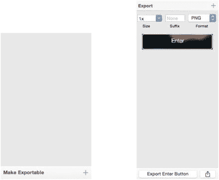
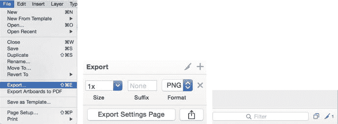
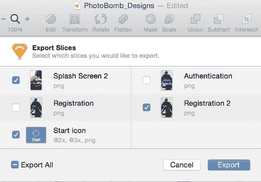
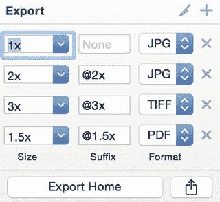
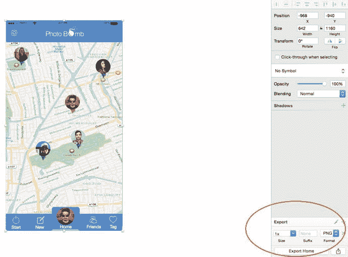
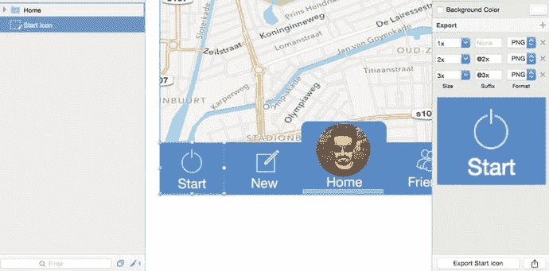
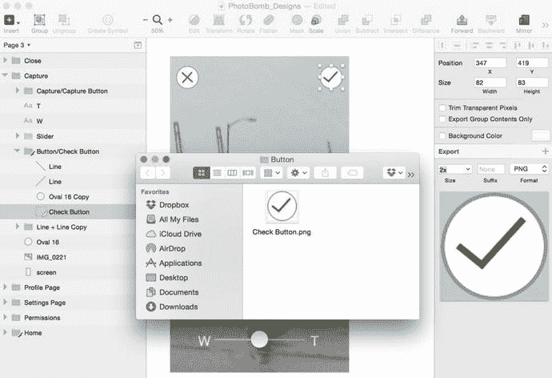
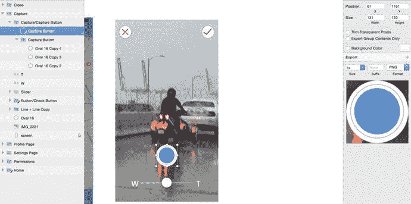

# 10. 导出设计资源用于开发

你的应用设计已完成，所有方案都已获批。客户很满意，你正与创意团队庆祝又一次圆满收官。但且慢！既然应用设计已全部完成，即将变成可供下载的真实应用，你就需要将这些设计交付给工程师或开发团队。应用的外观固然重要，但良好的运行体验同样关键。这需要设计师与开发者之间的紧密协作。

随着设计与开发之间的界限日益模糊，两者间的整合点已成为应用开发生命周期中不可或缺的部分。设计师越来越熟悉代码，开发者也越来越了解设计，而 Sketch 正是这一趋势的重要推动者。如今，将 Sketch 设计课程与 Swift 开发课程打包教学已不罕见，这样设计师就能在设计技能之外补充开发能力。借助 Sketch，导出资源用于 Xcode 从未如此简便。

如果你并非亲自开发应用，而是交由开发者完成，那么你需要与其沟通，了解他倾向于以何种方式接收设计资源。这一点尤其重要，尤其当你此前未采用协作式设计方法、未让开发者参与全程的情况下。

在本章中，我们将探讨 Sketch 3 的导出功能及其使用方法，并逐步演示如何为 iOS 执行特定的导出任务。幸运的是，Sketch 在此也能提供帮助。导出资源是设计师的常规工作，而这项功能正是 Sketch 的强项之一。该程序提供了多种文件格式的导出选项，以及相对简便的导出操作。我们将从基础开始，讲解如何利用 Sketch 以不同方式导出 iOS 开发所需的资源。

由于 iOS 需要导出多种分辨率，你必须能够导出 `@2×` 甚至 `@3×` 的资源，而 Sketch 让这一切成为可能，且流程极为流畅。学完本章后，你将能够使用 Sketch 导出设计，准备交付。

与前面章节类似，本章所有练习仍将使用 PhotoBomb 应用。这样，我们就能用一套设计完成整个设计流程，最终为该应用导出一整套资源。

## 哪些需要导出，哪些无需导出

那么，我们如何判断哪些内容需要导出给开发者呢？这就要靠沟通了。与开发者讨论他的偏好始终是明智之举。但通常情况下，你需要导出的是那些无法通过编程重新创建的资源。当应用在 Xcode 中创建时，开发者会用代码重建你的设计。字体和文本图层这类元素可以轻松通过代码实现，但某些图形元素则需要提供给开发者。外观可能变化的元素也应导出。例如，如果工具栏上的某个项目在点击时必须高亮或发光，则应单独导出。或者，你也可以为这个元素创建“开启”和“关闭”两个版本，一并导出给开发者，以便呈现两种状态的图形表示。此外，不属于 iOS 标准 UI 的图标也应导出。如有疑问，不妨先将元素导出。如果开发者不需要，他自然会忽略。

在 Sketch 中导出的两种方式：
一种是在工具栏的 "插入" 菜单中选择 "导出"。
另一种是选中图层后，点击画布检查器窗口右下角的 "设为可导出" 按钮。如图 10-1 所示，点击 "设为可导出" 按钮后，Sketch 会在该按钮上方区域创建导出图层的预览。如果选中了多个图层，所有缩略图都会显示在此处。

图 10-1. 选中图层导出前后 "设为可导出" 按钮的状态。本例中，我们选中了 PhotoBomb 应用引导页上的 "进入" 按钮

在关注导出流程时，你需要留意画布的几个区域。图 10-2 展示了导出时需关注的三个画布区域。从上图（原图，译者注）从左至右依次为：文件菜单中的导出选项（如果你选择此路径）；检查器右下角的导出选项；以及图层列表底部的切片和图层选项。

图 10-2. 从 Sketch 画布导出资源时应考虑的三个区域

## 小刀图标

选中图层准备导出时，你会注意到图层列表底部的小刀图标会高亮。这个小刀图标表示有图层可供导出。任何旁边有小刀图标的图层，都会在你下次从工具栏菜单中选择"导出"时显示。下拉菜单会显示该导出中包含的所有图层，如图 10-3 所示；该图展示了下拉菜单和选中的导出图层。

图 10-3. 从工具栏菜单中选择"导出"时，下拉菜单显示可供导出的切片

返回你的图层列表，你会看到图 10-3 中显示的所有图层旁边都有小刀图标。你可以将这些图层移至相应的分组中，以便更好地组织。

### 从"插入"菜单切片

要选择切片或导出的区域，你也可以从"插入"菜单中选择"切片"选项。完成后，光标会变成一把小刀，你就可以选择画布上设计中的任意区域进行导出。选择区域后，检查器中会显示切片的预览，图层列表下方的小刀图标也会更新，显示画布上当前切片的总数。

#### 导出的文件格式

在 Sketch 中导出文件时，程序提供了多种输出格式选项，包括：JPEG、PNG、TIFF、PDF、EPS 和 SVG。我们来了解一下这些文件格式。

##### PNG

PNG 是一种非压缩图形格式，也是导出 iOS 文件的首选格式。它基本上是一种所见即所得的格式。在导出过程中，图像不会增加或减少任何内容。PNG 的另一个优点是支持透明度，这意味着如果你的图形中包含透明背景，该格式不会将其显示出来。PNG 是 Apple 的 IDE（Xcode）首选的文件大小格式，因为 Xcode 会在构建过程中对 PNG 进行优化。

##### JPEG

JPEG 是一种压缩文件格式。这意味着你的最终图形文件及其包含的任何颜色、效果或渐变都会被压缩，其颜色数量会少于原始文件。导出后的 JPEG 文件体积也会远小于 PNG。如果你只是想展示工作进度（此时压缩率和颜色精确度无关紧要），那么 JPEG 是个不错的选择。

### TIFF

`TIFF` 是另一种无压缩的图形文件格式；它被视为传递印刷图像（如照片）的标准格式。你很可能很少需要将 `TIFF` 文件交给从事网页或移动端界面设计的人。前面展示的三种图像格式均属于**栅格图像**。

> **提示**  
> `Sketch` 不支持导出 `Photoshop` (`.psd`) 和 `Illustrator` (`.ai`) 文件。

以下文件格式支持矢量图形，如果你需要将文件发送给将要编辑图像的人员，这些格式是不错的选择。

### PDF

这种文件格式是网络上广泛使用的流行格式。`PDF` 文件能够保留文件中矢量对象和文本的矢量特性，并且可以任意缩放。

### EPS

如果你要将文件发送给使用 `Illustrator` 等 Adobe 程序进行编辑的人员，该文件格式是最佳选择。`EPS` 代表封装的 PostScript 语言，但如今大多数 Adobe 程序都拥有自己的专有文件格式。

### SVG

通常，图标、徽标以及其他二维图形都是以 `SVG` 格式创建并导出的。`SVG` 代表可缩放矢量图形，并且通常支持一定程度的动画或交互功能。

## 导出的尺寸选项

`Sketch` 提供了多种选项，用于以不同尺寸导出你的作品。在检查器中点击尺寸下拉菜单，会显示 `Sketch` 可以导出画板和图像的一系列预设尺寸。你可以使用乘数（例如任何数字后跟 `x`）来将导出图像放大相应倍数。预设尺寸为 `0.5×`、`1×`、`2×`、`3×`，以及 `512w` 和 `512h`，但你也可以选择任意数字作为乘数，或为高度和宽度选择任意数值。一旦你选择了高度，`Sketch` 会自动计算出合适的宽度；同样，一旦选择了宽度，`Sketch` 会计算出合适的高度。`Sketch` 还允许你同时导出同一元素或画板的多个版本和尺寸。图 10-4 中展示了这些选项的截图。

**图 10-4.** 在 `Sketch` 中导出尺寸、后缀和格式

选择好尺寸和格式后，`Sketch` 还会在文件名末尾自动添加相应的后缀。将图像导入 `Xcode` 后，在软件开发过程中 `Xcode` 会识别这个后缀。

> **提示**  
> 默认的尺寸和格式选项是 `1×` 和 `PNG`。

### 快速导出法

如果你想要一种无痛且简便的方法，无需执行上述任何步骤即可立即导出一个图层，`Sketch` 同样能满足你的需求。在你选择了要导出的区域并在检查器中显示为预览后，只需将其拖拽到桌面上，即可立即转换为所选格式和尺寸。没有比这更简单的了。

## 导出画板

如果你正在移交资源，并需要展示最终产品的样子，那么导出画板就是你将会做的事情。不过，更多情况下，你导出的是图标和图层等单个资源。目前，我们将专注于导出画板本身。这个过程非常简单。假设我们想要导出 PhotoBomb 应用的主页。首先，你需要在画布或图层列表中选中整个画板。完成后，点击检查器面板右下角的 **Make Exportable** 按钮。你会看到尺寸、后缀和格式设置也会显示在预览窗格中。对于此示例，你可以保持默认设置。那里的设置应该是尺寸为 `1×`，无后缀，以及 `PNG` 作为目标格式。再次点击 **Export** 按钮，会弹出一个目标位置窗口，让你选择最终导出文件的保存位置。图 10-5 显示了导出前的界面。最终导出的将是一个指定位置的平面化 `PNG` 文件。

**图 10-5.** 导出前高亮显示检查器的主页画布

## 导出单个资源

导出单个资源是你很可能经常要做的事情。图标在设计中的应用非常广泛，尤其是在 iOS 设计中。因此，了解如何为 iOS 开发导出图标非常重要。切片可以被创建并作为组文件夹的成员存储，以便于组织。如你所知，通过从 **Insert** 菜单下拉中选择 **Slice** 来创建切片。例如，假设我试图为标签栏中的“开始”图标创建一个切片。我会在其周围创建一个切片。`Sketch` 会直观地创建该切片的预览。调整好大小后，我可以选择需要为该图标创建的、适用于不同分辨率的各种版本，如图 10-6 所示，然后导出所有三个图标为尺寸合适的 `PNG` 文件。只有预览中显示的切片才会被导出。

**图 10-6.** 创建三个不同尺寸（`@1×`、`@2×` 和 `@3×`）的切片用于导出

不过，你的切片必须精确，因为切片选项会精确剪裁窗口内选中的内容。你始终可以使用检查器来查看图像的哪一部分正在被选中并随后导出。

## 为资源创建文件夹

导出资源可能是一项混乱的工作，但就像组织和命名你的图层一样，它同样重要。组织好你的资源也很重要，尤其是在将它们交给开发者时。我努力让我的图层标题直观易懂，并尝试导出到开发者可以找到所需一切资源的文件夹中。`Sketch` 也使得这个过程变得简单。

`Sketch` 提供了一个便捷的功能。通过更改图层的名称并添加一个正斜杠（`/`），`Sketch` 会自动创建一个包含你的资源的文件夹。其约定是：正斜杠之前的部分是文件夹名称，之后的部分是你的切片或资源的名称。例如，要创建一个名为“Button”的文件夹，里面包含一个名为“Check Button”的资源或切片，如图 10-7 所示，我将组名改为了 `Button/Check Button`。`Sketch` 自动创建了一个包含该资源的文件夹。

**图 10-7.** 如何命名图层以便 Sketch 自动为你的资源创建文件夹

### 裁剪背景

有时，当你选择切片进行导出时，Sketch 会自动包含背景。但大多数情况下，我们并不真正希望将背景与资源一同导出。尤其是一些图标和按钮会出现这种情况。当你只想要资源本身时，Sketch 提供了一种简单的方法来处理不需要的背景。具体操作如下。以我们的 PhotoBomb 拍摄页面为例，假设我们只想选择该页面上用于实际拍照的按钮。如前所述，你需要选中该资源。但是，当预览出现在检查器中（如图 10-8 所示）时，我们会发现背景图像也被包含了进来。

图 10-8. 有时 Sketch 会为导出选中背景图像以及选中资源

由于我们不想导出背景，因此勾选预览上方的复选框，选择“仅导出组内容”。这会告诉 Sketch 我们对背景不感兴趣，只选择并导出我们想要的资源。最终导出的 PNG 文件如图 10-9 所示。

图 10-9. 最终导出的不含背景图像的 PNG 文件

就是这样。现在你已掌握所有必要知识，能够轻松有序地导出所有资源以用于开发。

## 总结

当资源导出和交接完成后，在开发过程中你仍可能需要参与进来回答问题，并进行创意抽查。到目前为止，本书已通过使用 Sketch 程序概述了大部分设计任务，向你展示了 Sketch 作为设计软件的能力。然而，有一个充满活力的开发者社区在创建插件来扩展 Sketch 的功能。我们将在下一章讨论其中一部分。

