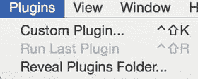
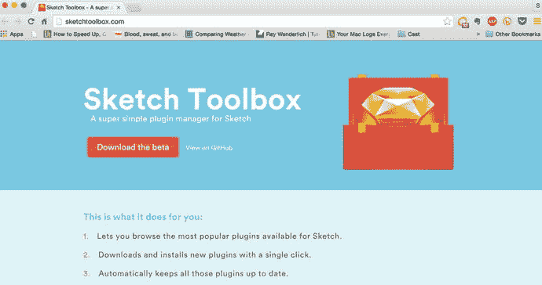
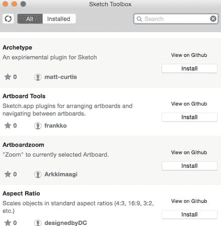
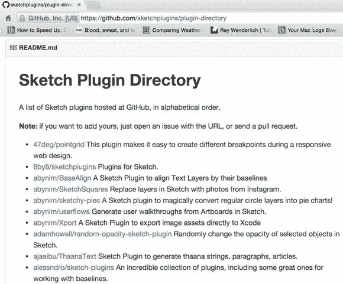

# 11. Sketch 资源

在本书的这一部分，我们将介绍来自不断壮大的 Sketch 社区的各类资源，这些资源旨在让使用 Sketch 进行设计变得更加轻松。这确实是 Sketch 的一大优点。在 Bohemian Coding 的鼓励下，社区围绕该程序聚集起来，现在有大量优秀的插件可供添加，以增强 Sketch 的功能并改进你的工作流程。我将在此尽可能多地介绍我所了解的插件。

## 插件

插件是扩展 Sketch 功能的绝佳附加组件。它们由对扩展 Sketch 功能感兴趣的开发者创建。如果你有兴趣编写自己的插件，可以在 Bohemian Coding 网站上找到一些资源和文档。

### 安装插件

如果你在网上搜索并找到了想要安装的插件，以下是在 Sketch 中安装该插件的方法：

下载插件并打开文件。通常文件会存放在压缩文件夹中。打开该文件夹后，启动 Sketch，导航至工具栏中的插件菜单（如图 11-1 所示），然后选择“显示插件文件夹”。Sketch 将自动打开一个新窗口。

图 11-1. Sketch 菜单中的插件下拉窗口

将 Sketch 文件拖入插件文件夹。现在插件应该已安装完成。

### Sketch Toolbox

可以说，你第一个想要安装的插件就是 Sketch Toolbox。它就像一个浏览器，列出了大量适用于 Sketch 的插件。在其中，你可以找到一系列出色的插件，并且可以直接通过这一个插件进行安装。强烈建议将其作为你安装的第一个插件。要下载此插件，你可以直接访问网站 `http://www.sketchtoolbox.com`，在 Google 上搜索，或直接从 GitHub 下载。我将首先向你演示如何从网站安装插件。Sketch Toolbox 网站如图 11-2 所示。

图 11-2. Sketch Toolbox 网站。你可以从此处下载 Sketch Toolbox 插件

点击网站上的“下载 Beta 版”按钮后，下载将自动开始。你可以像安装任何其他 Mac OS 应用程序一样安装此应用：解压缩并将其拖入你的 `Applications` 文件夹。

**提示**  
你可能需要更改 Mac OS 设置，以允许安装来自 Apple 以外开发者的应用程序。

安装 Sketch Toolbox 后，即可打开它。你将看到一个可滚动的窗口，其中列出了可供安装的插件。Sketch Toolbox 允许你直接从此界面安装所有插件。这是一种更简便的安装插件的方式。如果你选择直接从 GitHub 安装插件，则需要遵循前面提供的说明。现在，我们通过 Sketch Toolbox 来体验安装应用的过程。图 11-3 是 Sketch Toolbox 界面的截图。

图 11-3. Sketch Toolbox 界面

如你所见，它相当简单。插件按字母顺序列出，并附有简短的功能说明以及开发者名称。你可以点击界面上的“安装”按钮来安装插件，也可以在 GitHub 上查看该插件。如果点击“在 GitHub 上查看”，将打开一个新的浏览器窗口，显示该插件在 GitHub 上的页面。为了方便查看，你还可以在“所有可用插件”和“仅已安装插件”之间切换。

现在你已准备就绪，可以为 Sketch 安装所有插件了！

**提示**  
Sketch Toolbox 仍处于 Beta 版，可能存在缺陷。如果你发现缺陷，请进行报告，以帮助改进产品。

### GitHub

GitHub 是寻找 Sketch 插件的绝佳资源。在 Google 中搜索“github sketch plug-ins”将会显示 Sketch 插件的链接（见图 11-4）。在那里，你将找到指向 GitHub 仓库中所有可用 Sketch 插件的链接。

图 11-4. GitHub 上的 Sketch 插件目录截图，这是一个寻找 Sketch 插件的绝佳资源

### 我最喜欢的插件

以下是我在设计工作流程中使用的一些我最喜欢的插件列表。

- **Content Generator**：Sketch 的 Content Generator 可为你创建的任何设计生成头像、名称、照片和文本。
- **Sketch Icon Stamper**：自动创建不同尺寸的多个多样化图标。
- **Day Player**：从多种来源添加占位图像。
- **Duplicator**：通过将对象、形状和元素复制到网格和列表中，快速显示它们。
- **AEiconizer**：让你生成 iOS 图标所需的所有尺寸。
- **Sketch Measure**：让你提供测量值和规格说明，以便交接给开发者。
- **Sketch Squares**：用来自 Instagram 的照片填充你的图层或方块。
- **Sketch Export Assets**：调整导出文件大小并为 iOS 及其他平台导出的文件添加元数据。
- **Sketch Style Inventory**：审查、导入和导出你的样式。
- **Sketch to Xcode assets catalog**：将 Sketch 中的资源导出到 Xcode 资源目录中，用于 iOS 开发。

### 画板专用插件

以下插件用于在 Sketch 中处理画板。

- **Marvel Sketch**：将你的画板直接导出到 Marvel 原型中。
- **Sketch Arrange Artboards**：将所有画板按用户指定的行数排列成网格。
- **ArtboardZoom**：轻松缩放到当前选中的对象所在的画板。
- **Sketch Mate**：让你自动调整画板尺寸以匹配图层和内容。

### 其他资源

以下是一些来自网络的好用 Sketch 资源链接。这份列表并不完整，因为一直有优秀且才华横溢的人在不断贡献新的 Sketch 资源。这里只是我尝试分享一些个人最爱。

#### 网站

- Bohemian Coding Sketch 社区：[`http://bohemiancoding.com/sketch/community/`](http://bohemiancoding.com/sketch/community/)
  官方 Bohemian Coding Sketch 社区。
- Sketchapp.tv：[`http://sketchapp.tv/`](http://sketchapp.tv/)
  关于 Sketch 的视频教程。
- SketchLand：[`http://sketch.land/`](http://sketch.land/)
  Sketch 插件索引。
- Sketch App Sources：[`www.sketchappsources.com/`](http://www.sketchappsources.com/)
  Sketch 免费资源目录，涵盖 Web 和 App 开发。
- Sketch Tricks：[`sketchtricks.com/`](http://sketchtricks.com/)
  关于 Sketch 的文章和链接合集。

#### 群组

- Sketch Facebook 群组：[`https://www.facebook.com/groups/sketchformac/`](https://www.facebook.com/groups/sketchformac/)
- Sketch Talk 论坛：[`sketchtalk.io/`](http://sketchtalk.io/)
- Reddit 上的 Sketch：[`https://www.reddit.com/r/sketchapp/`](https://www.reddit.com/r/sketchapp/)
- Medium 上的 Sketch 合集：[`https://medium.com/sketch-app/`](https://medium.com/sketch-app/)
- Design & Code Facebook 群组：[`https://www.facebook.com/groups/designcode/`](https://www.facebook.com/groups/designcode/)
- SketchDesign.io Facebook 群组：[`https://www.facebook.com/groups/sketchdesignio/`](https://www.facebook.com/groups/sketchdesignio/)

#### 与 Sketch 集成的应用

- Avocode.com：从 Photoshop 和 Sketch 中导出和分享。
- Origami：[`http://facebook.github.io/origami/`](http://facebook.github.io/origami/)

#### 设计原型工具

- Invision：[`http://www.invisionapp.com/`](http://www.invisionapp.com/)
  原型制作与工作流协作工具。
- Wake：[`https://wake.io/`](https://wake.io/)
  协作设计工具。
- Zeplin：[`zeplin.io/`](https://zeplin.io/)
  让你自动生成样式指南。
- Flinto：[`https://www.flinto.com/`](https://www.flinto.com/)
  Mac 版设计原型工具。
- Marvel：[`https://marvelapp.com/`](https://marvelapp.com/)
  移动端和 Web 端原型制作。

希望这些网站对你的设计之旅有所帮助。

## 总结

本章提到的插件旨在帮助你加快工作流程，并辅助你完成 App 设计的整个过程。这些插件并非必需，但它们是不断发展的 Sketch 社区的重要组成部分，旨在增强你对 Sketch 的使用。

现在你已读完本书并完成了设计课程，欢迎加入社区，结识其他设计师并做出贡献。

### 索引

- Adobe Creative Cloud
- Adobe Creative Suite
- Adobe Photoshop（`事实上的`标准程序的专有格式）
- 角度遮罩
- 角度渐变工具
- App 图标
  - 添加
  - 相机背景颜色设置
  - 炸弹
  - 人机界面指南
  - 光线照射
  - 引导页
  - 流行品牌
  - 简洁性
  - 用 Sketch 设计火花
  - 避免用词
- Apple 设计大奖
- Apple Watch
  - 内置应用
  - 特性
  - 人机界面指南
  - 尺寸
  - watchOS
- 应用设计
  - 清晰度
  - 从属关系
  - 深度
  - 设备和分辨率
  - 人机界面指南 (HIGs)
  - 标准 iOS 尺寸
- 非对称模式
- Axure 工具
- 背景模糊效果
- Balsamiq 工具
- Bohemian Coding 网站
- 布尔运算
  - 复杂路径
  - `减去`工具
  - 图形程序
  - `相交`工具
  - Photoshop
  - `减去`工具
  - `联合`工具
  - 矢量工具
- 布尔工具
- Cast 应用
- Cast Beauty 应用
- 字符间距
- 圆形渐变工具
- 差异工具
- 断开模式
- Dropbox
- 吸管工具
- 封装的 PostScript (EPS)
- 导出资源
  - 画板
  - 设计与开发
  - `导出`选项
  - 文件夹创建
  - 正斜杠
  - PhotoBomb 截图
  - `PNG` 文件
  - 单个资源-刀片图标下拉菜单
  - 格式和大小
  - 位图图像尺寸选项
  - `切片`选项
  - 矢量图形图层选项
  - `设为可导出`按钮
  - Xcode
- 取色器工具
- 扁平设计深度
- Flinto
- Flinto for Mac
- 高斯模糊效果
- 图形软件程序
- 十六进制代码
- 人机界面指南 (HIGs)
- Illustrator 工具
- iMessages 应用
- InDesign 工具
- 相交工具
- InVision
- iPhone 6 机型
- iPhone 操作系统 9 (iOS9)
  - App 切换器
  - 返回按钮
  - 特性
  - 导航，照片
  - 系统字体
- JPEG
- 线性渐变
- 行间距
- Mac App Store
- Mac 操作系统
- Marvel
- 镜像贝塞尔曲线
- 镜像模式
- MockFlow 工具
- 动感模糊效果
- 负空间
- 噪点填充
- Omnigraffle 工具
- 轮廓遮罩
- 段落间距
- 图案填充
- PDF
- 钢笔工具
- Periscope
- PhotoBomb 应用
  - 画板尺寸
  - 相机
  - 拍摄屏幕
  - 颜色
  - 电子邮件注册
  - 地理位置信息
  - 主页
  - Meng 的线框图模板注释
  - 引导页
  - 权限页面
  - 个人资料页
  - 设置页面
  - 登录屏幕
  - 闪屏
  - 舞台，设置
- Photoshop
- 插件
  - 画板专用
  - Bohemian Coding 网站
  - 设计工作流
  - GitHub
  - 安装
  - 资源
    - 应用
    - 群组
    - 原型工具
    - 网站
  - Sketch Toolbox 界面
  - Sketch Toolbox 网站
  - `PNG`
- 点系统
- 演示模式
- 径向渐变工具
- 旋转工具
- 四舍五入到最近的像素边缘
- 可缩放矢量图形 (SVG)
- 形状
  - 混合
    - 模糊
      - 背景
      - 高斯
      - 动感
      - 缩放
    - 布尔运算
      - 复杂路径
      - `减去`工具
      - 图形程序
      - `相交`工具
      - Photoshop
      - `减去`工具
      - `联合`工具
  - 颜色调整
  - 组合形状
  - 自定义编辑点
  - 填充
    - 噪点
    - 图案
  - 扁平化
  - 渐变
    - 圆形
    - 线性
    - 径向
  - 图像
  - 遮罩种类
  - 不透明度
  - 缩放
  - 阴影
  - 共享
  - 样式
  - 特殊形状
  - 样式
- Sketch
  - 画板
  - 画布自定义
  - 工具栏
  - 安装
  - 图层
    - 应用
    - 画布
    - 复制
    - 编组
    - 隐藏和锁定
    - 检查器
    - 选择和移动
    - 样式
  - 布局网格
  - 打开
  - Sketch 标尺和参考线
  - 快捷键
    - 自定义通用
    - Sketch 图层快捷键（插入）
    - 移动、隐藏和调整大小
    - 图层文本和类型
    - 显示网格
    - 显示像素
    - 显示标尺和参考线
    - 智能参考线
  - 工具栏
- Sketch 2.0
  - Fontcase
  - 界面设计
  - Mac OS X 应用
  - Sketch Mirror
  - Snow Leopard
- Sketch 3.0
  - Adobe Photoshop 6 界面
  - 社区设计师
  - 工具箱功能
  - 界面设计 Mac OS 应用
  - 位图与矢量
  - 基于位图的工具
  - 位图形状速度
  - 基于矢量的工具
  - 矢量形状
  - 3.3.3 版本
- 智能参考线
- 直线模式
- 减去工具
- 符号
  - 抗锯齿和文本
  - fireworks
  - 编组
  - iOS 模板
  - 图层列表
  - `管理符号`选项
  - `组织符号`
  - Sketch 3 功能
  - 智能对象
  - 文本对齐
  - 文本和字体
    - 默认文本工具
    - 预加载的 iOS App 模板尺寸
    - 字体排印
    - 文本检查器
  - 路径上的文本
  - 文本轮廓
  - 文本样式
  - 用户界面
- Teehan+Lax
- TIFF
- 变换工具
- 联合工具
- UXPin 工具
- 矢量工具
- 线框图
  - 应用
  - 认证
  - 相机拍摄
  - 电子邮件注册
  - 主页
  - iOS 指南
  - 引导页
  - 纸笔线框
  - 权限
  - 偏好设置页面
  - 个人资料页
  - 闪屏
  - 模板
- 工作流
  - 调色板
  - 自定义网格
  - 默认样式
  - 扁平化图像
  - 图形程序
  - 命名图层和符号
  - 组织文档偏好设置
  - 演示模式
  - 旋转工具
  - Sketch Mirror 工具
  - Dropbox
  - Flinto
  - Flinto for Mac
  - InVision
  - Marvel
- 工作区自定义
- 缩放模糊效果
