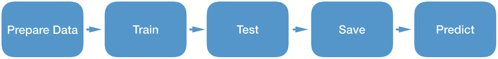
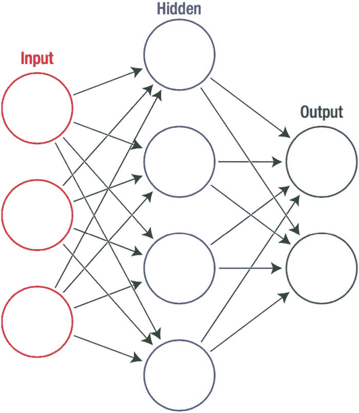
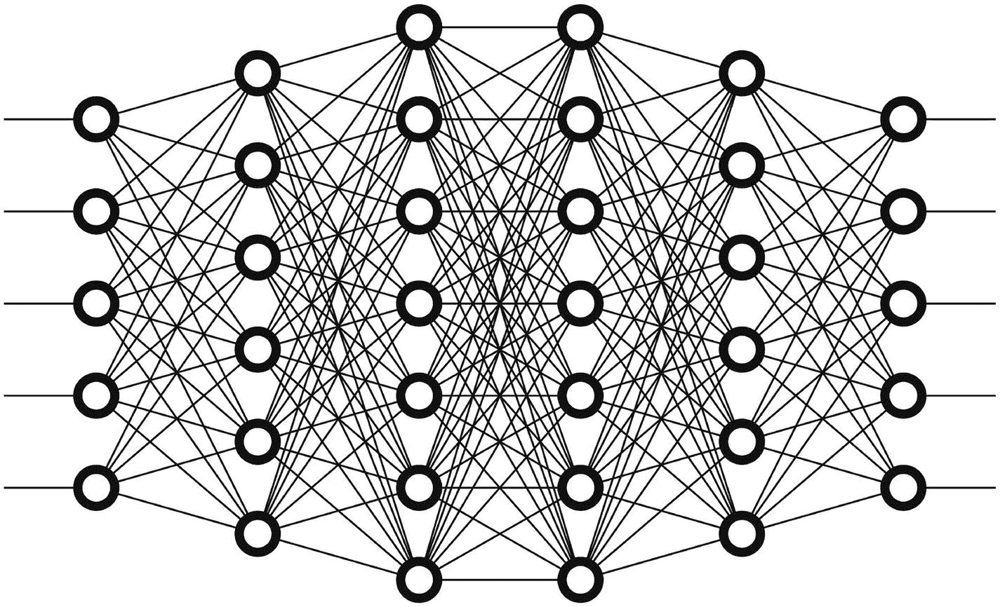
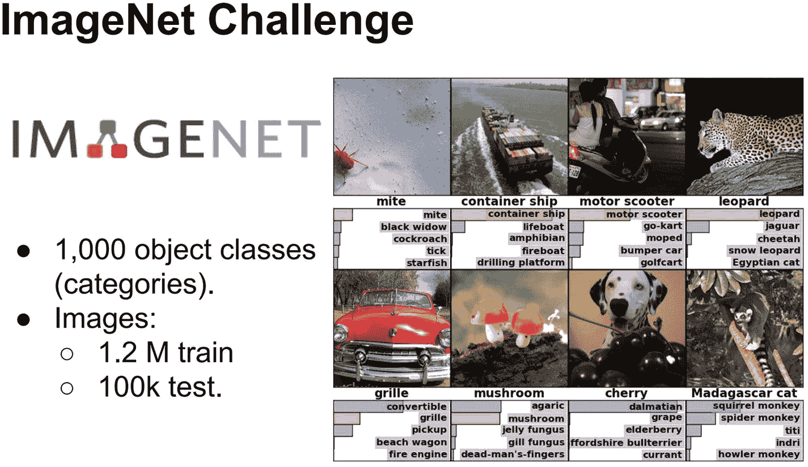
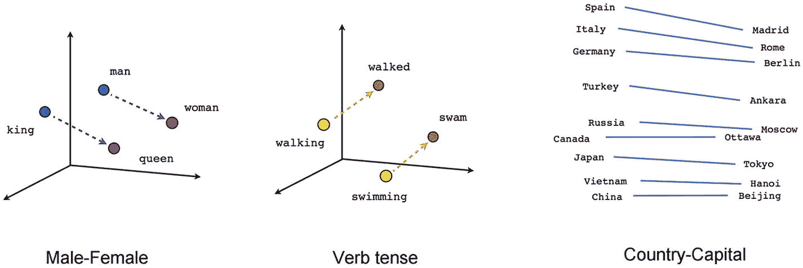

# 1. 机器学习与自然语言处理入门简介

本章将为你提供机器学习（ML）和深度学习（DL）的鸟瞰式概览。为了让内容更易于理解，我们将以故事化的方式讲述这些领域的发展历史。我们将探讨它们为何兴起，以及它们有哪些应用类型。在掌握了基础知识之后，你将开始认识自然语言处理（NLP）。你将学习如何通过 NLP 让文本数据变得能被计算机理解。即使你对这些学科一无所知，在阅读完本章后，你也能领悟其背后的直觉。

## 什么是机器学习？

作为*智人*，我们喜欢创造能节省时间和精力的工具。起初，人类开始利用动物来摆脱人力束缚。随着工业革命，我们开始用机器替代人体。当前人类关注的焦点是将思考和学习的技能转移给机器，以摆脱枯燥的脑力任务。过去几十年里，这一领域取得了显著进步。我们尚未拥有能完成所有智力任务的通用人工智能，但我们已经构建了能出色完成特定任务的 AI 模型，比如理解人类语言，或在一篇文章中寻找问题的答案。在某些任务上，如图像分类，它甚至比人类做得更好。

机器学习是当下的一个热词。围绕它有许多理论，但独立开发者能构建的真实应用却很难见到。开发一个端到端的机器学习系统需要线性代数、向量微积分、统计学和优化等多个领域的广泛专业知识。

因此，从开发者的角度来看，存在一条高难度的学习曲线挡在面前，但最新的工具能为开发者处理大部分工作，让他们专注于编码。在本书中，你将学习如何构建机器学习应用，这些应用能从图像中提取文本（光学字符识别）、对文本进行分类、在文章中寻找答案、总结文本，以及在给定输入句子时生成句子。你将掌握苹果提供的最新工具，并能够开发自己的智能应用。我们将通过编码来学习；我们将要开发的部分应用会像图 1-1 中所示那样。

图 1-1：智能应用

机器学习是一个活跃的研究领域，研究计算机算法如何在没有显式编程的情况下从数据中学习。

我们所说的“没有显式编程”是什么意思？让我们看一个例子。机器学习算法的一种类型是分类算法。假设我们想对正面和负面邮件进行分类。在常规编程中，我们会编写一些`if-else`语句来检查邮件中是否包含某些词汇，如代码 1-1 所示。

```
if mail.contains("good") ||
mail.contains("fantastic") ||
mail.contains("elegant")
{ mailEmotion = "positive"}
else {mailEmotion = "negative"}
```

**代码 1-1：** 判断邮件正面情绪的代码

我们如何使用机器学习来解决同样的问题？我们会收集大量正面和负面邮件的样本，并将它们分类为正面和负面。我们将这些数据输入模型，模型会优化其结构以适应数据中的模式。图 1-2 展示了一个已分类邮件的样本数据。

图 1-2：训练机器学习模型

通过多次迭代，模型学会区分这些句子，而无需为此问题编写任何特定代码。它仅仅通过观察大量示例来学习。当我们的模型结构开始正确预测许多标签后，我们便保存这个模型结构。

现在，我们可以将这个保存的模型结构用于新的预测。通过给它一个邮件样本作为输入，它会输出该邮件是正面还是负面，如图 1-3 所示。

图 1-3：使用机器学习模型进行预测

机器学习通常分为两类：监督学习和无监督学习。

图 1-4：机器学习分类


## 监督学习

我发现 Adam Geitgey 的这个例子非常直观，有助于理解监督学习。假设你是一名房地产经纪人，只需看一眼房子就能非常准确地估算出其价值。你想招一名实习生，但他们没有你的经验，因此无法准确预测房价。

为了帮助你的实习生，你记录了每笔房屋销售的一些细节，比如卧室数量、面积、街区以及过去 3 个月内成交的价格。表 1-1 展示了训练数据。

**表 1-1** 房屋销售记录

| 卧室数量 | 面积（平方英尺） | 街区 | 价格 |
| --- | --- | --- | --- |
| 3 | 2000 | 诺曼镇 | 250,000 美元 |
| 3 | 800 | 时尚小镇 | 300,000 美元 |
| 2 | 850 | 诺曼镇 | 150,000 美元 |
| 1 | 550 | 诺曼镇 | 78,000 美元 |

利用这些训练数据，我们希望创建一个能够估算该地区任何其他房价的程序。假设给定表 1-2 中所示的房屋详细信息，我们需要猜测其价格。

**表 1-2** 房价预测

| 卧室数量 | 面积（平方英尺） | 街区 | 价格 |
| --- | --- | --- | --- |
| 3 | 2000 | 时尚小镇 | ??? |

这就是所谓的监督学习。你拥有该地区每笔房屋销售的价格（标签）记录，因此你知道问题的答案。你可以逆向推导，找到某些影响价格的逻辑。

监督学习是一种机器学习类型，它通过像这些房地产记录中那样带有标签的示例来学习。这类似于通过展示动物并叫出它们的名字来教孩子。你利用分类好的示例来教导它。

标签会随着数据而变化。例如，在情感分析中，我们希望对给定文本的情感进行分类。这些标签可以采用如表 1-3 所示的形式。

**表 1-3** 情感数据集样本

| 文本 | 标签 |
| --- | --- |
| 我不喜欢它。 | 负面 |
| 这是一本好书。 | 正面 |

在这类数据中，我们清楚自己的目标（此示例中为情感分类）。文本和标签之间存在某种模式。我们希望通过在此数据上训练模型，以数学方式对这种模式进行建模。训练完成后，我们的模型即可用于预测文本的情感；它利用自身的数学结构，试图模仿这种功能。

标签可以是你能想象的任何东西：对于动物图片数据集，它可以是动物种类；对于语言翻译数据集，它是翻译后的单词；对于声音数据集，它是声音类型；对于自动补全数据集，它是下一个字母；等等。数据可以有多种形式：文本、声音、图像等等。监督学习就是通过观察这类数据来学习，就像老师通过展示对错来教导孩子一样。

## 无监督学习

在这种学习类型中，数据没有标签列。因此，我们让机器学习模型自行找出数据中的模式或分组。想象一下，你在一个旧盒子里发现了许多没有名字的旧盒式磁带。你开始听所有这些磁带，直到你逐渐领悟出一些直觉，能够理解不同类型的音乐风格。凭借这种直觉，你可以根据流派对它们进行分类。这就是无监督学习。你并没有像房地产经纪人示例中那样获得已经分类好的磁带供你学习。

考虑另一个例子。假设我们有一个数据集，包含如表 1-4 所示的书籍评论。

**表 1-4** 文本数据集样本

| 文本 | 性别 | 年龄 | 位置 | 年份 |
| --- | --- | --- | --- | --- |
| 这本书本身就是一部天才之作。 | 男 | 35 | 纽约 | 2015 |
| 这本书的物理质量非常好。 | 女 | 40 | 旧金山 | 2014 |
| 我不喜欢这本书。 | 女 | 30 | 洛杉矶 | 2019 |

该数据集是关于书籍购买者的个人信息。对于这类数据，我们可能希望让机器学习模型对数据进行聚类。这种聚类可能会揭示数据中我们肉眼看不到的隐藏模式。

例如，我们可能推断出，位于纽约且为女性的客户，年龄更可能在 35 到 50 岁之间。在这种学习类型中，我们不使用特定的类别标签来指导机器学习模型。相反，模型会自行判断数据集中是否存在更高级别的关系。

## 机器学习基本术语

在开发机器学习应用程序时，你会经常听到训练、测试、模型、迭代、层和神经网络等概念。我们来了解一下它们是什么。

机器学习专注于开发能够从给定的输入数据集中学习模式的算法。这些算法通常被称为**模型**。这些模型具有可以改变以适应输入数据模式的数学结构。我们在训练期间使用的数据称为**训练数据**。我们将输入数据分成若干批次，并通过向模型输入这些批次来多次运行模型。这被称为**训练**。每次使用一批数据运行称为一次**迭代**或**周期**。在这个训练期间，模型根据**误差函数**优化自身。如果模型拟合了输入数据中的模式并产生相似的输出，那么这个错误率就会较低；否则，错误率会更高。当错误率足够低时，训练就会停止，我们保存这种形式的模型。

训练完成后，我们要测试模型变得有多好。这通过**测试数据**来执行，测试数据是从输入数据中分离出来且未在训练中使用的那部分（例如，输入数据的 20%）。因此，我们在模型从未见过的数据上测试它，看它是已经泛化了知识，还是仅仅记住了训练数据。这部分数据称为测试数据。

测试模型并确保其正常工作后，我们可以使用样本数据运行它并检查其输出；这被称为预测或推理。总结一下，我们使用训练数据来训练模型，使用测试数据来评估模型，保存模型，然后使用训练好的模型进行预测。机器学习项目通常的生命周期如图 1-5 所示。



**图 1-5** 机器学习生命周期

机器学习算法有很多种，例如回归、决策树、随机森林、神经网络等。这里我们只介绍神经网络，因为它们也是深度学习模型的基础。

神经网络是由相互连接的神经元（节点）组成的层，旨在处理信息。类似于人脑中的神经元，这些数学神经元知道如何接收输入、对其应用权重，并计算输出值。直到 21 世纪初，这些神经网络通常只有如图 1-6 所示的几层，并且无法学习复杂的模式。



**图 1-6** 神经网络

在那之后，研究人员发现，通过使用这些神经元的许多层，我们可以对更复杂的函数进行建模，例如图像分类。具有两层以上结构的模型被称为深度神经网络。使用深度神经网络处理信息需要大量的矩阵运算。使用计算机的 CPU 进行此类操作需要很长时间。由于 GPU 可以并行执行此类操作，因此它们可以更快地解决这些问题。如今它们也变得更加实惠，许多人能够用他们的个人电脑训练深度神经网络。


## 什么是深度学习？

在过去几十年中，得益于人工神经网络，我们开始教机器识别图像、声音和文本。通过使用更多的神经网络层，我们得以教会计算机处理更复杂的事情。这开启了一个名为深度学习的新领域，其重点在于通过使用更多层次的网络（如图 1-7 所示）进行示例教学。



图 1-7

深度神经网络

深度学习让我们能够开发出多种多样的应用，这些应用可以识别人脸、检测嘈杂声音，并将文本分类为正面和负面。深度学习算法开始重塑许多领域。

深度学习的兴起始于`ImageNet`时刻。`ILSVRC`（`ImageNet`大规模视觉识别挑战赛）是一项视觉识别挑战赛，参赛者的算法需要在一个大型图像数据集中对物体进行分类和检测。这个`ImageNet`数据集包含超过 1400 万张带标签的图像，分为 21841 个类别。图 1-8 展示了`ImageNet`数据集的一些样本。



图 1-8

ImageNet 数据集

2012 年，一个名为`AlexNet`的深度神经网络在此挑战赛中取得了显著的成绩。随着`AlexNet`的成功，从 2013 年开始，所有参赛者都开始使用基于深度学习的技术。到了 2015 年，这些算法表现出了超越人类的性能，超过了我们的图像识别水平（95%）。这些进步使得深度学习模型更加流行。这些模型开始出现在从语言翻译到制造业等各行各业。

自 2016 年谷歌切换到神经机器翻译后，我们不能再像过去那样嘲笑它的翻译结果了。这种翻译算法让`Google Translate`支持 103 种语言（过去只有少数几种），每天翻译超过 1400 亿个单词。自动驾驶汽车曾经是未来的梦想；如今，它们已经行驶在道路上。`Siri`能够理解你的指令并代表你执行操作。当你在编写消息时，你的手机会为你推荐词语。我们可以生成从未存在过的面孔，甚至能让面部动起来，模仿声音，并制作名人的虚假视频。它在医疗行业也有应用。它可以帮助临床医生对皮肤黑色素瘤进行分类、解读`ECG`心律条带以及分析糖尿病视网膜病变图像。`Apple Watch`能够检测房颤——一种可能导致中风的危险心律失常。

正如你所见，深度学习有许多应用，并且其数量与日俱增。在过去十年中，深度学习在计算机视觉和`NLP`领域都展现出了极高的有效性。

## 什么是自然语言处理

自然语言处理（`NLP`）是人工智能的一个子集，专注于计算机与人类语言之间的交互。

`NLP`的主要目标是分析、理解和处理自然语言数据。如今，大多数`NLP`任务都利用机器学习来处理文本并推导其含义。借助`NLP`技术，我们可以创建许多有用的工具，这些工具能够检测文本的情感（情绪）、寻找某篇作品作者、创建聊天机器人、在文档中查找答案等等。

`NLP`的应用在我们的生活中非常普遍。`Amazon Echo`和`Alexa`、`Google Translate`以及`Siri`都是使用自然语言处理来理解文本数据的产品。

借助苹果提供的最新`ML`工具，你无需深入了解`NLP`即可将其应用于你的项目中。为了进一步理解，本书将分享更多资源。

让我们简要地看一下`NLP`是如何工作的，它是如何演进的，以及它被用在哪里。

Sebastian Ruder（`DeepMind`的研究科学家）在其综述《A Review of the Neural History of Natural Language Processing》中讨论了`NLP`领域近期基于神经网络方法的主要进展。如果你对机器学习有入门级的了解，推荐阅读此书。我将从他的综述中简要总结`NLP`的里程碑。

语言建模是根据前面的文本预测下一个单词。2001 年，首个使用前馈神经网络的神经语言模型被提出。在这项工作之前，`n-grams`在研究界比较流行。`N-grams`基本上是一组共现的词，如表 1-5 所示。

表 1-5

N-grams

| 示例 | 1-Gram | 2-Gram |
| --- | --- | --- |
| to be or not to be | to, be, or, not, to, be | to be, be or, or not, not to, to be |

你在自然语言处理中经常会听到的另一个关键术语是词嵌入。词嵌入在`NLP`中有着悠久的历史。词嵌入是单词的数学表示。例如，我们可以用每个词出现的次数（频率）来表示文本中的单词。这被称为`bag-of-words`模型。

2013 年，Tomas Mikolov 和他的团队使这些词嵌入的训练更加高效，并引入了`word2vec`——一个两层神经网络，它处理文本并输出它们的向量。这个网络不是深度学习网络，但它对深度学习模型很有用，因为它能创建计算机可处理的数学数据。

它非常实用，因为它可以在向量空间中表示单词，如图 1-9 所示。这使得可以对词向量进行数学计算，如加法、减法等。多亏了`word2vec`，我们可以推断出男人与女人、国王与王后之间的关系。例如，我们可以做这样的计算：`"King – Man + Woman = Queen"`。



图 1-9

`word2vec`捕捉到的关系 (`Mikolov et al., 2013a, 2013b`)

借助`word2vec`，我们可以推断出有趣的关系；例如，我们可以问“如果唐纳德·特朗普是共和党人，那么巴拉克·奥巴马是什么？”，`word2vec`会产生`[Democratic, GOP, Democrats, McCain]`。我们给出的数据表明唐纳德·特朗普是共和党人，然后我们想为巴拉克·奥巴马找到类似的关系，结果指出他是民主党人。这种类型的推断提供了从文本数据中推导出的无限可能性。

2013 年之后，更多的深度学习模型开始被用于`NLP`。循环神经网络（`RNNs`）和长短期记忆网络（`LSTM`）变得更加流行。


